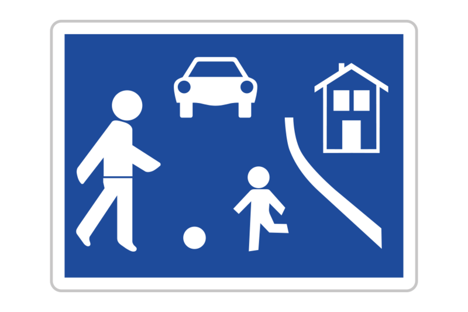
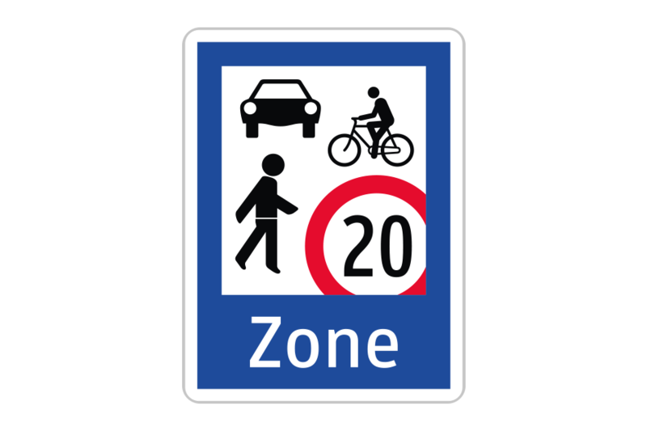

```table-of-contents
```
## Begriffe (GW01)
### Straße
The **Fahrbahn** is the whole road, the **Fahrstreifen** is a single lane.

**Nebenstraßen** are lanes that run parallel to the main road but are separated in some manner, e.g. a Grünstreifen.

**Banketten** are the sides of the road, and do not count to the road itself. It should not be driven on obviously.

**Leitpfosten** are on the side of the road and are generally about 33m apart, and about 50m apart on highways.

**Ortsgebiete** are marked  by start-end tafeln, and you are in the Ortsgebiet on all roads that follow, until an end sign is reached. There is a 45-50km/h speed limit within an Ort, but that can be overriden by speed limit signs.
### Schutzweg, Zebrastreifen
**Schutzwege** dienen als Straßenübergang für Fußgägner und/oder Radfahrer. Wenn der Lenker erkennen kann, dass jemand den Schutzweg überqueren will, MUSS man ihn überqueren lassen. You cannot hinder or endanger them. Man soll außerdem immer auf Gefahrensicht fahren, wenn man einen Schutzweg erkennt.
At the Practical exam, it is recommended to stop even if it is not strictly necessary. It's not wrong to be careful and stop, even if it turns out to be redundant. Make eye contact with the person you suspect wants to cross the road. 

Auf einem Schutzweg gelten folgende Verbote:
- Auf- und 5m vor (und in einer Einbahn auch nach) dem Schutzweg halten und parken
- Überholen, außer der Schutzweg ist geregelt
- Vorbeifahren (wenn das auto vor dir stehen bleibt)

**Halten, Parken**
- Halten: 10 min, Ladetätigkeiten unabhängig von der gebrauchten Zeit
- Parken: >10 min

**Schutzweg + Radfahrüberfahrt**
Komination aus Fußgägner und Fahrrad Schutzweg, looks checkered
Bikes can only go 10kmh on it.

**Verkehrsinseln**
- Bauliche Trennung der Fahrbahnen (kurz)
- einbahn: can choose what side you drive past it on
- Sign will tell you (blue sign with white arrow)
- otherwise just pass it on the right side

**Wohnstraße**
- Nur ein- und Ausfaßhren, kein Durchfahren
- Schrittempo (3-5kmh, no faster)
- Immer Nachrang, wenn man diese verlässt


**Begegnungszone**
- Man hat im Auto Vorrang
- In der Praxis gibt man trotzdem allen anderen Vorrang
- Typischerweise ca. 20km/h, ist aber angeschrieben


**Mehrzweckstreifen** werden durch eine unterbrochene oder rote Linie gekennzeichnet. Sie dienen bspw. dazu, um einer Straßenbahn auszuweichen, oder um einen Radfahrstreifen anzubieten, den Kraftfahrzeuge wenn nötig auch befahren können. Man darf dabei nur nicht Fahrradfahrer gefährden oder behindern.

**Reitweg**
**Reitweg**
- Not allowed to enter under any circumstances
**Fahrradstrasse**
- Nur zu und abfahren
- hoechstens 30km/h
**Fahrradstrasse**
- Nur zu und abfahren
- hoechstens 30km/h

**Schienenfahrbahnen** sind baulich von der restlichen Fahrbahn getrennt, und dienen dem Schienenverkehr, bspw. Straßenbahnen. Diese darf man auf keinen Fall betreten.
### Bodenmarkierungen
**Einseitige Fahrstreifenbegrenzungslinien** zeigen an, dass nur bspw. von der linken Spur auf die rechte wechseln darf, aber nicht vice versa. Man darf von der offenen Seite auch überholen, von der geschlossenen aber nicht.

**Fahrstreifenbegrenzungslinien** sind durchgezogene Linien, die nicht überfahren werden dürfen.

A **Begrenzungslinie** looks the same, but it marks that a lane should only be used if necessary (e.g. very side of the road, where cars may also be parked). Meistens kürzere Striche und breiter.

**Sperrflächen** dürfen nicht befahren werden.

**Ordnungslininen** sind unterbrochene haltelinien, die anzeigt, dass man Vorrang geben muss. An dieser Linie kann man ggf. halten.

**Haltelinie** usually accompanied by stop sign, HAVE to stop, but at the haltelinie not the stop sign. You have to stop when you're the next person to leave, doesn't count if you're just stopping behind someone else. 

Arrows (dreicke) pointing against your fahrrichtung
- Just shows it's a kreuzung
- doesn't say anything about vorrang, just that you should prob. stop

**Linien zum Halten/Parken**
Gelbe Linie, durchgezogen
- Halten und Parken verboten
Gelbe Linie, nicht durchgezogen
- halten erlaubt, parken verboten
Gelbe Zick-Zack Linien
- halten erlaubt, parken verboten
Blaue Linie
- Halten und Parken erlaubt
### Lichtfarben
Orange/red lights indicate a Construction zone, which we may pass on the left side.
### Verkehrleiteinrichtungen
Leitplanken are these rectangular red and white arrows and indicate what lanes you should use, how you should arrange yourself, or just as a warning.
### Geschwindigkeitstrichter
Two horizontal lines coming in from the sides, getting longer until they almost close indicate that you should slow down.
### Unterscheidung der Fahrzeuge
Fahrzeug
- Kraftfahrzeuge
	- Krafträder
		- These are einspurige Kraftfahrzeuge
		- Motorrad
		- Moped
		- etc
	- Kraftwagen
		- These are mehrspurige Kraftfahrzeuge
		- PKW
		- Kombi, 
		- Traktor etc.
- Fahrzeug ohne Motor
	- Fahrrad
	- Fuhrwerk
	- Anhänger

The B license allows you to drive any Kraftwagen that weight up to 3.5 tons.

## Überholen, Hintereinanderfahren (GW09)
### Überholen
Überholen ist das seitliche vorbeifahren an einam Fahrzeug, das in die gleiche Richtung fährt. Dabei muss das zu überholende Auto auch in Bewegung sein, sonst gilt es als Vorbeifahren.

Normalerweise ist nur das Linksüberholen erlaubt, es gibt aber Ausnahmen:
- Wen jemand zum Linksabbiegen eingeordnet ist, darf man die Person rechts Überholen.
- Schienenfahrzeuge müssen auf der rechten Seite überholt werden, unless there is too little space -> not allowed to overtake, need to stay 20m behind it.
- Auf einer Einbahn dürfen Schienenfahrzeuge auf beiden Seiten überholt werden.

**Straßendienstfahrzeuge** dürfen rechts überholt werden, wenn es auf der linken Seite nicht genügend Platz gibt. Meistens ist aber eine blaue Tafel angebracht, die einen auf den richtigen Fahrstreifen einweist.

Grundsätzlich können wir überholen, wenn folgendes gilt:
- Ausreichende Überholsichtweite, innerhalb dieser kein Gegenverkehr
- Genug Seitenabstand
- Wenn wir nicht selber überholt werden
- Keine Sperrlinie zwischen den Fahrstreifen
- Wir können uns ungefährdet wieder einordnen nach dem Überholen
- Wir dürfen 20km/h schneller fahren, als das zu überholende Fahrzeug
Wenn man selber überholt wird, darf man niemals beschleunigen.

In diesen Situationen dürfen wir nicht überholen:
- Bei Gegenverkehr
- Wenn Sperrlinien vorhanden sind (2m Abstand kann nicht eingehalten werden)
- Nicht geregelter Schutzweg oder Kreuzung (außer, wir sind in der Kreuzung auf einer Vorrangstraße)
- "Überholen verboten" Tafel
	- Bspw. dürfen wir keine Kraftfahrzeuge überholen
- Wenn wir überholt werden
- In den letzten 80m vor dem Gleis darf man **mehrspurige** nicht überholen, man muss sich aber vor dem Gleis ungefährdet wieder einordnen können, was praktisch nicht möglich ist.

**Überholvorgang:**
- Zuerst über Geschwindigkeitsbeschränkungen und Verbote vergewissern
- Auf Gegenverkehr achten
- 3s Blick
- Blinker
- Überholen, auf einem niedrigeren Gang (meist reicht -1 Gang?). Dabei auf den rechten Fahrstreifen achten.
- Rechts blinken und wieder einordnen

**Überholweg, Überholzeit**
Im Durchschnitt braucht es ungefähr 10 Sekunden, um ein Fahrzeug zu überholen. Das bedeutet, wir müssen bei Gegenverkehr eine Überholsichtweite von 20 Sekunden haben. Um die nötige Überholsichtweite in Metern zu bestimmen, müssen wir berechnen, wie viele Meter der Gegenverkehr in 10 Sekunden zurücklegt + den Weg, den wir in dieser Zeit zurücklegen.
$$\text{Approx. distance traveled in one second: } d = \frac{v}{10}*3$$
**Seitenabstand**
- straßebahn : 0.5m
- mehrspurig: 1m
- einspurig: 1.5 in ortsgebiet, else 2m.
- should be more if the person you're overtaking can't keep their lane

**In der Nacht:**
- Fernlicht beim Überholen einschalten, auch wenn es blendet
	- Wenn das Auto vor einem das Fernlicht an hat, muss man es erst selber einschalten, wenn man auf der selben Höhe ist.
	- Das andere Auto muss anschließend Abblenden
- Essentially, the car in the very front of a kolonne always needs the fernlicht on, all others need to keep it off. So cars need to do a little switcharoo when overtaking.
### Sicherheitsabstand, Hinterinander fahren
Sicherheitsabstand kann in m oder s eingehalten werden. Typischerweise gelten 2s Sicherheitsabstand auf der Freilandstraße oder im Ortsgebiet, das sind ca. 50m bei 80km/h.
Auf der Autobahn sind es 3 Sekunden, im Schnee oder Regen sind es 4.
Schnee, Regen: 4s
Anhänger, long vehicles: at least 50m, so that other vehicles can overtake you.
Tall vehicles, can't see ahead: more sicherheitsabstand
- this could block sight of traffic lights, another reason why we need to keep distance
## Verkehrszeichen (G02)
Yellow "Wohngebiet, kein Durchzugsverkerhr" is not an official sign
Ortstafeln (blau) mean 50kmh zone.
### Vorrangszeichen
auch von hinten erkennbar, d.h. auch von hinten für uns relevant

**Stop:**
Bei haltelinie, oder sodass man gut in die kreuzung sieht. Man muss immer komplett stehen bleiben (0 am tacho). eine zeitangabe gibt es nicht. Stehen bleiben, und dann lnks/recht schauen.

**Vorrang geben:**
Wir müssen hier nicht stehen bleiben, aber wir dürfen anderen nicht den Vorrang nehmen -> der Andere soll nicht bremsen müssen.

Zur Annäherung ist hilfreich:
Eine strichlierte Linie am Boden kann auch zeigen, dass jemand ein Vorrang geben Schild hat.
Haltelinie -> Halt tafel (Stop)

**Vorrangsstraße:**
Querverkehr hat immer Wartepflicht, wir haben immer Vorrang. Die linken/rechten werden Vorrang Geben oder Halt Tafeln haben.
Hier gelten auch andere Regeln:
- Auf einer Kreuzung überholen
- Links zufahren ist verboten
### Gefahrenzeichen
Aufrechte dreicks-Tafeln.
Stehen je nach Fahrgeschwindigkeit eine gewisse Distanz von der Gefahr entfernt. Ca.:
Autobahn: 250-500m
Landstraße: 100-250m
Ort: Unreguliert

Meistens je nach Gefahr entsprechend langsam über die Strecke fahren, bspw. bei Wölbung oder Rinnen im Boden.

**Gefährliche Kurve:**
Bei mehreren Kruven:
- Die Kurven fürfen nur alles 240m voneinander entfernt sein, außer, es steht eine Zusatztafel dabei (bspw. 2km)
Wir müssen hier auch einfach langsamer fahren, und sollen aber immer mit Gegenverkehr rechnen.
Wir dürfen hier nicht
- Überholen
- Mittig oder sehr linksbündig fahren (müssen uns sehr rechts halten)
- Stehen bleiben (halten, parken)
- Umdrehen

**Kreuzung:**
- Auf einer geregelten Kreuzugn dürfen wir immer überholen, vorraussetzlich, dass es nicht gefährlich ist.
- Auf einer ungeregelten dürfen wir Fahrräder und Mopeds überholen.
- Ist an der Kreuzung ein Vorrangsschild bzw. wir sind auf einer Vorrangsstraße, dürfen wir immer überholen.

**Kreuzung mit Kreisverkehr:**
- Eiegentlich hat man im Kreisverkehr vorrang, wenn man ihn betreten will
- Meistens wird es aber ein Vorrang Geben Schild geben.
- Beim herausfahren blinken

**Kreuzung imt Straße ohne Vorrang:**
- Wir haben Vorrang auf einer Straße, die Querliegende Straße nicht.
- Sagt uns zwar, dass wir Vorrang haben, aber nicht, dass wir auf einer Vorragnsstraße sind

**Bahnübergang:**
- Mit oder Ohne Schranke, in 150-240m

**Bahnenbanken:**
- Weißes Rechteck mit 3, 2, und 1 Linie. Eine Linie = 80m Entfernung von der Eisenbahnkreuzung
- 3 linien: in 240m das nächste Gleis
- 2: 160m
- 1: 80m
Dürfen in dem Warnbereich kein Mehrspuriges Kraftfahrzeug überholen

**Andreaskreuz:**
Bahnübergang, 3m vor dem Gleis. Kann horizontal oder Vertikal sein.. Kommt einfach darauf an, wie viel Platz es neben der Fahrbahn gibt.
Zwei Kreuze -> mehrere Schienen.

Wir dürfen auf der Eisenbahnkreuzung nicht:
- Stehen bleiben
- Überholen
- Umkehren
Man darf unmittelbar VOR der Kreuzung umkehren, wenn man dabei keine Tafeln etc. verdeckt.

**Fahrbanverengung:**
Langsam fahren, Nachfolgeverkehr beobachten, Reißverschlußsystem anwenden.
An der veerenungstelle einfahren, nicht vorher!

**Baustelle:**
Oft 30er Zone, bei Baustelle aber nicht bis ein Ende der 30er angeschrieben wird (oder eine andere Beschränkung). Die Geschwindigkeitsbeschränkung ist dan aufgehoben, wenn es offensichtlich ist, dass die Baustelle hinter einem ist.

**Gefährliches Gefälle (bspw. 10, 20%)**
Slope nach unten: bremsen, langsamer werden. Aber nicht immer auf der Betriebsbremse stehen. Niedrigen Gang einlegen, sodass die Motorbremse ausreicht, um die Geschwindigkeit zu halten (Motor muss weniger arbeiten, um die Räder zu drehen -> Räder brauchen beim rollen gleichzeitig mehr kraft, um den Motor zu drehen).

Sloped nach oben: also lower the gang, just like with a bike.

**Andere Gefahren:**
Details stehen dann auf Zusatztafel:
- Reiter
- Achtung auf Linksabbieger (hier muss man wirklich aufpassen)
### Vorschriftszeichen
Runde Tafeln, schreiben ein Gebot oder Verbot an. Gelten ab der Stelle, an der sie sind. Bspw. von einem 50er in einen 30er Rollen ist verboten.

**Fahrverbot in beide Richtungen:**
- Zusatztafel ist wieder zu beachten, für Ausnahmen bspw.
- Kann nur für Kraftfahrzeuge gelten, Zeichen im Schild.

**Einfahrt Verboten:**
- Einbahn

**Überholen Verboten:**
- Variante 1: Überholen von Mehrspurigen Kraftfahrzeugen verboten (d.h. zwei Auto snebeneinander).
	- Gefährte ohne Motor, oder EInspurige, dürfen überholt werden.
- Variante 2: Lastwagen dürfen nicht überholen

**Geschwindigkeitstafeln:**
Nach dem abbiegen gilt die Begrenzing nicht mehr, außer, es steht "Zone" dabei.

**Begegnungszone:**
Normalerweise 20kmh, sollten anderen eher vorrang geben

**Wohnstraße:**
Vorher stehen bleiben! Man darf nicht nurchfahren
- 5-7kmh
- Beim herausfahren: Fließverkehr regel, fließender verkehr hat vorrangb
### Hinweiszeichen

### Zusatztafeln
Zeigen bspw. an:
- genau wie weit weg eine Gefahr ist unter einerm Gefahrenzeichen.
- Für welche Fahrzeuge ein Verbot gilt
	- Anlieger, Anreiner. Anlieger können auch zum Besuch der Anreine hineinfahren, lieferungen etc.

## Beeinträchtigung (G1)

Es gibt 3 Gewichte
- Eigengewicht
	- Wie viel das Auto selber wiegt + vollem Tank
- Gesamtgewicht
	- Mit Personen
- Höchstzulässigesgesamtgewicht
	- Gewicht, dass der Hersteller definiert. "So schwer darf das Fahrzeug mit voller Beladung sein"

Bei einer Eisenbahn darf man Überholen, wenn man vorher ungefährdet stehen bleiben kann. Sonst muss man 80m vorher wieder einreihen können?
### Beeinträchtigung der Fahrtüchtigkeit
Drogen, Alk, Müdigkeit, Ablenkungen. 0.0 (im Blut) Probe, sonst 0.5.
Alls beeinträchtigtes Fahren gilt, den Motor zu starten/inebtriebnahme. Es gilt auch Rauchverbot, wenn jemand unter 18 Jahren im Fahrzeug ist.
### Verkehrsunfall
Bei Personenschaden muss man die Polizei anrufen, bei Sachschaden darf man es nicht. Bei Sachschaden soll man sie nur anrufen, wenn z.B. der Ausweis nicht hergezeigt wird.

**Beispiel - kleiner Unfall:**
- Feststellen, ob es sich um einen Personenschaden handelt
- ggf. Polizei oder Rettung rufen, Erste Hilfe leisten
- Fotos machen, Unfallbericht, Zeugen sammeln + namen/tel.
- Ausweis -> Kontaktdaten austauschen

AUSNAHMEN:
- Transporter mit einem gelben Schild mit schwarzen Nummern sind Gefarhswarentransporter. Diesen Transportern sollte man wsl nicht zu nahe kommen, und Polizisten/Rettung beim Anruf informieren.

**Wild:**
Förster anrufen, aber nicht die Polizei. Das Tier von der Fahrbahn entfernen, und niemals mitnehmen lol.
Sollte man ein Tier die Straße überqueren sehen, hupen, und niemals anblenden.
### Pflichten des Lenkers und Zulassungsbesitzers
Was muss man dabei haben?
- Führerschein
- Zulassungsschein
- Erste Hilfe (kofferraum)
- Warnweste
- Bahnendreieck (manchmal oben in der heckklappe)

Vorläufige Führerschein gilt 4 Wochen, nach Einzahlung sollte man innerhalb von 2 Wochen den richtigen Führerschein von der BH erhalten haben. Sonst dort anrufen.

Wenn man ihn mal verliert, muss man zur Polizei -> Verlustanzeige -> geben dir einen Zettel, womit man weiterfahren kann.

Sollte man das Nummernschild verlieren, darf man vorrübergehen mit einem selbstgemachten nummernschild fahren, solange es lesbar ist.

Vignetten
- Ist mehr oder weniger eine Zulassung für das Auto

## Partnerkunde (G03)
### Sinnesorgane
ca. 10sek nach vorne schauen, bei 100km/h bspw. 300m.
- Kurvenbeginn und Kurvenende ansehen, damit wir die Kurve einschätzen können. Das abbremsen muss schon VOR der Kurve passieren.
- Leitlinie betrachten

Einstellungen
- Sitzhöhe: faust zwischen kopf und decke
- Schulter und Lenkradmitte auf gleicher höhe.
- Nach vorne- und hinten: Beim Kuppeln darf das bein nicht ausgestreckt sein, wenn die kupplung ganz eingedrückt wird.
- Arme abgewinkelt am lenkrad.
- Kopfstütze mindestens auf scheitelhöhe
- Mit dem hintern immer ganz hinten sitzen (spürt bspw. schleudern)
### Gefahrenlehre
 If someone is driving in the middle, which actually isn't allowed, you still need to overtake from the left. You can't just overtake the guy on the right/speed up next to him.

### Rücksichtnahmegebot, Vertrauensgrundsatz und Ausnahmen
**Lichthupe**
- Is a short burst of fernlicht
- e.g. when an oncoming car isn't tunring off their fernlicht

**Warnlicht:**
- Aller blinker blinken
- e.g. stopping on side
- entering stau on autobahn
### 3-A-Technik
Beurteilung anderer Verkehrsteilnehmer
- Alter
	- Bei Kindern stehen bleiben
	- Same for disabled folks
- Absicht
	- See if someoene is looking back - might want to turn
	- Blink lights etc.
	- Roadblocks, how other people will need to act around them
- Aufmerksamkeit
	- Be careful around distracted people

Das überfahren einer Sperrlinie ist erlaubt, wenn es keinen anderen Ausweg gibt (bspw. blockierende Ladetätigkeit)

### Bevorzugte Straßenbenutzer
People/groups who have advantages on the road
- Kids
- Police
- Ambulance
- Postal services
- Busse des Linienverkehrs im Ortsgebiet beim ein- und ausfahren. (marked by text on the bus). Nicht Reisebusse. 
- Schülertransport - warnleuchten und warnblinker an - **vorbeifahrverbot**. wir MÜSSEN hinten stehen bleiben! Erkennbar an orangenen tafel mit kindern.
- Müllabfuhr
- Schienenfahrzeuge
- Groups of people
- Gefahrguttransport (weiter weg parken usw.)

## Fahrordnung 1 (GW04)
### Rechtsfahrordnung
Man muss vor ende der Sichtweite bremsen können. Besonders in Kurven müssen wir uns sehr rechts halten, aber auch wenn man überholt wird, schlechten Wetterbedingungen etc.

Wann dürfen wir nebeneinander fahren?
- Sind im Ort
- mind. 2 MARKIERTEFahrstreifen in unsere Richtung
- Bei Straßen mit möglichem Gegenverkehr nicht in der MItte
- Nur für Kraftfahrzeuge erlaubt
- Darf andere Verkehrsteilnehme nicht behindern.

Otherwise, we can only drive side by side if there is a Kolonne, i.e. if the circumstances require it.
Otherwise, we can only drive side by side if there is a Kolonne, i.e. if the circumstances require it.
### Vorbeifahren
Passing a halted/parked car.
Cannot pass school buses unless all their blinkers are on. Then you may pass at walking speed.
Cannot pass cars waiting at a schutzweg.
Generally, if there is a large car blocking a road, stop a good 10-1m away from it so you can assess the situation before moving on.
### Wechsel des Fahrstreifens
Bspw. wenn man links abbiegen will, vorbeifahren...

3-Spiegel-Blick
- Rückspiegel
- Seitenspiegel
- Schulterblick (um den toten Winkel des Seitenspiegels abzudenken)
	- Nicht ganz umdrehen, einfach nur leicht nach links schauen

Darf 5-7 Sekunden vor dem Maneuvre passieren, Schutzweg etc. soll noch im Sichtfeld sein.
Wir blinken hierbei auch vor dem Lenken.

3
### Einordnen und Einbiegen

Reißverschlussprinzip:
- Nicht komplett stehen bleiben, sonst wechselnviele den Fahrstreifen
- langam werden, einordnen/einordnen lassen

Fahrstreifenwahl:
- wenn es rehcts+gerade aus und gerade aus als optionen gibt, sollten wir eher den rechten streifen verwenden, außer, es ist sehr viel los.

Ohne Kupplung einbiegen

Pendel-Sicherungsblick auf die Querstraßne, Kurzer Richtungsblick zum rechten Fahrbahnrand, wieder gerade aus.

Beim ausfahren darauf warten, dass das auto eh nicht ein anderes fahrzeug verdeckt.

Beim links abbiegen haben alle andere Vorrang, d.h. in die mitte der Kreuzung fahren, und warten.

Bei zwei Linksabbiegerspuren gibt es meist eine Leitlinie, man muss je nach spur die äußere oder innere kurve nehmen, und dann auf der dementsprechenden spur einfahren.

an den Fahrbahnrand der Kurve anordnen.
### Links zufahren
#review
Am linken Fahrbahnrand halten oder parken. Es ist in folgenden Situationen verboten:
- Starker Verkehr
- Unübersichtliche Straßenstellen
- Vorrangstraßen im Ortsgebiet
- Auf Fahrbahnen mit Gleisen, außer es ist eine Einbahnstraße (wenn es Gegenverkehr gibt, darf man auf Straßen mit Gleisen nicht linkszufahren)

## Fahrordnung 2 (GW05)
### Verwendung der Beleuchtung
Hinten nur Rot (außer nummernschild), vornenur Weiß.

Tagfahrlicht kann am Tag an sein, ist nicht nötig, aber darf an sein.

**Abblendlicht bei schlechten** wetterbedingungen, nacht, und ist auf der rechten seite stärker, auf ca. 70-80m, und auf der linken seite nur 40-50m, damit wir fußgänger und fahrradfahrer sehen, aber keine autofahrere blenden.

**Fernlicht**
Nicht im Ort, bzw. nur in >50km/h Zonen. Bei Schneefall oder starkem Regen kann es einen auch selbst blenden, d.h. eher nur langsamer und mit Abblendlicht fahren.
Bei Gegenverkehr, Fernlicht abschalten wenn der andere es abschaltet, oder wenn man sich selber geblendet fühlt.
Wenn man wirklich geblendet wird, langsam werden, zum rechten fahrbahnrand blicken, und notfalls halten.
Langsamer werden sollten wir aber immer

**Nebellichter**
Strahlen mehr in die Breite und können den Fahrbahnrand (20-30m) besser ausleuchten.
Dürfen auch verwendet werden, wenn es dunkel und kurvenreich, oder regnerisch etc. ist. Ist praktisch immer erlaubt in Kombination mit Abblendlicht.

**Nebelschlusslicht**
Man sieht autos im nebel damit auch von hinten besser, es kann aber auch blenden. In diesem fall mehr abstand halten, und sollte man selber in ein er kolonne sein, deaktivieren. Separate taste.

**Standlicht = Begrenzungslicht**
Beim halten und parken müssen wir das Fahrzeug beleuchten. D.h. Standlicht einschalten. Kann (IM ORT) auch nur auf der Straßen-seitigen Seite des Autos eingeschaltet werden. Dann wird es als **Parklicht** bezeichnet. Das Abblendlicht kann auch verwendet werden, braucht aber mehr Batterie.

Wenn das Auto nicht am Fahrbahnrand steht, ist dies aber nicht nötig, oder wenn es von einer Fahrbahnbeleuchtung beleuchtet wird. Ein rot-weißes band bedeutet, dass es sich abschaltet.

Ortstafeln geben geschwindigkeit nicht an, und heben limits auch nicht automatisch auf 100 auf. vor dem ort 70, dann im ort 70, und nach dem ort 70. Ortstafeln sind nur hinweise.

ganze sicht: mehr als 3.5m breit, ganze fahrbahn, gegenverkehr ist "neben" dir.
halbe sicht: weniger als 3.5m breite fahrbahn, gegenverkehr ist vor dir

What is the diff between begrenzung und tagfahrlicht #review 

Kurvenlicht
Turns in the direction you're signaling or steering. Makes you recognise people and objects in your turning path sooner.

Blinklichter
Orange lol. If all of them are blinking at the same time, that's a warning light. E.g. to secure the scene of an accident, when your car breaks down, or when approaching a traffic jam.

Rückfahrscheinwerfer
Schalten sich im Rückwärtsgang automatisch ein, einziger weg um dies zu erkennen.

KNOW THESE LIGHTS FOR THE PRACTICAL AS WELL.

### Schlechte Fahrverhältnisse
Bei nebel und in der früh immer mit abblendlicht fahren, auch wenn es hell ist. Es geht darum, dass andere einen sehen können.

Aquaplaning
Wenn man die spuren der anderen autos sehen kann (vom wasser, 1-2mm), ist es kein problem.
Bei Spurinnen (einbuchtungen), dann kann das wasser 1-2cm tief sein, und die reifen bekommen keinen halt. Man hört ein "schleudern" wie bei einer Waschmaschine. Der Reifen muss sehr viel Wasser verdrängen.
- wir können die geschwindigkeit verringern
- außerhalb der Rinne fahren

Im fall des Aquaplanings
- Entkuppeln
- Bremsen
- Bis wir wieder Bodenkontakt haben

### Verhalten bei Pannen
??? not covered lmao

## Personen- und Gütetransport (B2)
### Personenbeförderung
Maximal 9 Sitze -> 8 Passagiere (then said max 4, idk)
Driver is responsible for kids under 18 to be buckled in.
Kids under 14: Kindersicherung muss an sein + Fenster + korrekte Sitzgelegenheiten.

Maxi Cosi entweder hinten auf der beifahrerseite oder vorne. Airbag aus, wenn das Kind vorne ist. Hinten: mit dem Gurt befestigen. Den Sitz immer verkehrt rum anlegen.

Gewichtsklassen
0
- unter 9 monate
- maxi cosi
1
- 9 monate bis 4 jahre
- Kindersitz mit extra gurt
2
- 4+
- Kindersitz mit normalem gurt
- Mit Rückenlehne
3
- 7-14
- Passender Kindersitz, nur erhöht.

Wenn drei Kinder hinten sitzen, müssen die seiten-airbags deaktiviert werden.

SOS Taste um über Radio kontakt aufzunehmen. Teilt GPS, um Rettungskräfte zu senden, falls man nicht ansprechbar ist.

### Beladung
Große Sachen unten, kleine oben.

Mit Ladung, maximale höhe des Fahrzeugs:  4m
max width: 2.55m
length: 12m
Beladung darf unbegrenzt hinten hinausragen, bei mehr als 1m müssen wir aber ein kennzeichen am ende der ladun gmarkieren (90cm übe dem boden an der ladung). Nach vorne darf sie maximal 1/4 der Fahrzeuglänge herausragen, bei 1m+ muss diese aber auch gekennzeichnet werden.

Bit Dachbox: 120kmh? #review 
Die Sachen dürfen beim kurven fahren oder bremsen nicht verrutschen. die ladung darf in alle richtungen herausragen.

Nie über die Sitzlehnenhöhe beladen, die sachen könnten nach vorne fliegen.

Fernseher kann man bspw. am Rücksitz transportieren, und die gurte links/rechts überkreuzt anwenden.

Für Fahrräder gibts Heckträger. Der braucht auch sein eigenes Kennzeichen und beleuchtung.

## Fahrordnung 2 (GW05)
0.5m Abstand zum rechten Rand, kann aber auch verringert werden (unübersichtliche Stellen)...
### Umkehren
#review 
Verboten bei den folgenden Tafeln:
- Vorgeschriebene Fahrtrichtung
- Umkehren verboten
- Linkseinbiegen verboten

Zum unkehren braucht man typischerweise ca. 12m. Man soll darauf achten, regelmäßig Pendelblicke zu machen.

Auf einer schmalen Straße:
- an den rechten fahrbanrand fahren
- stark nach links einschlagen, mit dem vorderteil an den linken Rand fahren.
- stark nach rechts einschlagen, rückwärts fahren
- dann wieder nach vorne weiterfahren.
- Soll ungefär 30s brauchen.

In eine Querstraße:
- Bis nach der Querstraße fahren
- Rückwärts in die Querstraße, nah am Bordstein
- Vorwärts aus der Querstraße wieder herausfahren

Verboten in den folgenden Situationen:
- Dichter Verkehr
- Vor allen unübersichtlichen Straßenstellen
- Brücken
- Tunnel
- Auf Vorrangstraßen
- Autobahn, Einbahn
- Direkt auf der Eisenbahnkreuzung ist es absolut verboten.
	- Darf Verkehrseinrichtungen nicht verdecken.

Auf geregelten Kreuzungen könnte man umdrehen, solange man es in einem Zug machen kann.
### Rückwärtsfahren
Nicht erlaubt auf:
- Einbahnstraßen (außer vielleicht zum parken)
- Autobahn
- Richtungsfahrbahnen

Man hat beim rückwärts fahren immer nachrang, auch beim ausparken...

### Ein- und Ausfahren
Am besten vorwärts parken
### Ausweichen
bspw. Bus braucht manchmal 1-5 Fahrstreifen.
- Am besten vorher noch ausweichen undam straßenrand wartne

Jemand der nach unten fährt sollte gegenüber von jemandem der nah oben fährt anhalten.

Prinzipiell weicht man rechts aus, außer bei Schienenverkehr, dort darf man es sich aussuchen.
### Vorrangstraße
Yellow diamond, bleu car, blue 1, EEE
Darf auch bei einer ungerelgelten kreuzung  
### Autostraße
Nur für Kraftfahrzeuge bei denen mehr als 60km/h zugelassen sind.  
Kein halten und parken, kein umkehren, pannenstreifen immer freihalten
### Autobahn
- Fahrtrichtungen baulich getrennt
- Keine Kreuzungen, Kreisverkehre etc. Nur Auf- und Abfahrten
- Braucht Vignette 
	- 10 tage, 2 monte oder 1 jahr (14 monate)
	- kann man auch online kaufen

Auffahren:
- 3 Gang, 50km/h wenn wir uns nähern
- blinken
- 2-3 mal richtungsblick+sicherungsblick
- schulterblick, auf die autobahn fahrspur
- Dann auf tempo 130

Bei Geisterfahrer: möglichst rechts einordnen

Rettungsgasse:
Bei 3+ spuren, linker streifen nach links, alle anderen nach rechts. Rechts auch pannenstreifen verwenden.

bei panne:
Warndreieck in Anhalteweg Distanz, 1.5m vom linken Pannenstreifenrand entfernt. (bspw. 200m vom auto)

Abfahren:
- 100km/h wenn nass/regen
- 70km/h in der kurve beim abfahren
### Tunnel
Wenn man den tunnel ohne auto verlassen muss, schlüssel stecken lassen!

## Technische Bauteile 1 (B3)
### Verbrennungsmotor
Typically we have 4+ cylinders. More cylinders correspond to greater Leistung. 

The Motorkontrollampe (motor control lamp?) indicates that there is an issue. Head to the Pannenstreifen and call someone. While this lamp is on, the car won't accelerate as quickly, and won't deliver the same power.

If the gas pedal or brakes get stuck:
- Decouple
- turn motor off but do not take out key/disable steering wheel
- Try to roll onto a pannenstreifen eventually

Oil changes
Orange tab, measuring wand. Take it out, clean it, then stick it in again and check where the oil level is between te´he indicators on it. Add about 250-500ml of oil if necessary. If the oil change warning sign shows up (no waves), motor damage is imminent. Therefore stop the motor and decouple immediately. 
#### Diesel
Diesel cars ignite themselves through Glühkerzen, unlike a Benzin car.
When we have a diesel motor, a little control light will tell us if the motor needs to warm up before it can start. The Starthilfe will work to warm it up, and once that light turns off, you might need to start the motor manually again.
While it is warming up, we should turn off all other electricity consumers in the car, as the battery is being used and a high enough voltage is required to warm the motor up properly.

Im Dieselauto ist ein Partikelfilter, um den Ruß herauszufiltern. Bei einer Langstreckenfahrt erhöht der Motor regelmäßig (alle 3-5 Stunden) seine Temperatur, um diese Partikel herauszubrennen. Er ist daher selbstreinigend, außer, es werden keine langen Strecken gefahren.

Dieselautos haben oft einen AdBlue Tank, um Abgase zu reduzieren. Dies ist eine Ammoniak-Lösung und wird ins Abgas eingespritzt.

Eignet sich also für regelmäßige längere Strecken.
#### Benzin
In Benzinmotoren ist ein Catalysator eingebaut, der die giftigen Stoffe vermindert (aber nicht ungiftig). Dies funktioniert aber hauptsächlich auf langen Strecken, da der Motor eine bestimmte wärme haben muss. Auf Kurzstrecken wird also wenig gefiltert, und es entstehen mehr Ablagerungen und Rost. Eine Langstreckenfahrt (bspw. Autobahn) "reinigt" den Auspuff wieder.

Hat den Vorteil, dass er bei Kurzstrecken länger warm bleibt, es enstehen dadurch weniger Reparaturkosten. 
### Elektrofahrzeuge

### Kupplung

### Getriebe

### Differenzial

### Antriebsarten

## Vorrangregeln und Geregelte Kreuzungen
### Vorrangregeln
Bei nicht geregelten Kreuzungen gibts ungleichrangige und gleichrangige Kreuzungen. Bei gleichrangigen Kreuzungen gibt es keine Tafeln, die Aussagen über den Vorrang machen. 

**Rechtsregel:**
Der Rechtsliegende hat immer Vorrang. Gibt es keinen äußerst rechten, kann jemand auf seinen Vorrang verzichten, dann lässt sich die Rechtsregel wieder anwenden. Dies passiert über Handzeichen und Blickkontakt.

**Schienenfahrzeugregel:**
Ein Schienenfahrzeug hat immer von der linken und der rechten Seite Vorrang. Sind wir auf einer Vorrangstraße, bzw. unser Auto und die Straßenbahn von der Vorrangsituation sind nicht gleich, können wir diese Regel aber nicht anwenden.

**Einsatzfahrzeugregel:**
Bei Blaulicht oder Ton haben Einsatzfahrzeuge immer Vorrang.

**Wartepflichtsregel:**
Ist ein "Vorrang geben" oder "Stop" angebracht, sind wir ein Vorrang Level unter den anderen. Bei einer Zusatztafel mit dickem Streifen ist der Querverkehr der, der in diesem dickem Streifen fährt.

**Vorrangstraßenregel:**
Wenn wir auf einer Vorrangstraße fahren, haben wir bei der nächsten Kreuzung Vorrang gegenüber allen anderen Fahrzeugen, außer Radfahrer auf der Radfahrüberfahrt oder EInsatzfahrzeuge. Das gilt über die ganze Fahrbahn.
Bei einer Vorrangstraße mit Zusatztafel: der dicke Strich zeigt, in welche richtung die Vorrangstraße geht. Egal ob wie diese befahren oder verlassen, wir haben vorrang.

**Gegenverkehrsregel:**
Bei gleichranginger Vorrangsituation. Fahrzeuge, die geradeaus fahren oder rechts einbiegen haben immer Vorrang gegenüber Linkseinbiegern die von vorne entgegenkommen.

**Verzichtsregel:**
Bei einer Stop Tafel verzichtet man immer auf seinen Vorrang. Man kann dies aber auch freiwillig mit einem Handzeichen machen. Wenn zwei Verkehrsteilnehme eine Stop Tafel haben, haben beide auf Vorrang verzichtet, d.h. muss man die Reihenfolge dann durch Blickkontakt klären.

**Fließverkehrsregel:**
Wenn man aus einer Wohnstraße, Tankstelle, etc. (also nicht aus einem Fließverkehr) kommt, hat man gegenüber allen anderen Wartepflicht.
### Geregelte Kreuzungen
Geregelte Kreuzungen funktionieren über Ampeln oder einen Polizisten.

**Armzeichen eines Polizisten:**
Es besteht freie Fahrt für die Autos, die in die Richtung der Arme des Polizisten zeigen. Zum Richtung ändern kann dieser die Hand nach oben geben, als "halt" Zeichen für die, die vorher fahren konnten.

**Ampeln:**
Ein gelbes Licht zeigt, dass die Ampel bald auf Rot umschalten wird, man muss also halten. Blinkt die Ampel Gelb, ist diese außer Betrieb, und man muss sich nach den Verkehrstafeln richten.

## Räder und Reifen
Sind mit Eisengewebe versetzt. Im Sommer sind härtere Reifen besser, es entsteht weniger wärme durch die verringerte Reibung. Im Winter ist die zusätzliche Auftragsfläche nützlicht.

Die Rillen, die diagonal stehen, verdrängen Wasser und Schmutz.

**Winterreifen**
Auch Lamellenreifen genannt. Die Ecken lassen sich eindrücken, dadurch wird der Reifen beim fahren "flacher" und wir haben mehr Auftragsfläche. Sollte von 1. Nov bis 15. April verwendet werden. Markiert mit M+S (Matsch + Schnee). Ist technically aber nur bei winterlichen Fahrbahnverhältnissen nötig. Use higher pressure because of the lower temps (air takes up less space obv). Helfen nicht mit dem Treibstoffverbrauch. Man darf sie auch mit Sommerreifen zusammen verwenden, solange die Profiltiefe unter 4mm liegt.

**Radialreifen**
Die meisten Gewebeinlagen sind Radial - der Reifen wird sehr hart, on rollt leicht. Man braucht dadurch weniger Treibstoff. Es biegt in auch mehr nach außen, man hat dadurch mehr Fläche in Kontakt mit dem Boden.

**Diagonalreifen**
Gewebeeinlagen sind Diagonal verlegt, ist dadurch seitlich sehr hart. Die Bremskräfte etc. werden schlechter auf die Fahrbahn übertrgen. Werden kaum noch verwendet. 

**Spikereifen**
Reifen mit metallstiften, für eis- oder schneefahrbahnen. Auf asphalt sind diese aber sehr rutschig. Nur bei Kraftwagen bis 3.5 Tonnen un 1.8 Tonnen Achslast bei Anhängern. Braucht hinten am Auto auch ein Spikepickerl. Mit den Reifen darf man nur im Ort 50, Freiland 80, und sonst 100km/h fahren, da sie laut sind und die Fahrbahn beschädigen. Bei solchen Fahrzeugen viel Sicherheitsabstand einhalten. Sie duerfen nur vom 1. Oktober bis zum 31. Mai verwendet werden.

**Schneeketten**
Auf mindestens zwei antriebsrädern müssen schneeketten angelegt sein, wenn so eine Tafel angegeben ist, auch wenn dort noch kein Schnee liegt. Danach kann man nur mit 50-60km/h fahren, und immer wieder die Kette nachspannen. Wenn keine Schneekettenpflicht beschildert ist, darf man nur auf durchgehenden Schneefahrbahnen nehmen.
Auf mindestens zwei antriebsrädern müssen schneeketten angelegt sein, wenn so eine Tafel angegeben ist, auch wenn dort noch kein Schnee liegt. Danach kann man nur mit 50-60km/h fahren, und immer wieder die Kette nachspannen. Wenn keine Schneekettenpflicht beschildert ist, darf man nur auf durchgehenden Schneefahrbahnen nehmen.
### Reifenbezeichnung
Erste Zahl, bspw. 185/65
- 185... Breite in mm
- 65... 65% ??? #review 

Zweite Zahl, bspw. R 15
- R... Radial
- 15... Felgendurchmesser in Zoll

Dritte Zahl, bspw. 88T
- Tragfähigkeits-Kennzahl
- Rechechieren, wie viele kg ein 88 markierter Reifen aushält
- T... Geschwindigkeitsbegrenzung
	- bspw T = 190km/h
	- S = 180km/h
	- Q = 160km/h
	- Muss im Sommer mit Bauartgeschwindigkeit übereinstimmen
	- Im Winter darf es auf 160km/h herunter gehen.

### Stats
**Mindestprofil**
Im Sommer: min. 1.6mm auf 3/4 der Lauffläche
Im Winter: 4.0, bzw. 5.0 bei diagonalen Reifen
Reifen haben einen Indikator ("Brücke" in den Rinnen der Reifen) die mit einem Pfeil am Rand markiert sind. Diese sind auf das Mindestprofil abgestimmt. Solange das Profil höher ist als der Indikator, ist es erlaubt.

**Reifendruck**
Ist in Bar angegeben, steht oft im Tankdeckel, in den Tür oder der Betriebsanleitung. Wenn sehr viel Transportiert wird, muss der Druck leicht erhöhrt werden. Wenn der Reifendruck nicht passt, wird er anders abgenutzt. So werden auch die Bremswege länger, und wir haben viel Reibung.
Aus der Oberfläche erkennt man, ob der Reifendruck über einen längeren Zeitraum gepasst hat. Wenn er nur außen oder nur innen..... #review 

Wenn der reifen nur einseitig abgenutzt ist, dann stimmt etwas mit der Spur des Reifens nicht.

**Radwechsel**
1. Ebene Fläche suchen, abstellen
2. Rad aus dem Kofferraum nehmen + Wagenheber
3. Wagenheber laut Betriebsaleitung anbringen und Kurbeln
4. Rad herunterschrauben, neues Rad Anschrauben
	- Diagonal anziehen! Also gegnüberliegende schrauben zuerst
	- Nicht zu fest anziehen, nicht auf den Schraubschlüssel steigen lol

**Räder flicken**
Das Gel drückt man in den Reifen, dann pumpt man den reifen mit einem kleinen kompressor wieder auf... Funktioniert aber nur bei Stichverletzungen.

### Federung und Stoßdämpfer
Schraubenfeder und Stoßdämpfer pro Rad.

**Überprüfung**
Auf das Auto über dem Stoßdämpfer drücken (and der Kante!), sollte nach unten und wieder nach oben gehen, ohne zu springen. Ist aber nicht nötig lol, man soll in die Fachwerkstätte.

### Lenkung
Servo-Lenkung? #review Unterstützt das Lenken, damit man weniger Kraft braucht.

**Überprüfung**
Bewegen das Lenkrad durch das Fenster ein bisschen nach links und rechts. Der Reifen sollte sich sofort bewegen, ohne Leerweg!

## Eisenbahnkreuzungen, Abstellen
### Eisenbahnkreuzungen
Andreaskreuz steht 3m vor dem Bahnübergang. 
Eine Stop Tafel kann andeuten, dass die technischen Anlagen (Schranken, Licht), defekt sind. Man muss d.h. auf jeden fall anhalten.
Bei ungesicherten Schienen, wenn die Sicht extrem schlecht ist UND man die bahn nicht hören kann, darf man sie gar nicht erst überqueren.
Ist es unklar, ob die Eisenbahnkreuzung ungeregelt ist oder einfach nur defekt (bspw. halb-offene Schranken), darf man die Kreuzung nicht überqueren.

SOLLTE DER MOTOR AUF EINER EISENBAHNKREUZUNG STERBEN:
Bei einem Benzinmotor kann man einen Gang einlegen (make sure it'
s coupled as well), und den Motor starten. Der Anlasser, der kleine Elektromotor der normalerweise den Motor startet, kann dann den Motor hoffentlich genug ankurbeln, um etwas nach vorne zu rollen. Become Elektroauto.
SOLLTE DER MOTOR AUF EINER EISENBAHNKREUZUNG STERBEN:
Bei einem Benzinmotor kann man einen Gang einlegen (make sure it'
s coupled as well), und den Motor starten. Der Anlasser, der kleine Elektromotor der normalerweise den Motor startet, kann dann den Motor hoffentlich genug ankurbeln, um etwas nach vorne zu rollen. Become Elektroauto.
### Abstellen
....
Kurzparkzonen
Werktags sind alle Tage außer Sonntag und gesetzliche Feiertage!

Bei Straßen mit Gegenverkehr müssen 2 Fahrstreifen frei bleiben, wenn man parkt. Halten ist jedoch erlaubt.

Es ist ebenfalls verboten, den Gehweg zum halten oder parken zu verwenden, das Auto darf 
## Technische Bauteile 3
### Bremsen
Eine Zweikreisbremse hat zwei unabhängige Bremskreise, diese sind meistens diagonal aufgeteilt. Es werden zwei verwendet, damit eines ausfallen kann. Bei einem diagonalen layout hat man garantiert 50% der Bremskraft.

Die Bremsen funktionieren Hydraulisch, zur Druckübertragung dient die Bremsflüssigkeit.Mit dem Bremspedal übt man Druck auf den Kreislauf aus, die Bremsbelege drücken dadurch auf die Scheibe oder Trommel. Wenn die Brems-stücke abgenutzt sind, braucht es auch mehr Flüssigkeit.

Wenn die Brems-Kontrollampe aufleuchtet, darf man noch weiterfahren, aber muss in die Werkstatt. Man soll nicht einfach Bremsflüssigkeit nachfüllen.

Die Bremsflüssigkeit sollte ca. alle 2 Jahre von der Werkstatt ausgetauscht werden.

**Bremsweg:** $d=({s\over10})^2$   where s is speed in km/h, d is in meters.
Bremsweg in Sekunden: $t = \frac{s~*~0.5}{10}$
### Elektrik und Elektronik

### Verwendung der Beleuchtung
### Verhalten bei Pannen
### Abschleppen

## Wahl der Fahrgeschwindigkeit
### Geschwindigkeitsbegrenzungen
Ort: 50, Land/Autostraße: 100, Autobahn: 130
Mit leichtem Anhänger: Capped at 100, otherwise same
... many other Begrenzungen based on Fahrzeugklasse/Anhänger.

Geschwindigkeitstafel wird aufgehoben durch:
- Verlassen der Straße
- Andere Tafel/Ende (Auch weißes mit schwarzem Strich, was auch Überholverbot beendet)
Wird aber NICHT durch Ortsanfang aufgehoben! Die Tafel gilt dann aber NICHT im ganzen Ortsgebiet, außer, die tafeln sind auf dem gleichen Pfosten. Es muss aber am Ende auch eine "Ende" der Begrenzung stehen.

Zonenbeschränkungen gelten bis zu einem "Ende der Zone" Tafel, egal wie oder wo man abbiegt!
### Anhalteweg
Vom Erkennen der Gefahr bis zum Stillstand des Fahrzeugs. AW = Anhalteweg, RW = Reaktionsweg, BW = Bremsweg

Der Reaktionsweg sagt uns, wie weit wir in einer Sekunde fahren bei einer bestimmten Geschwindigkeit. Bergab oder bei schwierigen Fahrverhältnissen ist dieser länger.  Der Reaktionsweg hängt von meiner normalen Reaktionszeit und meiner Konzentration ab. Man kann zur Verbesserung dieser Zeit Kupplungs und Bremsbereit fahren (wenn bspw. Kinder am Straßenrand spielen), das bedeutet, man hat den Fuß schon über der Bremse.
$$\text{Reaktionsweg: }RW_{(1s)}=\frac{v}{10}*3$$
Der Bremsweg ist der Weg, den wir bei einer Notbremse bei einer bestimmten Geschwindigkeit zurücklegen. Dieser verlängert sich bei nasser Fahrbarn um das doppelte, das benötigt eine Geschwindigkeitsreduktion von 1/3. Bei Schnee müssen wir unsere Geschwindigkeit um 1/2 reduzieren, bei Eis um 2/3.$$\text{Bremsweg: }  BW = \left( \frac{v}{10} \right)^2$$
Der Anhalteweg ist die Summe des Reaktions- und Bremswegs. So weit bewegen wir uns vom Erkennen der Gefahr bis zum anhalten. $$\text{Anhalteweg: }AW=RW+BW$$
Beim fahren sollten wir diese auswendig können, damit wir nicht rechnen müssen:
- 30km/h -> 18m
- 50km/h -> 40m
- 70km/h-> 70m
- 100km/h -> 130m
- 130km/h -> 208m

Zum abschätzen von Distanzen können wir Leitpflöcke verwenden. Sehen wir bspw. 2 Leitpflöcke = 66m, dürfen wir ca. 70km/h fahren. 1LP = 50km/h
- Landstraße 33m
- ?? #review

Wir müssen auch immer entscheiden, ob wir auf halbe oder ganze Sicht fahren. Natürlich fahren wir immer dann auf halbe Sicht, wenn wir mit Gegenverkehr rechnen müssen. Zusätzlich müssen wir auf Gefahrensicht fahren, wenn wir mit einer Gefahr rechnen müssen (bspw. unübersichtliche Querstraße, Kühe, Kinder, Schutzwege etc.).

Bei einer Schneefahrbahn (oder nassen Fahrbahn?) muessen wir fuer den gleichen anhalteweg auf 50% der normalen Geschwindigkeit herunterfahren, auf eis sogar auf 30%.

Bei einer Schneefahrbahn (oder nassen Fahrbahn?) muessen wir fuer den gleichen anhalteweg auf 50% der normalen Geschwindigkeit herunterfahren, auf eis sogar auf 30%.
### Fahrgeschwindigkeit und Sichweite
Bei langen, geraden Straßen schaut man weiter nach vorne, wodurch man oft automatisch schneller wird. Daher soll man immer wieder einen Blick aufs Tacho werfen. 

Tipp: 50km/h am Ende eines Verzögerungsstreifens.

Auf Brücken muss man besonders aufpassen. Der Wind, der relativ konstant über die Brücke bläst kühlt das Wasser auf der Straße und friert es womöglich schon bei +5°C ein. Auch an schattigen Stellen kann Wasser oder Eis länger liegen bleiben. 

Nasse Erde und Dreck verkleben das Profil und macht es Rutschiger. Seitenwind erfordet auch oft Gegenlenkung, je nach Fahrzeug-Größe und -Gewicht

Anhalteweg in Sekunden in bestimmten Geschwindigkeitsintervallen:
up to 30km/h -> 2s
30-60km/h -> 3s
60-90km/h -> 4s
90-130km/h -> 5s
+1s in rain, +2 for snow or ice.

**All the random seeming Geschwindigkeitsbegrenzungen for different attributes**
- Ladungen, die hinten mehr als 1/4 der Fahrzeuglaenge herausragen: 50 - 50 - 80 - 80S
- Spikereifen (mit oder ohne leichtem Anhänger) oder schwerer Anhänger: 50 - 80 - 100 - 100
- Leichter Anhänger: 50 - 100 - 100 - 100
## Fahrdynamik
### Fahrdynamik

### Fahren bei kritischen Straßenverhältnissen
Wenn man ins Rutschen kommt in einer Kurve:
- Entkuppeln
- Lenkrad stabil halten bis man wieder halt hat
- sollte das nicht passieren, bremsen.

Wenn man zu schnell beschleunigt, bzw. ins schleudern kommt, "driftet" man mehr oder weniger.
- Auskuppeln
- Sofort entgegenlenken (in Schleuderrichtung)
- Warten, bremsen

Besonder hier ist es kritisch, dass die Hinterräder mindestens genauso gut oder besser sind als die Vorderräder. Sonst kommt man ins Schleudern. 
### Modern Driving

## Non-module specific
### Halten und Parken
Parkregeln:
Man darf praktisch überall jemanden ein- und aussteigen lassen, ausser bei halte-parkverbotszonen. Es gilt auch als Ladetaetigkeit. ABER man darf als "Taxi" jemanden ein- und aussteigen lassen.

Wenn wir uns im Ortsgebiet befinden, dürfen wir in einer Einbahnstraße immer halten und parken, wenn ein Fahrstreifen frei bleibt. Rechnen wir mit Gegenverkehr, muss zum Halten ein Fahrstreifen frei bleiben, zum Parken zwei.

Auf dem Gleis des Schienenverkehrs (Straßenbahn) darf man halten, wenn die oberen Regeln eingehalten werden und wir im Fahrzeug bleiben. Aber nur außerhalb des Haltestellenbereiches! im Bereich 15m vor und nach der Haltestelle darf man Personen nur rasch  ein- und aussteigen lassen.

In Bushaltebuchten darf man außerhalb der Betriebszeiten halten UND parken, ansonsten nur halten, solange man im Auto bleibt, und natürlich darf man jemanden ein- und aussteigen lassen.

Wenn wir NICHT im Ortsgebiet sind, darf man nur halten.

### Verlorenes Kennzeichen
If you lose your Kennzeichen, you can make a DIY license plate and keep driving with it for ONE week. Make sure to tell the police, and carry their Verlustbestaetigung around with you.
If you are unable to get it back in that time/it isn't found, you need to get a new license plate.
### Links zufahren (again bc i keep forgetting)
#review
Am linken Fahrbahnrand halten oder parken. Es ist in folgenden Situationen verboten:
- Starker Verkehr
- Unübersichtliche Straßenstellen
- Vorrangstraßen im Ortsgebiet
- Fahrbahnen mit aqktivem Gegenverkehr
- Auf Fahrbahnen mit Gleisen

### Umkehren (I also keep forgetting this)
Verboten wenn:
- Andere Verkehrsteilnehmer behindert oder gefährdet werden
- Tafeln die es verbieten
- startker verkehr, unübersichtliche straßenstellen
- Vorrangstraßen im Ortsgebiet
	- Ausnahme: geregelte Kreuzungen, wenn das Umkehren in einem Zug möglich ist.
- Autobahnen, Autostraßen, Einbahnstraßen und Richtungsfahrbahnen (makes sense lmao)
- Gekennzeichneter Straßentunnel (500m+)
- Bei Eisenbahnkreuzungen, auch davor und danach wenn dabei Schilder verdeckt werden.

### When can I use what?
Winterreifen: have to from 1. Nov bis 15. April, if it is winterlich
Spikereifen: dürfen nur vom 1. Oktober bis zum 31. Mai verwendet werden. CAN USE THEM LONGER THAN WINTERREIFEN

### panik time
- Schienenverkehr hat nicht automatisch vorrang!
- Grüne tafeln kennzeichnen vorrangstraßen, werden aber nicht von der EU bezahlt lol
- Parkleuchten SIND DAS BEGRENZUNGSLICHT. Dass jemand im fahrzeug sitzt, ist uns egal
- Halten und Parken ist grundsätzlich auf vorrangstraßen erlaubt, nur das links zufahren nicht

Vorrangstraßen
- Parking: yes
- Umkehren: No
- Linkszufahren: No
Gleis
- Parking: no
- Halten: If you stay in te car
- Umkehren: Yes
- Linkszufahren: No, außer in einer Einbahnstraße
