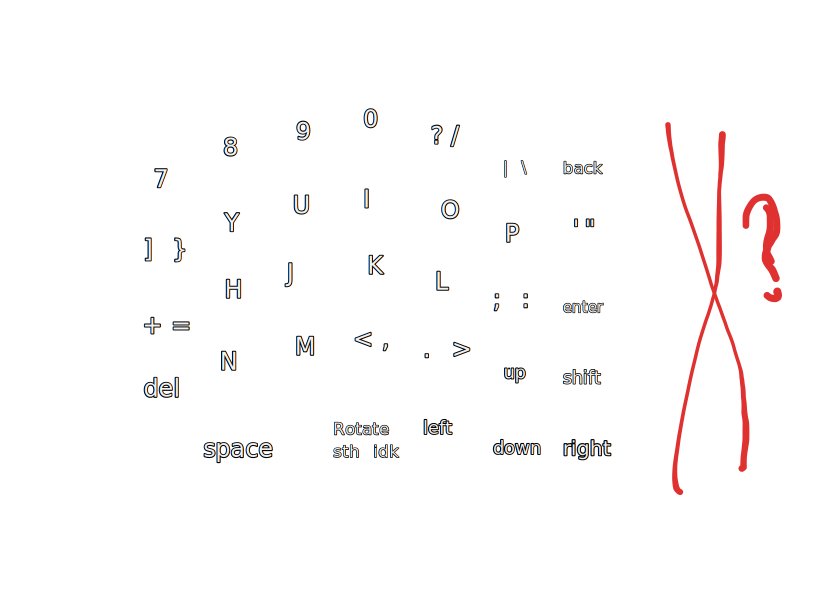

PCB(s) used: [AMOEBA single switch PCBs](AMOEBA%20single%20switch%20PCBs.md)
Displays: [Link](https://www.makerfocus.com/products/2pcs-i2c-oled-display-module-0-91-inch-i2c-ssd1306-oled-display-module-1?srsltid=AfmBOoq9cGzWhGNKihLica92uLuNhsKXaSlrtpdHdTn5mrMNBsPg05Hr) , [spec sheet](_attachments/4614270%204784121%20Display%20Product%20Manual.pdf)
Firmware: [QMK](QMK.md)
## Motivation
6 function keys, we can toggle between f1-f6, f7-f12, and debugging mode, where we have f5,f10,f11, etc for continuing, stepping, stepping in, out, stopping and restarting. this should usually be attached to the left side of the keyboard using magnets, but we can slide it out. A button is used to toggle between the 3 modes, with 3 LEDs indicating the current layer.

## Wiring
This drawing shows how the function rows should be wired. The function row is its own row, but each key still corresponds to a column on the main board. These wires are then bundled up (use an old usb-c cable) and connected to the wires on the main board.

For how they should be wired in general, see [AMOEBA single switch PCBs](AMOEBA%20single%20switch%20PCBs.md).
## Layout
### Measurements
#### Switch hole

14x14mm works perfectly. The switches snap into place and hold.
#### Stabilizer holes
The space bars need additional holes for the stabilizers. 
**Single stab:**
- length (perpendicular to keycap): 19.4mm
- width (parallel to keycap): 7mm
- From bottom of switch hole, one side should extend about 5mm in length. The stabilizer feet are not centered. The other side extends for about 5mm (both measured from the main "tall part" of the stab).
- "tall part" of the stab (length): 10.8mm

**As a whole:**
- width: 3.5mm
### Idea / Inspiration
Use the US layout as a baseline but make caps lock multi purpose. In this case, caps lock should be a modifier to create umlauts.

I decided on wanting to implement column-oriented stagger. Apparently this is the perfect balance between a row-col stagger keyboard and an ortho. It's also the way most splits tend to go.

0.75u stagger for my short pinky I guess lol, that's 0.75\*19.05= about 14

This has turned into a complete mess
### Plate Version 1

Issues: the space bar is a u2.75 where the switch is on the left socket. I wanted to put a 2u there but it isn't as comfortable as I'd like it to be. 
- Space bar switch hole needs to be moved further to the right
- Rotating dial thing should  then be between space bar and alt (upside down pgup here)
- Add function row
- The column containing the R,F,V should be lower than the one to its left.
Additional notes:
- The switches fit in the plate perfectly
- The upside down keys in the images are just keycaps I didn't have.
### Plate Version 2
Shit is getting wacky.
- I have decided that the debuggin row is only 4-long now, using up 5 keys (+1 for esc)
- We could also make the "caps lock"  key mod the numbers (1-9, -, +) to the function keys. That would make it more useful. bonus points for also making the side row more functional. not sure what to map it to, if not the function keys.
#### Trying to come up with the right side

- Would be great if we can make it the exact same but without the bonus row.
#### Outcome, necessary improvements

TODO:
- [ ] space bar needs to have holes for the stabilizer
- [x] Make a rotating thingy knob
## Case
### Measurements
#### Amoeba
W: 1.89 cm
L: 1.65cm
H (pcb only): 0.17cm
H (with diode): 0.29mm

We can use the plate to hold the pcbs in place.
#### ALP Rotary encoder
L: 13mm 
W: 12.4mm. 
Nub height: 3mm
#### Screws
Screw holes should be 3mm in diameter assuming that we'll use the screws from the old kbd75 plate
### Construction
The plate will probably be the exact same size as the full case, and screwed in/wedged as a layer inbetween the top and bottom half of the case
