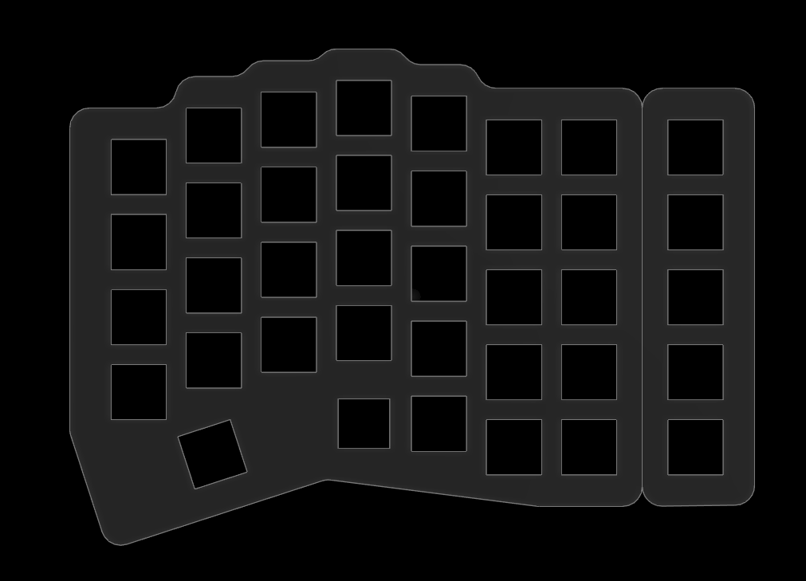

---

tldraw-file: true
tags: [tldraw]

---

^2f799393-ba0f-4c2c-92e0-b9eafabc626b


^ef028378-5072-4507-a140-7cffd0762bd9


```json !!!_START_OF_TLDRAW_DATA__DO_NOT_CHANGE_THIS_PHRASE_!!!
{
	"meta": {
		"uuid": "2c9cbe12-719c-4b96-a8eb-776b436588a2",
		"plugin-version": "1.15.0",
		"tldraw-version": "3.4.1"
	},
	"raw": {
		"tldrawFileFormatVersion": 1,
		"schema": {
			"schemaVersion": 2,
			"sequences": {
				"com.tldraw.store": 4,
				"com.tldraw.asset": 1,
				"com.tldraw.camera": 1,
				"com.tldraw.document": 2,
				"com.tldraw.instance": 25,
				"com.tldraw.instance_page_state": 5,
				"com.tldraw.page": 1,
				"com.tldraw.instance_presence": 5,
				"com.tldraw.pointer": 1,
				"com.tldraw.shape": 4,
				"com.tldraw.asset.bookmark": 2,
				"com.tldraw.asset.image": 5,
				"com.tldraw.asset.video": 5,
				"com.tldraw.shape.arrow": 5,
				"com.tldraw.shape.bookmark": 2,
				"com.tldraw.shape.draw": 2,
				"com.tldraw.shape.embed": 4,
				"com.tldraw.shape.frame": 0,
				"com.tldraw.shape.geo": 9,
				"com.tldraw.shape.group": 0,
				"com.tldraw.shape.highlight": 1,
				"com.tldraw.shape.image": 4,
				"com.tldraw.shape.line": 5,
				"com.tldraw.shape.note": 8,
				"com.tldraw.shape.text": 2,
				"com.tldraw.shape.video": 2,
				"com.tldraw.binding.arrow": 0
			}
		},
		"records": [
			{
				"gridSize": 10,
				"name": "",
				"meta": {},
				"id": "document:document",
				"typeName": "document"
			},
			{
				"meta": {},
				"id": "page:page",
				"name": "Page 1",
				"index": "a1",
				"typeName": "page"
			},
			{
				"id": "asset:-126259270",
				"type": "image",
				"typeName": "asset",
				"props": {
					"name": "tldrawFile",
					"src": "asset:obsidian.blockref.2f799393-ba0f-4c2c-92e0-b9eafabc626b",
					"w": 758,
					"h": 547,
					"fileSize": 38379,
					"mimeType": "image/png",
					"isAnimated": false
				},
				"meta": {}
			},
			{
				"x": 1169,
				"y": 367.0703125,
				"rotation": 0,
				"isLocked": true,
				"opacity": 1,
				"meta": {},
				"id": "shape:Erb0bnoIkB1er1DaEwD2X",
				"type": "image",
				"props": {
					"w": 758,
					"h": 547,
					"assetId": "asset:-126259270",
					"playing": true,
					"url": "",
					"crop": null,
					"flipX": false,
					"flipY": false
				},
				"parentId": "page:page",
				"index": "a1",
				"typeName": "shape"
			},
			{
				"x": 1290,
				"y": 510,
				"rotation": 0,
				"isLocked": false,
				"opacity": 1,
				"meta": {},
				"id": "shape:0fMKRqI4DAZ5fPhBFTiGR",
				"type": "text",
				"props": {
					"color": "black",
					"size": "m",
					"w": 17.765625,
					"text": "7",
					"font": "draw",
					"textAlign": "start",
					"autoSize": true,
					"scale": 1
				},
				"parentId": "page:page",
				"index": "a27Ub",
				"typeName": "shape"
			},
			{
				"x": 1359.624392256854,
				"y": 478.3907733092998,
				"rotation": 0,
				"isLocked": false,
				"opacity": 1,
				"meta": {},
				"id": "shape:GF6EQe7f4KZJUYy8Q0DKL",
				"type": "text",
				"props": {
					"color": "black",
					"size": "m",
					"w": 17.8125,
					"text": "8",
					"font": "draw",
					"textAlign": "start",
					"autoSize": true,
					"scale": 1
				},
				"parentId": "page:page",
				"index": "a354b",
				"typeName": "shape"
			},
			{
				"x": 1432.624392256854,
				"y": 462.3907733092998,
				"rotation": 0,
				"isLocked": false,
				"opacity": 1,
				"meta": {},
				"id": "shape:SajGpK6qYyMHFNree4Avi",
				"type": "text",
				"props": {
					"color": "black",
					"size": "m",
					"w": 17.8125,
					"text": "9",
					"font": "draw",
					"textAlign": "start",
					"autoSize": true,
					"scale": 1
				},
				"parentId": "page:page",
				"index": "a42CL",
				"typeName": "shape"
			},
			{
				"x": 1500,
				"y": 450,
				"rotation": 0,
				"isLocked": false,
				"opacity": 1,
				"meta": {},
				"id": "shape:8ShUdFnGkXx_g9WjzcHZl",
				"type": "text",
				"props": {
					"color": "black",
					"size": "m",
					"w": 17.5,
					"text": "0",
					"font": "draw",
					"textAlign": "start",
					"autoSize": true,
					"scale": 1
				},
				"parentId": "page:page",
				"index": "a5BOU",
				"typeName": "shape"
			},
			{
				"x": 1567.624392256854,
				"y": 466.3907733092998,
				"rotation": 0,
				"isLocked": false,
				"opacity": 1,
				"meta": {},
				"id": "shape:FlA9NzrZpLDT1q3AyMSPZ",
				"type": "text",
				"props": {
					"color": "black",
					"size": "m",
					"w": 31.21875,
					"text": "? /",
					"font": "draw",
					"textAlign": "start",
					"autoSize": true,
					"scale": 1
				},
				"parentId": "page:page",
				"index": "a64Fu",
				"typeName": "shape"
			},
			{
				"x": 1640,
				"y": 500,
				"rotation": 0,
				"isLocked": false,
				"opacity": 1,
				"meta": {},
				"id": "shape:h_0c0rSonQlrn2PfSGHpq",
				"type": "text",
				"props": {
					"color": "black",
					"size": "m",
					"w": 28.367781553524246,
					"text": "| \\",
					"font": "mono",
					"textAlign": "start",
					"autoSize": true,
					"scale": 0.6417596392455114
				},
				"parentId": "page:page",
				"index": "a72Qh",
				"typeName": "shape"
			},
			{
				"x": 1700,
				"y": 500,
				"rotation": 0,
				"isLocked": false,
				"opacity": 1,
				"meta": {},
				"id": "shape:FPQB5x713onApPdHUf2DV",
				"type": "text",
				"props": {
					"color": "black",
					"size": "m",
					"w": 40.523550506268066,
					"text": "back",
					"font": "mono",
					"textAlign": "start",
					"autoSize": true,
					"scale": 0.6914175506268079
				},
				"parentId": "page:page",
				"index": "a83vT",
				"typeName": "shape"
			},
			{
				"x": 1700,
				"y": 780,
				"rotation": 0,
				"isLocked": false,
				"opacity": 1,
				"meta": {},
				"id": "shape:IKHtOnsjap_Tcc7y7Ofnm",
				"type": "text",
				"props": {
					"color": "black",
					"size": "s",
					"w": 30.38599479296593,
					"text": "right",
					"font": "draw",
					"textAlign": "start",
					"autoSize": true,
					"scale": 1.1273716934325368
				},
				"parentId": "page:page",
				"index": "a93hq",
				"typeName": "shape"
			},
			{
				"x": 1640.624392256854,
				"y": 704.4454608092998,
				"rotation": 0,
				"isLocked": false,
				"opacity": 1,
				"meta": {},
				"id": "shape:RuloA6xbp1-nszd62E-5k",
				"type": "text",
				"props": {
					"color": "black",
					"size": "s",
					"w": 22.875,
					"text": "up",
					"font": "draw",
					"textAlign": "start",
					"autoSize": true,
					"scale": 1
				},
				"parentId": "page:page",
				"index": "aA1Jh",
				"typeName": "shape"
			},
			{
				"x": 1560,
				"y": 760,
				"rotation": 0,
				"isLocked": false,
				"opacity": 1,
				"meta": {},
				"id": "shape:DCIBEnbXRrh-COkO7Zwil",
				"type": "text",
				"props": {
					"color": "black",
					"size": "s",
					"w": 34.609375,
					"text": "left",
					"font": "draw",
					"textAlign": "start",
					"autoSize": true,
					"scale": 1
				},
				"parentId": "page:page",
				"index": "aB7Xx",
				"typeName": "shape"
			},
			{
				"x": 1630,
				"y": 780,
				"rotation": 0,
				"isLocked": false,
				"opacity": 1,
				"meta": {},
				"id": "shape:-SN4kiXHDgfjIT2W8oYsm",
				"type": "text",
				"props": {
					"color": "black",
					"size": "s",
					"w": 51.4375,
					"text": "down",
					"font": "draw",
					"textAlign": "start",
					"autoSize": true,
					"scale": 1
				},
				"parentId": "page:page",
				"index": "aC8Qq",
				"typeName": "shape"
			},
			{
				"x": 0,
				"y": 0,
				"lastActivityTimestamp": 0,
				"meta": {},
				"id": "pointer:pointer",
				"typeName": "pointer"
			},
			{
				"followingUserId": null,
				"opacityForNextShape": 1,
				"stylesForNextShape": {},
				"brush": null,
				"scribbles": [],
				"cursor": {
					"type": "default",
					"rotation": 0
				},
				"isFocusMode": false,
				"exportBackground": true,
				"isDebugMode": false,
				"isToolLocked": false,
				"screenBounds": {
					"x": 0,
					"y": 0,
					"w": 1080,
					"h": 720
				},
				"insets": [
					false,
					false,
					false,
					false
				],
				"zoomBrush": null,
				"isGridMode": false,
				"isPenMode": false,
				"chatMessage": "",
				"isChatting": false,
				"highlightedUserIds": [],
				"isFocused": false,
				"devicePixelRatio": 1,
				"isCoarsePointer": false,
				"isHoveringCanvas": null,
				"openMenus": [],
				"isChangingStyle": false,
				"isReadonly": false,
				"meta": {},
				"duplicateProps": null,
				"id": "instance:instance",
				"currentPageId": "page:page",
				"typeName": "instance"
			},
			{
				"editingShapeId": null,
				"croppingShapeId": null,
				"selectedShapeIds": [],
				"hoveredShapeId": null,
				"erasingShapeIds": [],
				"hintingShapeIds": [],
				"focusedGroupId": null,
				"meta": {},
				"id": "instance_page_state:page:page",
				"pageId": "page:page",
				"typeName": "instance_page_state"
			},
			{
				"x": 0,
				"y": 0,
				"z": 1,
				"meta": {},
				"id": "camera:page:page",
				"typeName": "camera"
			},
			{
				"x": 1170,
				"y": 370,
				"rotation": 0,
				"isLocked": true,
				"opacity": 1,
				"meta": {},
				"id": "shape:DD1gpwq2rb2Ej5lPjyc2p",
				"type": "image",
				"props": {
					"w": 758,
					"h": 547,
					"assetId": "asset:-126259270",
					"playing": true,
					"url": "",
					"crop": null,
					"flipX": false,
					"flipY": false
				},
				"parentId": "page:page",
				"index": "a08WX",
				"typeName": "shape"
			},
			{
				"x": 1280,
				"y": 720,
				"rotation": 0,
				"isLocked": false,
				"opacity": 1,
				"meta": {},
				"id": "shape:TpkL7Cy7LVXxxTp2AwTiH",
				"type": "text",
				"props": {
					"color": "black",
					"size": "m",
					"w": 40.296875,
					"text": "del",
					"font": "draw",
					"textAlign": "start",
					"autoSize": true,
					"scale": 1
				},
				"parentId": "page:page",
				"index": "aD0pt",
				"typeName": "shape"
			},
			{
				"x": 1700,
				"y": 710,
				"rotation": 0,
				"isLocked": false,
				"opacity": 1,
				"meta": {},
				"id": "shape:arNdWlP7Ha8_-moWouPSi",
				"type": "text",
				"props": {
					"color": "black",
					"size": "m",
					"w": 58.65625,
					"text": "shift",
					"font": "draw",
					"textAlign": "start",
					"autoSize": true,
					"scale": 0.7486948697544921
				},
				"parentId": "page:page",
				"index": "aE80m",
				"typeName": "shape"
			},
			{
				"x": 1700,
				"y": 640,
				"rotation": 0,
				"isLocked": false,
				"opacity": 1,
				"meta": {},
				"id": "shape:Jx_mFUrgkectKd8ZVmWDu",
				"type": "text",
				"props": {
					"color": "black",
					"size": "m",
					"w": 69.046875,
					"text": "enter",
					"font": "draw",
					"textAlign": "start",
					"autoSize": true,
					"scale": 0.6437573933786025
				},
				"parentId": "page:page",
				"index": "aFCJ8",
				"typeName": "shape"
			},
			{
				"x": 1710,
				"y": 560,
				"rotation": 0,
				"isLocked": false,
				"opacity": 1,
				"meta": {},
				"id": "shape:lOIuWMWEadEo6d-uk4NGw",
				"type": "text",
				"props": {
					"color": "black",
					"size": "m",
					"w": 23.5625,
					"text": "' \"",
					"font": "sans",
					"textAlign": "start",
					"autoSize": true,
					"scale": 1
				},
				"parentId": "page:page",
				"index": "aG3Zt",
				"typeName": "shape"
			},
			{
				"x": 1641.949295774648,
				"y": 564.351903609155,
				"rotation": 0,
				"isLocked": false,
				"opacity": 1,
				"meta": {},
				"id": "shape:GXy1IC75R9bO8ddZ9NC8q",
				"type": "text",
				"props": {
					"color": "black",
					"size": "m",
					"w": 16.0625,
					"text": "P",
					"font": "sans",
					"textAlign": "start",
					"autoSize": true,
					"scale": 1
				},
				"parentId": "page:page",
				"index": "aHBk3",
				"typeName": "shape"
			},
			{
				"x": 1630,
				"y": 630,
				"rotation": 0,
				"isLocked": false,
				"opacity": 1,
				"meta": {},
				"id": "shape:KLQ2Xi_kkfQ2rvX95rG8v",
				"type": "text",
				"props": {
					"color": "black",
					"size": "m",
					"w": 44.203125,
					"text": "; :",
					"font": "mono",
					"textAlign": "start",
					"autoSize": true,
					"scale": 1
				},
				"parentId": "page:page",
				"index": "aI1gv",
				"typeName": "shape"
			},
			{
				"x": 1560,
				"y": 680,
				"rotation": 0,
				"isLocked": false,
				"opacity": 1,
				"meta": {},
				"id": "shape:MITgTQG0oH2EWBoNdR9Tw",
				"type": "text",
				"props": {
					"color": "black",
					"size": "m",
					"w": 44.203125,
					"text": ". >",
					"font": "mono",
					"textAlign": "start",
					"autoSize": true,
					"scale": 1
				},
				"parentId": "page:page",
				"index": "aJ5bP",
				"typeName": "shape"
			},
			{
				"x": 1490,
				"y": 670,
				"rotation": 0,
				"isLocked": false,
				"opacity": 1,
				"meta": {},
				"id": "shape:ERs6jhUKTcSh7WfRCYbJW",
				"type": "text",
				"props": {
					"color": "black",
					"size": "m",
					"w": 44.203125,
					"text": "< ,",
					"font": "mono",
					"textAlign": "start",
					"autoSize": true,
					"scale": 1
				},
				"parentId": "page:page",
				"index": "aK0Wa",
				"typeName": "shape"
			},
			{
				"x": 1280,
				"y": 580,
				"rotation": 0,
				"isLocked": false,
				"opacity": 1,
				"meta": {},
				"id": "shape:wjgwhHH1AELP2iM0DJFiZ",
				"type": "text",
				"props": {
					"color": "black",
					"size": "m",
					"w": 44.203125,
					"text": "] }",
					"font": "mono",
					"textAlign": "start",
					"autoSize": true,
					"scale": 1
				},
				"parentId": "page:page",
				"index": "aM4Hn",
				"typeName": "shape"
			},
			{
				"x": 1278.9633802816902,
				"y": 656.1659881161972,
				"rotation": 0,
				"isLocked": false,
				"opacity": 1,
				"meta": {},
				"id": "shape:lK7ANDT-4rILs7tip4SS4",
				"type": "text",
				"props": {
					"color": "black",
					"size": "m",
					"w": 44.203125,
					"text": "+ =",
					"font": "mono",
					"textAlign": "start",
					"autoSize": true,
					"scale": 1
				},
				"parentId": "page:page",
				"index": "aN2qf",
				"typeName": "shape"
			},
			{
				"x": 1356.3647887323946,
				"y": 692.4645796654929,
				"rotation": 0,
				"isLocked": false,
				"opacity": 1,
				"meta": {},
				"id": "shape:DWedlpJPB15Eopcqf0fU6",
				"type": "text",
				"props": {
					"color": "black",
					"size": "m",
					"w": 16,
					"text": "N",
					"font": "mono",
					"textAlign": "start",
					"autoSize": true,
					"scale": 1
				},
				"parentId": "page:page",
				"index": "aO1A8",
				"typeName": "shape"
			},
			{
				"x": 1431.630985915493,
				"y": 677.5181007922536,
				"rotation": 0,
				"isLocked": false,
				"opacity": 1,
				"meta": {},
				"id": "shape:1aP-WDfo4tK5uY6sYc-mT",
				"type": "text",
				"props": {
					"color": "black",
					"size": "m",
					"w": 16,
					"text": "M",
					"font": "mono",
					"textAlign": "start",
					"autoSize": true,
					"scale": 1
				},
				"parentId": "page:page",
				"index": "aP5ob",
				"typeName": "shape"
			},
			{
				"x": 1504.2281690140846,
				"y": 596.3800726232394,
				"rotation": 0,
				"isLocked": false,
				"opacity": 1,
				"meta": {},
				"id": "shape:gRlaqdEiduftQQ5o_gJUU",
				"type": "text",
				"props": {
					"color": "black",
					"size": "m",
					"w": 16,
					"text": "K",
					"font": "mono",
					"textAlign": "start",
					"autoSize": true,
					"scale": 1
				},
				"parentId": "page:page",
				"index": "aQ6ZY",
				"typeName": "shape"
			},
			{
				"x": 1470,
				"y": 750,
				"rotation": 0,
				"isLocked": false,
				"opacity": 1,
				"meta": {},
				"id": "shape:TwRvBKWh9eSauWw1UvPDB",
				"type": "text",
				"props": {
					"color": "black",
					"size": "m",
					"w": 100.5203119628843,
					"text": "Rotate sth idk",
					"font": "mono",
					"textAlign": "start",
					"autoSize": false,
					"scale": 0.6963766688850552
				},
				"parentId": "page:page",
				"index": "aR3vy",
				"typeName": "shape"
			},
			{
				"x": 1340,
				"y": 780,
				"rotation": 0,
				"isLocked": false,
				"opacity": 1,
				"meta": {},
				"id": "shape:1Cq_xmE14Ewitgkbkf2lG",
				"type": "text",
				"props": {
					"color": "black",
					"size": "m",
					"w": 73,
					"text": "space",
					"font": "mono",
					"textAlign": "start",
					"autoSize": true,
					"scale": 1
				},
				"parentId": "page:page",
				"index": "aS1CG",
				"typeName": "shape"
			},
			{
				"x": 1572.0211267605634,
				"y": 612.3941571302817,
				"rotation": 0,
				"isLocked": false,
				"opacity": 1,
				"meta": {},
				"id": "shape:IQ74Spg2a9U0Sb71ClyBy",
				"type": "text",
				"props": {
					"color": "black",
					"size": "m",
					"w": 16,
					"text": "L",
					"font": "mono",
					"textAlign": "start",
					"autoSize": true,
					"scale": 1
				},
				"parentId": "page:page",
				"index": "aT6mj",
				"typeName": "shape"
			},
			{
				"x": 1423.623943661972,
				"y": 603.8533120598591,
				"rotation": 0,
				"isLocked": false,
				"opacity": 1,
				"meta": {},
				"id": "shape:BGzbI834XnftoScqxOZZH",
				"type": "text",
				"props": {
					"color": "black",
					"size": "m",
					"w": 16,
					"text": "J",
					"font": "mono",
					"textAlign": "start",
					"autoSize": true,
					"scale": 1
				},
				"parentId": "page:page",
				"index": "aUBne",
				"typeName": "shape"
			},
			{
				"x": 1361.1690140845071,
				"y": 620.4011993838028,
				"rotation": 0,
				"isLocked": false,
				"opacity": 1,
				"meta": {},
				"id": "shape:YmyGGZbGVrXHBv07P7NI9",
				"type": "text",
				"props": {
					"color": "black",
					"size": "m",
					"w": 16,
					"text": "H",
					"font": "mono",
					"textAlign": "start",
					"autoSize": true,
					"scale": 1
				},
				"parentId": "page:page",
				"index": "aV3UR",
				"typeName": "shape"
			},
			{
				"x": 1361.1690140845071,
				"y": 553.6758472711267,
				"rotation": 0,
				"isLocked": false,
				"opacity": 1,
				"meta": {},
				"id": "shape:heyUQ90I2sWaTSm12bfEK",
				"type": "text",
				"props": {
					"color": "black",
					"size": "m",
					"w": 16,
					"text": "Y",
					"font": "mono",
					"textAlign": "start",
					"autoSize": true,
					"scale": 1
				},
				"parentId": "page:page",
				"index": "aW29Z",
				"typeName": "shape"
			},
			{
				"x": 1429.4957746478874,
				"y": 536.0603543133802,
				"rotation": 0,
				"isLocked": false,
				"opacity": 1,
				"meta": {},
				"id": "shape:GX9mfiVTUVh1l3YezW2zE",
				"type": "text",
				"props": {
					"color": "black",
					"size": "m",
					"w": 16,
					"text": "U",
					"font": "mono",
					"textAlign": "start",
					"autoSize": true,
					"scale": 1
				},
				"parentId": "page:page",
				"index": "aX6IH",
				"typeName": "shape"
			},
			{
				"x": 1500,
				"y": 530,
				"rotation": 0,
				"isLocked": false,
				"opacity": 1,
				"meta": {},
				"id": "shape:yhnSv3UjTUNxOtZ3hdvyK",
				"type": "text",
				"props": {
					"color": "black",
					"size": "m",
					"w": 16,
					"text": "I",
					"font": "mono",
					"textAlign": "start",
					"autoSize": true,
					"scale": 1
				},
				"parentId": "page:page",
				"index": "aY1dt",
				"typeName": "shape"
			},
			{
				"x": 1577.892957746479,
				"y": 540.864579665493,
				"rotation": 0,
				"isLocked": false,
				"opacity": 1,
				"meta": {},
				"id": "shape:n4a2NtXDaiIIj4ueX9C30",
				"type": "text",
				"props": {
					"color": "black",
					"size": "m",
					"w": 16,
					"text": "O",
					"font": "mono",
					"textAlign": "start",
					"autoSize": true,
					"scale": 1
				},
				"parentId": "page:page",
				"index": "aZ72o",
				"typeName": "shape"
			},
			{
				"x": 1805.3382752543303,
				"y": 460.09848922040675,
				"rotation": 0,
				"isLocked": false,
				"opacity": 1,
				"meta": {},
				"id": "shape:P6y_j5SZWlg-xZgpvZ9ES",
				"type": "draw",
				"props": {
					"segments": [
						{
							"type": "free",
							"points": [
								{
									"x": 0,
									"y": 0,
									"z": 0.5
								},
								{
									"x": 0,
									"y": 3.25,
									"z": 0.5
								},
								{
									"x": 0,
									"y": 5.7,
									"z": 0.5
								},
								{
									"x": 0.81,
									"y": 8.95,
									"z": 0.5
								},
								{
									"x": 0.81,
									"y": 12.2,
									"z": 0.5
								},
								{
									"x": 1.63,
									"y": 17.09,
									"z": 0.5
								},
								{
									"x": 2.44,
									"y": 21.15,
									"z": 0.5
								},
								{
									"x": 3.25,
									"y": 27.66,
									"z": 0.5
								},
								{
									"x": 4.88,
									"y": 32.54,
									"z": 0.5
								},
								{
									"x": 5.7,
									"y": 39.87,
									"z": 0.5
								},
								{
									"x": 7.32,
									"y": 45.56,
									"z": 0.5
								},
								{
									"x": 8.95,
									"y": 52.88,
									"z": 0.5
								},
								{
									"x": 10.58,
									"y": 60.21,
									"z": 0.5
								},
								{
									"x": 12.2,
									"y": 66.72,
									"z": 0.5
								},
								{
									"x": 15.46,
									"y": 77.29,
									"z": 0.5
								},
								{
									"x": 17.9,
									"y": 85.43,
									"z": 0.5
								},
								{
									"x": 21.97,
									"y": 96.82,
									"z": 0.5
								},
								{
									"x": 26.04,
									"y": 104.95,
									"z": 0.5
								},
								{
									"x": 29.29,
									"y": 115.53,
									"z": 0.5
								},
								{
									"x": 31.73,
									"y": 122.85,
									"z": 0.5
								},
								{
									"x": 34.98,
									"y": 131.8,
									"z": 0.5
								},
								{
									"x": 36.61,
									"y": 138.31,
									"z": 0.5
								},
								{
									"x": 39.05,
									"y": 145.63,
									"z": 0.5
								},
								{
									"x": 40.68,
									"y": 150.52,
									"z": 0.5
								},
								{
									"x": 42.31,
									"y": 156.21,
									"z": 0.5
								},
								{
									"x": 43.93,
									"y": 161.09,
									"z": 0.5
								},
								{
									"x": 45.56,
									"y": 167.6,
									"z": 0.5
								},
								{
									"x": 48,
									"y": 172.48,
									"z": 0.5
								},
								{
									"x": 50.44,
									"y": 179.81,
									"z": 0.5
								},
								{
									"x": 52.88,
									"y": 186.31,
									"z": 0.5
								},
								{
									"x": 55.32,
									"y": 192.01,
									"z": 0.5
								},
								{
									"x": 57.77,
									"y": 200.15,
									"z": 0.5
								},
								{
									"x": 60.21,
									"y": 205.84,
									"z": 0.5
								},
								{
									"x": 61.83,
									"y": 212.35,
									"z": 0.5
								},
								{
									"x": 64.27,
									"y": 216.42,
									"z": 0.5
								},
								{
									"x": 66.72,
									"y": 222.93,
									"z": 0.5
								},
								{
									"x": 67.53,
									"y": 226.99,
									"z": 0.5
								},
								{
									"x": 68.34,
									"y": 231.88,
									"z": 0.5
								},
								{
									"x": 72.41,
									"y": 244.08,
									"z": 0.5
								},
								{
									"x": 73.22,
									"y": 245.71,
									"z": 0.5
								},
								{
									"x": 73.22,
									"y": 247.33,
									"z": 0.5
								},
								{
									"x": 74.04,
									"y": 250.59,
									"z": 0.5
								},
								{
									"x": 74.04,
									"y": 253.03,
									"z": 0.5
								},
								{
									"x": 74.04,
									"y": 257.1,
									"z": 0.5
								},
								{
									"x": 74.85,
									"y": 259.54,
									"z": 0.5
								},
								{
									"x": 74.85,
									"y": 263.61,
									"z": 0.5
								},
								{
									"x": 75.66,
									"y": 266.86,
									"z": 0.5
								},
								{
									"x": 75.66,
									"y": 269.3,
									"z": 0.5
								},
								{
									"x": 75.66,
									"y": 273.37,
									"z": 0.5
								},
								{
									"x": 75.66,
									"y": 276.62,
									"z": 0.5
								},
								{
									"x": 76.48,
									"y": 279.06,
									"z": 0.5
								},
								{
									"x": 76.48,
									"y": 281.51,
									"z": 0.5
								},
								{
									"x": 76.48,
									"y": 283.95,
									"z": 0.5
								},
								{
									"x": 76.48,
									"y": 285.57,
									"z": 0.5
								},
								{
									"x": 76.48,
									"y": 287.2,
									"z": 0.5
								},
								{
									"x": 76.48,
									"y": 288.83,
									"z": 0.5
								},
								{
									"x": 76.48,
									"y": 290.46,
									"z": 0.5
								},
								{
									"x": 77.29,
									"y": 292.08,
									"z": 0.5
								},
								{
									"x": 77.29,
									"y": 293.71,
									"z": 0.5
								},
								{
									"x": 77.29,
									"y": 295.34,
									"z": 0.5
								},
								{
									"x": 78.11,
									"y": 296.15,
									"z": 0.5
								},
								{
									"x": 78.11,
									"y": 297.78,
									"z": 0.5
								},
								{
									"x": 78.11,
									"y": 298.59,
									"z": 0.5
								},
								{
									"x": 78.11,
									"y": 299.4,
									"z": 0.5
								},
								{
									"x": 78.11,
									"y": 301.03,
									"z": 0.5
								},
								{
									"x": 78.11,
									"y": 301.85,
									"z": 0.5
								},
								{
									"x": 78.11,
									"y": 302.66,
									"z": 0.5
								},
								{
									"x": 78.11,
									"y": 304.29,
									"z": 0.5
								},
								{
									"x": 78.11,
									"y": 305.1,
									"z": 0.5
								},
								{
									"x": 78.11,
									"y": 305.91,
									"z": 0.5
								},
								{
									"x": 78.11,
									"y": 308.35,
									"z": 0.5
								},
								{
									"x": 78.11,
									"y": 310.8,
									"z": 0.5
								},
								{
									"x": 78.11,
									"y": 312.42,
									"z": 0.5
								},
								{
									"x": 78.11,
									"y": 314.05,
									"z": 0.5
								},
								{
									"x": 78.11,
									"y": 316.49,
									"z": 0.5
								},
								{
									"x": 78.11,
									"y": 318.93,
									"z": 0.5
								},
								{
									"x": 77.29,
									"y": 321.37,
									"z": 0.5
								},
								{
									"x": 77.29,
									"y": 323.81,
									"z": 0.5
								},
								{
									"x": 76.48,
									"y": 327.07,
									"z": 0.5
								},
								{
									"x": 76.48,
									"y": 329.51,
									"z": 0.5
								},
								{
									"x": 75.66,
									"y": 332.76,
									"z": 0.5
								},
								{
									"x": 75.66,
									"y": 334.39,
									"z": 0.5
								},
								{
									"x": 75.66,
									"y": 336.02,
									"z": 0.5
								},
								{
									"x": 75.66,
									"y": 338.46,
									"z": 0.5
								},
								{
									"x": 75.66,
									"y": 339.27,
									"z": 0.5
								},
								{
									"x": 75.66,
									"y": 341.71,
									"z": 0.5
								},
								{
									"x": 75.66,
									"y": 342.53,
									"z": 0.5
								},
								{
									"x": 75.66,
									"y": 343.34,
									"z": 0.5
								},
								{
									"x": 75.66,
									"y": 344.15,
									"z": 0.5
								},
								{
									"x": 74.85,
									"y": 344.15,
									"z": 0.5
								},
								{
									"x": 74.04,
									"y": 344.15,
									"z": 0.5
								}
							]
						}
					],
					"color": "red",
					"fill": "none",
					"dash": "draw",
					"size": "m",
					"isComplete": true,
					"isClosed": false,
					"isPen": false,
					"scale": 1
				},
				"parentId": "page:page",
				"index": "aa5ir",
				"typeName": "shape"
			},
			{
				"x": 1817.5422719827575,
				"y": 827.8455906370149,
				"rotation": 0,
				"isLocked": false,
				"opacity": 1,
				"meta": {},
				"id": "shape:qWVG9bUw-POVIjyPNFMBo",
				"type": "draw",
				"props": {
					"segments": [
						{
							"type": "free",
							"points": [
								{
									"x": 0,
									"y": 0,
									"z": 0.5
								},
								{
									"x": -0.81,
									"y": 0,
									"z": 0.5
								},
								{
									"x": -1.63,
									"y": 0,
									"z": 0.5
								},
								{
									"x": -2.44,
									"y": 0,
									"z": 0.5
								},
								{
									"x": -3.25,
									"y": -0.81,
									"z": 0.5
								},
								{
									"x": -3.25,
									"y": -1.63,
									"z": 0.5
								},
								{
									"x": -4.07,
									"y": -3.25,
									"z": 0.5
								},
								{
									"x": -4.88,
									"y": -4.88,
									"z": 0.5
								},
								{
									"x": -4.88,
									"y": -8.14,
									"z": 0.5
								},
								{
									"x": -5.7,
									"y": -11.39,
									"z": 0.5
								},
								{
									"x": -5.7,
									"y": -17.9,
									"z": 0.5
								},
								{
									"x": -5.7,
									"y": -24.41,
									"z": 0.5
								},
								{
									"x": -4.88,
									"y": -34.98,
									"z": 0.5
								},
								{
									"x": -3.25,
									"y": -43.12,
									"z": 0.5
								},
								{
									"x": -0.81,
									"y": -56.14,
									"z": 0.5
								},
								{
									"x": 0,
									"y": -64.27,
									"z": 0.5
								},
								{
									"x": 2.44,
									"y": -75.66,
									"z": 0.5
								},
								{
									"x": 4.07,
									"y": -84.61,
									"z": 0.5
								},
								{
									"x": 6.51,
									"y": -96.82,
									"z": 0.5
								},
								{
									"x": 8.95,
									"y": -106.58,
									"z": 0.5
								},
								{
									"x": 10.58,
									"y": -114.72,
									"z": 0.5
								},
								{
									"x": 13.02,
									"y": -126.92,
									"z": 0.5
								},
								{
									"x": 15.46,
									"y": -135.87,
									"z": 0.5
								},
								{
									"x": 17.9,
									"y": -144.82,
									"z": 0.5
								},
								{
									"x": 19.53,
									"y": -152.96,
									"z": 0.5
								},
								{
									"x": 21.97,
									"y": -161.09,
									"z": 0.5
								},
								{
									"x": 24.41,
									"y": -167.6,
									"z": 0.5
								},
								{
									"x": 26.85,
									"y": -174.92,
									"z": 0.5
								},
								{
									"x": 28.48,
									"y": -179.81,
									"z": 0.5
								},
								{
									"x": 30.92,
									"y": -185.5,
									"z": 0.5
								},
								{
									"x": 31.73,
									"y": -189.57,
									"z": 0.5
								},
								{
									"x": 33.36,
									"y": -194.45,
									"z": 0.5
								},
								{
									"x": 34.17,
									"y": -199.33,
									"z": 0.5
								},
								{
									"x": 35.8,
									"y": -203.4,
									"z": 0.5
								},
								{
									"x": 35.8,
									"y": -206.65,
									"z": 0.5
								},
								{
									"x": 36.61,
									"y": -210.72,
									"z": 0.5
								},
								{
									"x": 37.43,
									"y": -213.16,
									"z": 0.5
								},
								{
									"x": 37.43,
									"y": -216.42,
									"z": 0.5
								},
								{
									"x": 37.43,
									"y": -220.49,
									"z": 0.5
								},
								{
									"x": 38.24,
									"y": -222.93,
									"z": 0.5
								},
								{
									"x": 38.24,
									"y": -225.37,
									"z": 0.5
								},
								{
									"x": 39.05,
									"y": -227.81,
									"z": 0.5
								},
								{
									"x": 39.05,
									"y": -230.25,
									"z": 0.5
								},
								{
									"x": 39.05,
									"y": -231.88,
									"z": 0.5
								},
								{
									"x": 39.05,
									"y": -235.94,
									"z": 0.5
								},
								{
									"x": 39.05,
									"y": -237.57,
									"z": 0.5
								},
								{
									"x": 39.05,
									"y": -240.83,
									"z": 0.5
								},
								{
									"x": 39.05,
									"y": -243.27,
									"z": 0.5
								},
								{
									"x": 39.05,
									"y": -246.52,
									"z": 0.5
								},
								{
									"x": 39.05,
									"y": -249.78,
									"z": 0.5
								},
								{
									"x": 39.05,
									"y": -253.03,
									"z": 0.5
								},
								{
									"x": 39.05,
									"y": -256.28,
									"z": 0.5
								},
								{
									"x": 39.05,
									"y": -259.54,
									"z": 0.5
								},
								{
									"x": 39.05,
									"y": -262.79,
									"z": 0.5
								},
								{
									"x": 39.05,
									"y": -266.86,
									"z": 0.5
								},
								{
									"x": 39.05,
									"y": -269.3,
									"z": 0.5
								},
								{
									"x": 39.05,
									"y": -272.56,
									"z": 0.5
								},
								{
									"x": 39.05,
									"y": -276.62,
									"z": 0.5
								},
								{
									"x": 39.05,
									"y": -279.88,
									"z": 0.5
								},
								{
									"x": 39.05,
									"y": -284.76,
									"z": 0.5
								},
								{
									"x": 39.05,
									"y": -288.01,
									"z": 0.5
								},
								{
									"x": 39.05,
									"y": -293.71,
									"z": 0.5
								},
								{
									"x": 39.05,
									"y": -297.78,
									"z": 0.5
								},
								{
									"x": 39.05,
									"y": -302.66,
									"z": 0.5
								},
								{
									"x": 39.05,
									"y": -306.73,
									"z": 0.5
								},
								{
									"x": 39.87,
									"y": -310.8,
									"z": 0.5
								},
								{
									"x": 39.87,
									"y": -314.05,
									"z": 0.5
								},
								{
									"x": 40.68,
									"y": -318.12,
									"z": 0.5
								},
								{
									"x": 40.68,
									"y": -320.56,
									"z": 0.5
								},
								{
									"x": 40.68,
									"y": -323.81,
									"z": 0.5
								},
								{
									"x": 41.49,
									"y": -325.44,
									"z": 0.5
								},
								{
									"x": 41.49,
									"y": -327.88,
									"z": 0.5
								},
								{
									"x": 41.49,
									"y": -330.32,
									"z": 0.5
								},
								{
									"x": 41.49,
									"y": -331.95,
									"z": 0.5
								},
								{
									"x": 41.49,
									"y": -333.58,
									"z": 0.5
								},
								{
									"x": 41.49,
									"y": -335.2,
									"z": 0.5
								},
								{
									"x": 41.49,
									"y": -336.83,
									"z": 0.5
								},
								{
									"x": 41.49,
									"y": -338.46,
									"z": 0.5
								},
								{
									"x": 41.49,
									"y": -340.08,
									"z": 0.5
								},
								{
									"x": 41.49,
									"y": -340.9,
									"z": 0.5
								},
								{
									"x": 41.49,
									"y": -342.53,
									"z": 0.5
								},
								{
									"x": 41.49,
									"y": -344.15,
									"z": 0.5
								},
								{
									"x": 41.49,
									"y": -345.78,
									"z": 0.5
								},
								{
									"x": 41.49,
									"y": -346.59,
									"z": 0.5
								},
								{
									"x": 41.49,
									"y": -348.22,
									"z": 0.5
								},
								{
									"x": 41.49,
									"y": -349.03,
									"z": 0.5
								},
								{
									"x": 41.49,
									"y": -350.66,
									"z": 0.5
								},
								{
									"x": 41.49,
									"y": -352.29,
									"z": 0.5
								},
								{
									"x": 42.31,
									"y": -353.92,
									"z": 0.5
								},
								{
									"x": 42.31,
									"y": -354.73,
									"z": 0.5
								},
								{
									"x": 42.31,
									"y": -355.54,
									"z": 0.5
								},
								{
									"x": 42.31,
									"y": -357.17,
									"z": 0.5
								},
								{
									"x": 42.31,
									"y": -357.98,
									"z": 0.5
								}
							]
						}
					],
					"color": "red",
					"fill": "none",
					"dash": "draw",
					"size": "m",
					"isComplete": true,
					"isClosed": false,
					"isPen": false,
					"scale": 1
				},
				"parentId": "page:page",
				"index": "ab7St",
				"typeName": "shape"
			},
			{
				"x": 1903.7838488636435,
				"y": 543.085666973712,
				"rotation": 0,
				"isLocked": false,
				"opacity": 1,
				"meta": {},
				"id": "shape:SvWlWcINPIaMPQ3Yvk7jk",
				"type": "draw",
				"props": {
					"segments": [
						{
							"type": "free",
							"points": [
								{
									"x": 0,
									"y": 0,
									"z": 0.5
								},
								{
									"x": 0.81,
									"y": 1.63,
									"z": 0.5
								},
								{
									"x": 1.63,
									"y": 1.63,
									"z": 0.5
								},
								{
									"x": 2.44,
									"y": 3.25,
									"z": 0.5
								},
								{
									"x": 3.25,
									"y": 3.25,
									"z": 0.5
								},
								{
									"x": 3.25,
									"y": 4.88,
									"z": 0.5
								},
								{
									"x": 3.25,
									"y": 5.7,
									"z": 0.5
								},
								{
									"x": 4.07,
									"y": 6.51,
									"z": 0.5
								},
								{
									"x": 4.07,
									"y": 7.32,
									"z": 0.5
								},
								{
									"x": 4.07,
									"y": 8.95,
									"z": 0.5
								},
								{
									"x": 4.07,
									"y": 10.58,
									"z": 0.5
								},
								{
									"x": 4.07,
									"y": 11.39,
									"z": 0.5
								},
								{
									"x": 4.07,
									"y": 13.83,
									"z": 0.5
								},
								{
									"x": 4.07,
									"y": 15.46,
									"z": 0.5
								},
								{
									"x": 4.07,
									"y": 17.09,
									"z": 0.5
								},
								{
									"x": 4.07,
									"y": 18.71,
									"z": 0.5
								},
								{
									"x": 4.07,
									"y": 20.34,
									"z": 0.5
								},
								{
									"x": 4.07,
									"y": 21.15,
									"z": 0.5
								},
								{
									"x": 4.07,
									"y": 23.59,
									"z": 0.5
								},
								{
									"x": 3.25,
									"y": 25.22,
									"z": 0.5
								},
								{
									"x": 2.44,
									"y": 27.66,
									"z": 0.5
								},
								{
									"x": 1.63,
									"y": 29.29,
									"z": 0.5
								},
								{
									"x": 0.81,
									"y": 31.73,
									"z": 0.5
								},
								{
									"x": 0.81,
									"y": 33.36,
									"z": 0.5
								},
								{
									"x": 0,
									"y": 34.98,
									"z": 0.5
								},
								{
									"x": 0,
									"y": 36.61,
									"z": 0.5
								},
								{
									"x": 0,
									"y": 38.24,
									"z": 0.5
								},
								{
									"x": 0,
									"y": 39.87,
									"z": 0.5
								},
								{
									"x": 0,
									"y": 40.68,
									"z": 0.5
								},
								{
									"x": 0,
									"y": 42.31,
									"z": 0.5
								},
								{
									"x": 0,
									"y": 43.12,
									"z": 0.5
								},
								{
									"x": 0.81,
									"y": 44.75,
									"z": 0.5
								},
								{
									"x": 0.81,
									"y": 45.56,
									"z": 0.5
								},
								{
									"x": 0.81,
									"y": 46.38,
									"z": 0.5
								},
								{
									"x": 1.63,
									"y": 47.19,
									"z": 0.5
								},
								{
									"x": 2.44,
									"y": 48,
									"z": 0.5
								},
								{
									"x": 3.25,
									"y": 48.82,
									"z": 0.5
								},
								{
									"x": 3.25,
									"y": 50.44,
									"z": 0.5
								},
								{
									"x": 4.07,
									"y": 51.26,
									"z": 0.5
								},
								{
									"x": 4.07,
									"y": 52.07,
									"z": 0.5
								},
								{
									"x": 4.88,
									"y": 52.88,
									"z": 0.5
								},
								{
									"x": 4.88,
									"y": 53.7,
									"z": 0.5
								}
							]
						}
					],
					"color": "red",
					"fill": "none",
					"dash": "draw",
					"size": "m",
					"isComplete": true,
					"isClosed": false,
					"isPen": false,
					"scale": 1
				},
				"parentId": "page:page",
				"index": "acByF",
				"typeName": "shape"
			},
			{
				"x": 1904.5974486455389,
				"y": 630.9544434183883,
				"rotation": 0,
				"isLocked": false,
				"opacity": 1,
				"meta": {},
				"id": "shape:2XNk-nfYoMe6Mmyq_4AN6",
				"type": "draw",
				"props": {
					"segments": [
						{
							"type": "free",
							"points": [
								{
									"x": 0,
									"y": 0,
									"z": 0.5
								},
								{
									"x": 0,
									"y": 0.81,
									"z": 0.5
								},
								{
									"x": 0,
									"y": 1.63,
									"z": 0.5
								},
								{
									"x": 0.81,
									"y": 1.63,
									"z": 0.5
								},
								{
									"x": 1.63,
									"y": 2.44,
									"z": 0.5
								},
								{
									"x": 2.44,
									"y": 2.44,
									"z": 0.5
								},
								{
									"x": 4.07,
									"y": 3.25,
									"z": 0.5
								},
								{
									"x": 4.88,
									"y": 3.25,
									"z": 0.5
								},
								{
									"x": 5.7,
									"y": 3.25,
									"z": 0.5
								},
								{
									"x": 7.32,
									"y": 3.25,
									"z": 0.5
								},
								{
									"x": 8.14,
									"y": 3.25,
									"z": 0.5
								},
								{
									"x": 8.95,
									"y": 3.25,
									"z": 0.5
								},
								{
									"x": 9.76,
									"y": 3.25,
									"z": 0.5
								},
								{
									"x": 10.58,
									"y": 3.25,
									"z": 0.5
								},
								{
									"x": 11.39,
									"y": 2.44,
									"z": 0.5
								},
								{
									"x": 11.39,
									"y": 1.63,
									"z": 0.5
								},
								{
									"x": 11.39,
									"y": 0.81,
									"z": 0.5
								},
								{
									"x": 11.39,
									"y": 0,
									"z": 0.5
								},
								{
									"x": 11.39,
									"y": -0.81,
									"z": 0.5
								},
								{
									"x": 11.39,
									"y": -1.63,
									"z": 0.5
								},
								{
									"x": 11.39,
									"y": -2.44,
									"z": 0.5
								},
								{
									"x": 11.39,
									"y": -3.25,
									"z": 0.5
								},
								{
									"x": 11.39,
									"y": -4.07,
									"z": 0.5
								},
								{
									"x": 10.58,
									"y": -4.07,
									"z": 0.5
								},
								{
									"x": 9.76,
									"y": -4.88,
									"z": 0.5
								},
								{
									"x": 9.76,
									"y": -4.07,
									"z": 0.5
								},
								{
									"x": 9.76,
									"y": -3.25,
									"z": 0.5
								},
								{
									"x": 10.58,
									"y": -3.25,
									"z": 0.5
								},
								{
									"x": 10.58,
									"y": -2.44,
									"z": 0.5
								},
								{
									"x": 10.58,
									"y": -1.63,
									"z": 0.5
								}
							]
						}
					],
					"color": "red",
					"fill": "none",
					"dash": "draw",
					"size": "m",
					"isComplete": true,
					"isClosed": false,
					"isPen": false,
					"scale": 1
				},
				"parentId": "page:page",
				"index": "ad9Ks",
				"typeName": "shape"
			},
			{
				"x": 1883.4438543162646,
				"y": 560.9848621754054,
				"rotation": 0,
				"isLocked": false,
				"opacity": 1,
				"meta": {},
				"id": "shape:60kIrk3_r9jykeJo-omcO",
				"type": "draw",
				"props": {
					"segments": [
						{
							"type": "free",
							"points": [
								{
									"x": 0,
									"y": 0,
									"z": 0.5
								},
								{
									"x": 0,
									"y": -0.81,
									"z": 0.5
								},
								{
									"x": 0,
									"y": -1.63,
									"z": 0.5
								},
								{
									"x": 0,
									"y": -2.44,
									"z": 0.5
								},
								{
									"x": 0,
									"y": -3.25,
									"z": 0.5
								},
								{
									"x": 0,
									"y": -4.07,
									"z": 0.5
								},
								{
									"x": 0,
									"y": -5.7,
									"z": 0.5
								},
								{
									"x": 0,
									"y": -6.51,
									"z": 0.5
								},
								{
									"x": 0,
									"y": -8.14,
									"z": 0.5
								},
								{
									"x": 0,
									"y": -8.95,
									"z": 0.5
								},
								{
									"x": 0,
									"y": -11.39,
									"z": 0.5
								},
								{
									"x": 0,
									"y": -13.02,
									"z": 0.5
								},
								{
									"x": 1.63,
									"y": -15.46,
									"z": 0.5
								},
								{
									"x": 2.44,
									"y": -16.27,
									"z": 0.5
								},
								{
									"x": 3.25,
									"y": -18.71,
									"z": 0.5
								},
								{
									"x": 4.88,
									"y": -21.15,
									"z": 0.5
								},
								{
									"x": 5.7,
									"y": -22.78,
									"z": 0.5
								},
								{
									"x": 7.32,
									"y": -24.41,
									"z": 0.5
								},
								{
									"x": 8.95,
									"y": -26.04,
									"z": 0.5
								},
								{
									"x": 9.76,
									"y": -26.85,
									"z": 0.5
								},
								{
									"x": 11.39,
									"y": -27.66,
									"z": 0.5
								},
								{
									"x": 12.2,
									"y": -27.66,
									"z": 0.5
								},
								{
									"x": 13.02,
									"y": -27.66,
									"z": 0.5
								},
								{
									"x": 14.64,
									"y": -28.48,
									"z": 0.5
								},
								{
									"x": 15.46,
									"y": -28.48,
									"z": 0.5
								},
								{
									"x": 16.27,
									"y": -28.48,
									"z": 0.5
								},
								{
									"x": 17.9,
									"y": -28.48,
									"z": 0.5
								},
								{
									"x": 18.71,
									"y": -28.48,
									"z": 0.5
								},
								{
									"x": 19.53,
									"y": -28.48,
									"z": 0.5
								},
								{
									"x": 20.34,
									"y": -28.48,
									"z": 0.5
								},
								{
									"x": 21.15,
									"y": -28.48,
									"z": 0.5
								},
								{
									"x": 21.97,
									"y": -27.66,
									"z": 0.5
								},
								{
									"x": 22.78,
									"y": -27.66,
									"z": 0.5
								},
								{
									"x": 22.78,
									"y": -26.85,
									"z": 0.5
								},
								{
									"x": 24.41,
									"y": -25.22,
									"z": 0.5
								},
								{
									"x": 24.41,
									"y": -24.41,
									"z": 0.5
								},
								{
									"x": 25.22,
									"y": -23.59,
									"z": 0.5
								},
								{
									"x": 26.04,
									"y": -21.97,
									"z": 0.5
								},
								{
									"x": 26.04,
									"y": -21.15,
									"z": 0.5
								},
								{
									"x": 26.85,
									"y": -19.53,
									"z": 0.5
								},
								{
									"x": 27.66,
									"y": -17.9,
									"z": 0.5
								},
								{
									"x": 28.48,
									"y": -15.46,
									"z": 0.5
								},
								{
									"x": 28.48,
									"y": -13.83,
									"z": 0.5
								},
								{
									"x": 29.29,
									"y": -11.39,
									"z": 0.5
								},
								{
									"x": 30.1,
									"y": -9.76,
									"z": 0.5
								},
								{
									"x": 30.92,
									"y": -7.32,
									"z": 0.5
								},
								{
									"x": 30.92,
									"y": -6.51,
									"z": 0.5
								},
								{
									"x": 30.92,
									"y": -4.07,
									"z": 0.5
								},
								{
									"x": 30.92,
									"y": -3.25,
									"z": 0.5
								},
								{
									"x": 30.92,
									"y": -1.63,
									"z": 0.5
								},
								{
									"x": 30.92,
									"y": -0.81,
									"z": 0.5
								},
								{
									"x": 30.92,
									"y": 0,
									"z": 0.5
								},
								{
									"x": 30.92,
									"y": 0.81,
									"z": 0.5
								},
								{
									"x": 30.92,
									"y": 1.63,
									"z": 0.5
								},
								{
									"x": 30.92,
									"y": 2.44,
									"z": 0.5
								},
								{
									"x": 30.92,
									"y": 3.25,
									"z": 0.5
								},
								{
									"x": 30.92,
									"y": 4.88,
									"z": 0.5
								},
								{
									"x": 30.92,
									"y": 7.32,
									"z": 0.5
								},
								{
									"x": 30.1,
									"y": 8.95,
									"z": 0.5
								},
								{
									"x": 29.29,
									"y": 9.76,
									"z": 0.5
								},
								{
									"x": 29.29,
									"y": 10.58,
									"z": 0.5
								},
								{
									"x": 28.48,
									"y": 10.58,
									"z": 0.5
								},
								{
									"x": 27.66,
									"y": 12.2,
									"z": 0.5
								},
								{
									"x": 26.85,
									"y": 13.02,
									"z": 0.5
								},
								{
									"x": 26.04,
									"y": 13.83,
									"z": 0.5
								},
								{
									"x": 26.04,
									"y": 14.64,
									"z": 0.5
								},
								{
									"x": 26.04,
									"y": 15.46,
									"z": 0.5
								},
								{
									"x": 25.22,
									"y": 16.27,
									"z": 0.5
								},
								{
									"x": 25.22,
									"y": 17.09,
									"z": 0.5
								},
								{
									"x": 24.41,
									"y": 17.09,
									"z": 0.5
								},
								{
									"x": 23.59,
									"y": 18.71,
									"z": 0.5
								},
								{
									"x": 22.78,
									"y": 18.71,
									"z": 0.5
								},
								{
									"x": 22.78,
									"y": 19.53,
									"z": 0.5
								},
								{
									"x": 21.97,
									"y": 20.34,
									"z": 0.5
								},
								{
									"x": 21.97,
									"y": 21.15,
									"z": 0.5
								},
								{
									"x": 21.97,
									"y": 21.97,
									"z": 0.5
								},
								{
									"x": 21.15,
									"y": 21.97,
									"z": 0.5
								},
								{
									"x": 21.15,
									"y": 22.78,
									"z": 0.5
								},
								{
									"x": 21.15,
									"y": 23.59,
									"z": 0.5
								},
								{
									"x": 21.15,
									"y": 24.41,
									"z": 0.5
								},
								{
									"x": 21.15,
									"y": 25.22,
									"z": 0.5
								},
								{
									"x": 20.34,
									"y": 26.04,
									"z": 0.5
								},
								{
									"x": 20.34,
									"y": 26.85,
									"z": 0.5
								},
								{
									"x": 19.53,
									"y": 28.48,
									"z": 0.5
								},
								{
									"x": 19.53,
									"y": 29.29,
									"z": 0.5
								},
								{
									"x": 19.53,
									"y": 30.1,
									"z": 0.5
								},
								{
									"x": 19.53,
									"y": 30.92,
									"z": 0.5
								},
								{
									"x": 19.53,
									"y": 31.73,
									"z": 0.5
								},
								{
									"x": 19.53,
									"y": 32.54,
									"z": 0.5
								},
								{
									"x": 19.53,
									"y": 33.36,
									"z": 0.5
								},
								{
									"x": 19.53,
									"y": 34.17,
									"z": 0.5
								},
								{
									"x": 19.53,
									"y": 35.8,
									"z": 0.5
								},
								{
									"x": 20.34,
									"y": 35.8,
									"z": 0.5
								},
								{
									"x": 20.34,
									"y": 36.61,
									"z": 0.5
								},
								{
									"x": 21.15,
									"y": 37.43,
									"z": 0.5
								},
								{
									"x": 21.97,
									"y": 39.05,
									"z": 0.5
								},
								{
									"x": 21.97,
									"y": 39.87,
									"z": 0.5
								},
								{
									"x": 23.59,
									"y": 40.68,
									"z": 0.5
								},
								{
									"x": 24.41,
									"y": 40.68,
									"z": 0.5
								},
								{
									"x": 24.41,
									"y": 42.31,
									"z": 0.5
								},
								{
									"x": 25.22,
									"y": 43.12,
									"z": 0.5
								},
								{
									"x": 26.04,
									"y": 43.93,
									"z": 0.5
								},
								{
									"x": 26.85,
									"y": 43.93,
									"z": 0.5
								},
								{
									"x": 26.85,
									"y": 44.75,
									"z": 0.5
								},
								{
									"x": 26.85,
									"y": 45.56,
									"z": 0.5
								},
								{
									"x": 27.66,
									"y": 46.38,
									"z": 0.5
								},
								{
									"x": 27.66,
									"y": 47.19,
									"z": 0.5
								},
								{
									"x": 27.66,
									"y": 48,
									"z": 0.5
								},
								{
									"x": 28.48,
									"y": 48.82,
									"z": 0.5
								},
								{
									"x": 28.48,
									"y": 49.63,
									"z": 0.5
								},
								{
									"x": 29.29,
									"y": 50.44,
									"z": 0.5
								},
								{
									"x": 30.1,
									"y": 52.07,
									"z": 0.5
								},
								{
									"x": 30.1,
									"y": 52.88,
									"z": 0.5
								}
							]
						}
					],
					"color": "red",
					"fill": "none",
					"dash": "draw",
					"size": "m",
					"isComplete": true,
					"isClosed": false,
					"isPen": false,
					"scale": 1
				},
				"parentId": "page:page",
				"index": "ae63Y",
				"typeName": "shape"
			}
		]
	}
}
!!!_END_OF_TLDRAW_DATA__DO_NOT_CHANGE_THIS_PHRASE_!!!
```