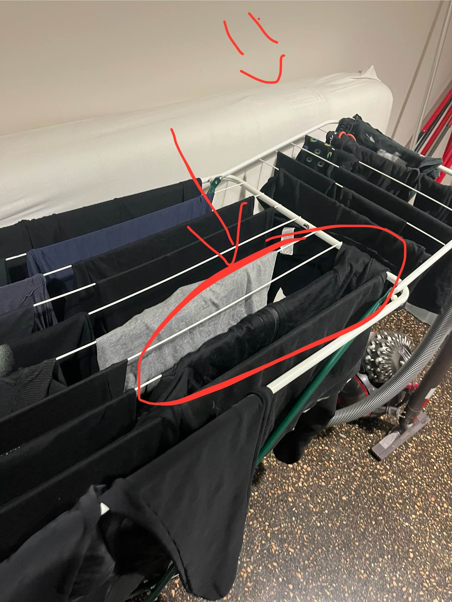
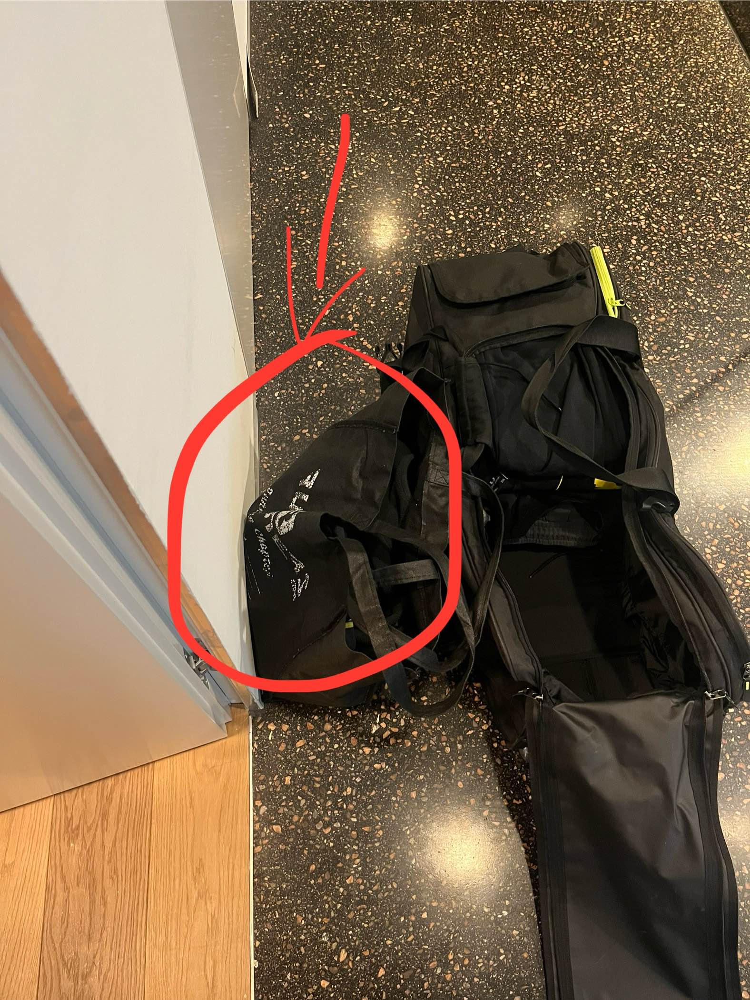
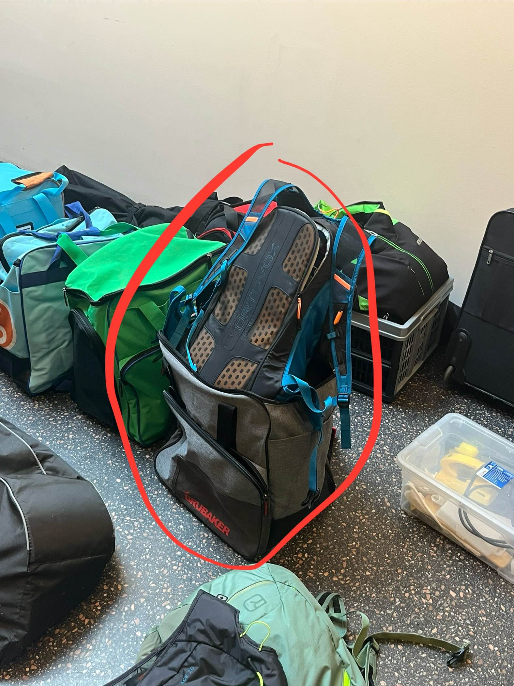
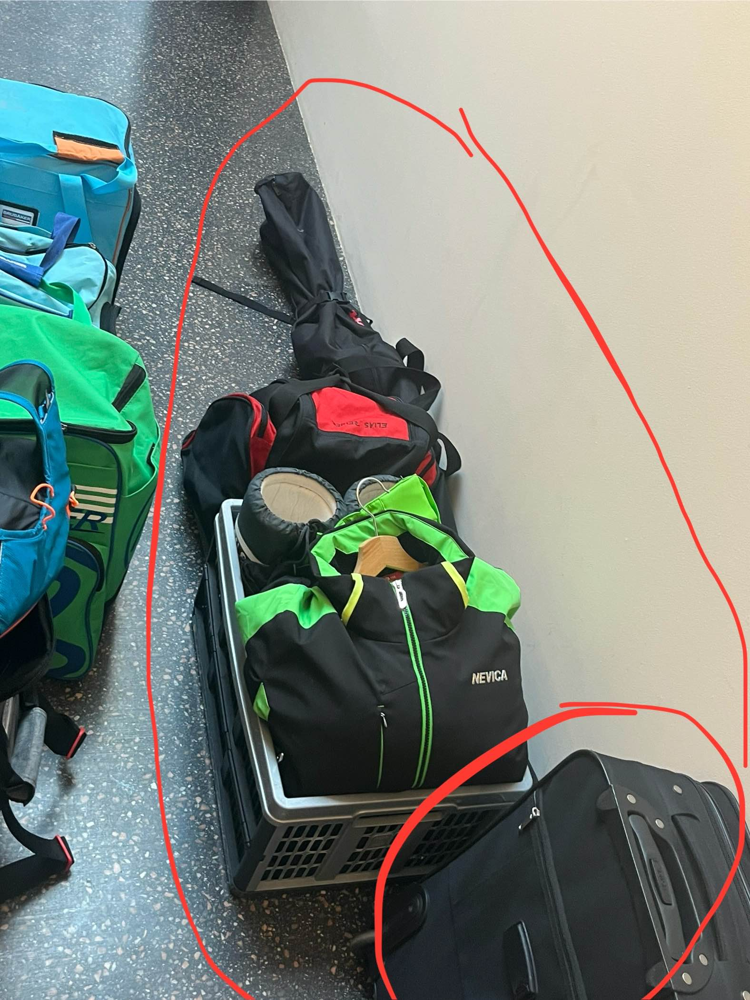
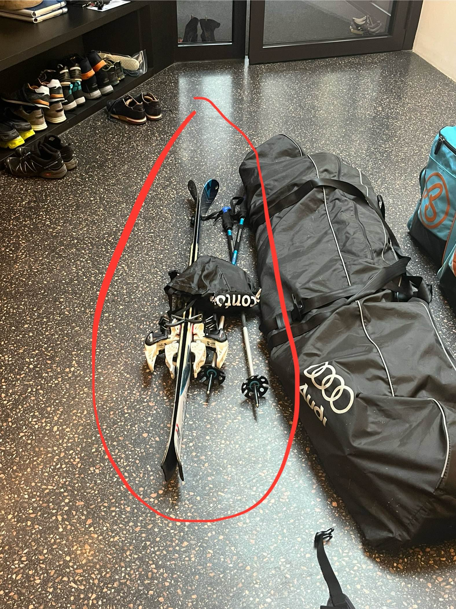

Dieses Dokument beinhaltet alle Gegenstände, die (für mich) in den Urlaub genommen werden sollten. Danke
## 1. Ski-Weste
Die Weste hängt noch am Ständer:

## 2. Ski-Unterwäsche
Ich habe schon ein Ski-Oberteil eingepackt. Mit fehlen noch:
- 1 Oberteil
- 2 Unterteile
Bitte die für mich auch einpacken wenn ihr dann selber nach dem Gewand sucht 🙏🏻
## 3. Extra Kleidungssackerl (Stofftasche)
Die Schwarze Stofftasche im Foto enthält weitere Kleidungsstücke. Wenn Juna in der großen Tasche nicht genug Platz hat, kann meine Kleidung teilweise von der großen Tasche in die Stofftasche verlagert werden. 

Die Stofftasche natürlich auch einpacken bitte lol

## 4. Skiausrüstung
- Meine Skijacke trage ich bereits/werde ich auch am Samstag schon an haben
- Skirucksack/Hose/Helm/Handschuhe/Felle etc sind alle auf einem Haufen (siehe Bild unten)
- Sonst gibts eigentlich eh nichts außer Ski und Stöcke, aber die sind eh schon in der langen Tasche (oder?)

## 5. Elias Zeug
- Graue Kiste
- Rote Tasche
- Grüne Jacke
- Dünnere lange Skitasche
- Koffer

Zusätzlich auch noch die Ski und Felle zum Skitourengehen für Elias:
