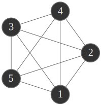

```dataviewjs
dv.el("span", 
	  (dv.el("div", "Kira Greifeneder (k12242829)"), dv.el("div", new Date().toLocaleString("de"))),
	  {attr: {style: "padding-top:100px"}}
)
```
<br>
## Instructions

## Solutions

### 1.1. Adjacency matrix / questions

| d1  | d2  | d3  | d4  | d5  | d6  | d7  | d8  |
| :-: | :-: | :-: | :-: | :-: | :-: | :-: | :-: |
|  1  |  2  |  2  |  4  |  2  |  8  |  2  |  9  |
```plantuml-svg
digraph G {
dpi=72.5
	rankdir="LR"
    bgcolor=transparent
	node [margin=0 width=0.5 color="#666666" penwidth=1.5 shape=circle fontcolor="#eeeeee" fontsize=20 style=filled fillcolor="#333333"]
	edge [color="#666666", fontcolor="#666666"]

	1 -> 2 [label=5]
	2 -> 1 [label=5]
	2 -> 2 [label=4]
	3 -> 2 [label=5]
	4 -> 1 [label=4]
	4 -> 2 [label=1]
	4 -> 3 [label=4]
	5 -> 3 [label=2]
	6 -> 3 [label=9]
	7 -> 4 [label=1]
	8 -> 5 [label=2]
	8 -> 7 [label=4]
	9 -> 6 [label=1]
	9 -> 8 [label=4]
}
```
**a. yes**
	Weights from the matrix have been added as edge labels
**b. yes**
	If it were undirected, we'd need (the same) weights for 4 -> 1 as for 1 -> 4 etc
**c. 2**
	4 incoming edges
**d. 4**
	4 outgoing edges
**e. 9**
	6 -> 3
**f. cyclic**
	 e.g. 2 -> 1 -> 2
**g. 1**
	 2 -> 2
**h. Weakly connected**
	 Directed and often only connected in one direction
i. No
	Trees don't have cycles and are undirected.
	
### 1.2. Complete undirected graph with 5+ vertices

### 1.3. Undirected graph, 3+ components, degrees of 2+
```plantuml-svg
digraph G {
dpi=72.5
    bgcolor=transparent
	node [margin=0 width=0.5 color="#666666" penwidth=1.5 shape=circle fontcolor="#eeeeee" fontsize=20 style=filled fillcolor="#333333"]
	edge [color="#666666", fontcolor="#666666", arrowhead=none]

	1 -> 2
	2 -> 3
	3 -> 1
	
	4 -> 5
	5 -> 6
	6 -> 4

	7 -> 8
	8 -> 9
	9 -> 7
}
```
### 1.4. Directed graph, cyclic, 4+ vertices...
```plantuml-svg
digraph G {
rankdir="LR"
dpi=72.5
    bgcolor=transparent
	node [margin=0 width=0.5 color="#666666" penwidth=1.5 shape=circle fontcolor="#eeeeee" fontsize=20 style=filled fillcolor="#333333"]
	edge [color="#666666", fontcolor="#666666"]

	1 -> 2
	2 -> 3
	3 -> 1
	3 -> 4
}
```
### 1.5. DFS
Graph with student ID:
```plantuml-svg
digraph G {
	dpi=72.5
    bgcolor=transparent
	node [
		margin=0 
		width=0.5 
		color="#666666" 
		penwidth=1.5 
		shape=circle 
		fontcolor="#eeeeee" 
		fontsize=20 
		style=filled 
		fillcolor="#333333"
	]
	edge [color="#666666", fontcolor="#666666"]

	1 -> d6
	d6 -> 1
	d6 -> d7
	1 -> 2
	1 -> 6
	2 -> d7
	2 -> d8
	2 -> 4
	d7 -> 0

	d6 [label=8]
	d7 [label="2*"]
	d8 [label="9"]
}
```

| Current | Adjacent    | Next    | Visited                    |
| :------ | :---------- | :------ | :------------------------- |
| 1       | \[8, 2, 6]  | 2       | \[1]                       |
| 2       | \[2*, 9, 4] | 2*      | \[1, 2]                    |
| 2*      | \[0]        | 0       | \[1, 2, 2*]                |
| 0       | \[]         | 2* (up) | \[1, 2, 2*, 0]             |
| 2*      | \[0]        | 2 (up)  | \[1, 2, 2*, 0]             |
| 2       | \[2*, 9, 4] | 4       | \[1, 2, 2*, 0]             |
| 4       | \[]         | 2 (up)  | \[1, 2, 2*, 0, 4]          |
| 2       | \[2*, 9, 4] | 9       | \[1, 2, 2*, 0, 4]          |
| 9       | \[]         | 2 (up)  | \[1, 2, 2*, 0, 4, 9]       |
| 2       | \[2*, 9, 4] | 1 (up)  | \[1, 2, 2*, 0, 4, 9]       |
| 1       | \[8, 2, 6]  | 6       | \[1, 2, 2*, 0, 4, 9]       |
| 6       | \[]         | 1 (up)  | \[1, 2, 2*, 0, 4, 9, 6]    |
| 1       | \[8, 2, 6]  | 8       | \[1, 2, 2*, 0, 4, 9, 6]    |
| 8       | \[1, 2*]    | end     | \[1, 2, 2*, 0, 4, 9, 6, 8] |

