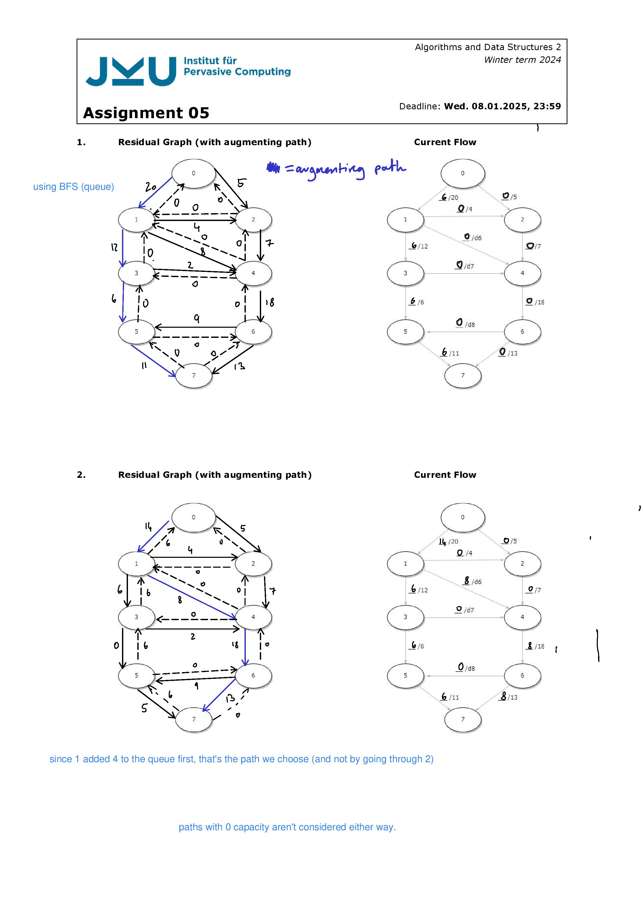

## Lecture material
Contains highlighted sections


## 1. Trees (Height Balanced)
### Determining a Tree's Characteristics
#### Ordered
A tree is ordered if all of its successors are ordered, e.g. the left child is always smaller than the parent, the right child always bigger.
#### Order
The maximum number of successors a node has in the tree.
#### Height (of the tree)
Maximum distance from a leaf to the root.
#### Depth (of a node)
The number of edges from the node to the root.
#### Complete
A tree of order $n$ is called complete if all leaves have the same depth, and each node has the maximum number or children.
### Binary Tree
No node has more than 2 children and it is acyclical. (and something else I forgor but it doesn't matter).
From this we can derive:
- The number of external nodes: min: $height + 1$, max: $2^{height}$
- ..n not sure this is relevant anyhow
#### Binary Traversal

I'm just going to assume that there will be little to no questions about this bc wtf
### B-Trees

B-Trees stay balanced by having its search, insert and remove actions sustatin balance. It is always balanced and maintains sorted data (keys). 
Each node stores multiple keys, they represent the threshholds between child nodes. Therefore there are 2t-1 keys for 2t child nodes. 
#### Identification
1. Every node has at most m children (m = 2t).
2. Every non-leaf node (except root) has at least ⌈t = m/2⌉ child nodes.
3. The root has at least 2 children if it is not a leaf node.
4. A non-leaf node with k children contains k−1 keys.
5. All leaves appear in the same level (height h)
#### Traversal
Check if the key we are looking for is below or between any of the children.

#### Insert
Traverse until we find the node where we could put the key.

- If not full, just add a key.
- If the node where we want to put the key is at max, split the node. Put the insertion key in the parent, and attach the node halves as children.
#### Remove
Removing an inner node could destroy balance, so before stepping down we check if there are enough keys in the subtree. The minimum number of keys is t-1, where t is half of the children a node can have (each node has max 2t children).

If it only has t-1 keys, then Move/Merge to prevent an imbalance after Remove.
We Merge by transfereing a sibling to expand the minimal inner node. 

Step by step:
- Determine min number of keys: t-1 (exception: root can have 1)
- Determine max number of keys: 2t-1
- Find key to remove
- Case distinction:
	1. Key is in a leaf where the node contains more than min keys: simply delete.
	2. Key is in an internal node, and the left child has enough keys: Replace the key with largest number from the left child (predecessor).
	3. Key is in an internal node, and only the right child has enough keys: Replace key with smallest number from right child (successor).
	4. Key is in an internal node, and both children have min keys: Move keys from right child into left child, along with the key we want to delete. Remove the key we want to delete from its original position and the new child node.
	5. Key is in a node with min keys, but sibling has t keys: Replace key with parent key, then replace the parent key with its successor (and remove said key from child).
### AVL Trees (!)
#### Insert (Double Rotations)
After insert, if there is an imbalance:
- Go up from the new node in the tree until you find a node (x) whose grandparent is unbalanced. Go up and name them x y z.
- Assign a,b,c to them in in-order traversal
- Switch:
	- z = b
	- children of z: a,c
	- children of a and c: children of x y z

#### Remove (Double Rotations)
After a removal, repeat until balanced:
THE UNBALANCED NODE IS THE ONE WHICH HAS UNBALANCED CHILDREN!!!


Keep in mind that multiple restructurings may be necessary until the tree is balanced again!!
#### Cut an Link Method
Pretty much what we did above but formalized. The 7 parts (a,b,c,t0,t1,t2,t3) can be found through in-order traversal.

We put these nodes into a 7-long array (according to in-order traversal), then re-attach all the nodes in the array. 

## 2. Trees (Weight Balanced)
$\alpha$ determines the degree of freedom in the tree. 
α = 1/2 : Balancing criterion only accepts complete binary trees
α < 1/2 : Structural restriction is increasingly relaxed

For balancing, we use the same rotation types as the avl tree.
### Multipath Search
All internal nodes of multipath trees have the following properties:
- Has $d$ amount of children, where $d \ge 2$
- Stores a $d-1$ long set of records $records(k,x)$, where $k$ is the key and $x$ the element ( notice that the number of records depends on how many children the node has )
- The set additionally contains 2 pseudo records for negative and positive infinity. (total set length d + 1 i guess?)
- Leaf nodes are just placeholders
#### Search
Is the same as a B-tree, where we just see between what records the key is.

// No further information to inserting etc. is given.
### (2,4) Trees
Remember that here, we look at the number of children each parent has, not the number of records per se.
#### Insertion (General)

For case 3, we just move the existing middle elemt to the parent, then split the node into two that we attach to the parent separately. Add the new element where it fits.
#### Top-Down Insertion
Starting with the root, apply node-splitting for each node with 3 elements that is visited on the path.
#### Bottom-Up Insertion
- Search for the insertion pos
- If the node at the insertion position already has 3 elements, node split.
- If this results in an "overflow" in the parent node (because when we move the middle element up, the parent may have more than 4 elements), do node splitting again.
#### Removal
- Find the record we want to delete
- **If the node has too few entres:**
	- Steal from parent
	- Parent steals from other child
- **If all siblings also only have one record**, steal from parent and merge the former parent record's children
	- 
- **If the parent also only has one record**, the merging propagates upwards:
	- Delete the node in question, then put siblings into the parent
	- Since the height is probably off now, merge children into grandparent on other side?
	- 
	- 


Special cases:
- If node has internal nodes among its children: reduce this case to the case where node has only external nodes as successors:
	- Search for previous entry according to in-order traversing
	- Swap entry with this predecessor
	- is repeated until the entry is at the lowest level of the tree.
### Red-Black Trees
Binary search tree which is also an alt representation of a (2,4) tree.
- Edges are colored red or black
- In no path from root to leaf may there be two consecutive red edges
- The number of black edges is the same for each path from root to a leaf ("black height")
- Edges that lead to leaves are always black.
#### Search
Identical to binary search
#### Insert
- Search for a leaf position for the new key to be inserted
- Replace the leaf with an internal node containing the new key
- Color the edge leading to the new node red
- Attack two new leaves to the node with black edges.

If the parent also has an incoming red edge, we need to restructure:
#### Restructuring by rotation on insert
If the sibling of n is also connected to their parent via a red edge, do restructuring by promotion instead. 
- Label the 3 red-connected nodes as n, p, g from bottom to top
- Label the non-leaf nodes/branches as t1, t2
- treat it like an AVL tree:
	- put p at the top
	- make g and n children of p
	- always add t1 and t2 from left to right
#### Restructuring by promotion on insert
This needs to be done when theee sibling of n also has a red incoming edge!
- Label n, p, g from bottom to top
- Simply recolor so it works again lmao? 

#### Removal
Case 1: if the node to be deleted has at least one leaf child, we can either remove it or just replace it with its non-leaf child.

Case 2: The node to be deleted only has non-lead children. 
- Replace the node with its in-oder predecessor or successor (closest smallest or larger child somewhere down the tree). 
- Like binary removal, just find the rightmost node down the left path.

Something about an algorithm for removal here but idk
### Splay Trees
Binary search tree where splaying is done after each access operation, in essence adapting to search queries.
- Splaying = special move-to-root operation applied to a node x
#### Splaying
Keep executing until x is the root.
Watch out for special case where x is root in removal, see lecture slides. I think the parent of the removed node is supposed to be the in-order predecessor, unless we are removing a leaf.

The depth of x keeps decreasing by 2 with each zickzick or zickzack, and by 1 in a zick.

Case 1: "zick zick" - z is the parent of y, y is the parent of x


Case 2: "zick-zack" - z is the parent of y, y is the parent of x.


Case 3: "zick" - y is the parent of x, and y is the root


Example:

#### Search
If node x contains key k, then splay x (like in example)
#### Insertion
Splay with new node x
#### Removal 
Remove like in binary search.
Splay with parent of removed node as x, or the parent of the in order successor.
## 3. Treaps
Combination of a binary tree and a heap...
- Keys are treated like those in a BST
- The ordering is the same as in a BST
- Nodes also have priorities, which are treated the same way as in a heap
- Priorities define an ordering from top to bottom (Parents always have a greater priority than their children).
- It's like storing pairs of data (x,y). (binary tree, binary heap)
#### Splitting
The goal is to separate one tree into two subtrees (L,R).
L contains all the elements where $X_L \le X$
R contains all the elements where $X_R > X$

- Check if the root is in R or L
- Obv keep the corresponding left or right child of the root
- If it is in L, you can probably also take a left subtree from the right side.
- If it is in R, probably a right subtree from the left side? idk, should be obvious once you see it.
#### Merging
We need to combine two trees T1,T2 without violating the order of priorities Y.
Choose the tree with the highest (lowest for minheap) priority as root, then recursively call merge for tthe other tree and subtree of the root node.

This is all under the assumption that all keys in T1 are smaller than those in T2.

Don't need to build it from scratch, but join the left tree with the right. So we just compare the rightmost branch of the first tree with the leftmost of the second tree, and draw lines from the lower prio to the higher prio. Old edges can then be deleted.


#### Insert (using split)
- Traverse as usual
- Stop at the first node where the priority is less than that of our new node. This is where we insert.
- Call Split(T, X) on the subtree starting at the found node, and use subtrees L and R as left and right children of the new node.
#practice
#### Erase / Remove (using Merge)
Traverse the tree as usual until the node is found.
- Call Merge on the node's children
- Put the return value of operation (the combined tree) in the place of the element we're deleting.
#practice
#### Rotation
Inverts the parent-child relation of two nodes

#### Insert using rotations
- Insert as you would in a binary tree
- If the priority is violated by this, rotateLeft if our node is the right child and vice versa.
- Label the nodes x, y p going up
- switch x and y, and attach y to p.
- Repeat where there is still a violation (always label the nodes where the violation is as x, y from bottom to top)
### Randomized Treaps
- Each node has a random priorit (but still sorted)
## 4. Hashing
### Universal Hashing
### Overflow Handling
#### Overflow Chaining
Each element in the table is a reference to an overflow chain

Search:
- Calculate hash(k)
- search until the end of the corresponding chain is reached
Insert:
- Calculate hash(k)
- Iterate and append to the end of the corresponding chain if it's not already contained
Remove
...

### Open Hashing / Adressing
#### Linear Probing
If the calculated position is already occupied, check another index (calculated by the hash function of (h +1), where h is the result of the last hash function)
If we end up and the original element again, the table is full.
- For searching, just keep checking left and right of the calculated value until we find it again lol

#### Quadratic Probing
Same as linear probing, but use $(h \pm i^2) \mod N$ instead of $(h \pm i) \mod N$ -> always switching between - and +.

I guess we use + and - of thee result before plugging it in again?

and $i = (-1)^j* \left\lceil \frac{j}{2} \right\rceil^2 = 0, -1,1,-4,4,-9,9$
Where j is just a sequence from 0 to N-1 (0, 1, 2, ... N-1)

#### Uniform Probing
In uniform probing, we choose hash addresses solely based on the key (k). This leads to equal probability of ending up at a certain spot. Should be more optimal.
#### Random probing
Opposite of uniform probing, basically, where the probing func chooses a hash address randomly. 
#### Summary/Comparison

## 5. Double Hashing
### Open Hashing: Double Hashing
We use two different hash functions:
- Hash: $h_1()$
- Offset: $h_2()$ (must not return 0)

The size of the hashtable/arr should be prime.
You could always apply both h1 and h2, but in the exercise h2 was only used in case of a collision.

Pseudocode:
```
insert(key)
	hash = hashfunction1(key)
	offset = hashfunction2(key)
	while (occupied(hashtable[hash])) // collision
		hash = hashfunction1(hash + offset)
		if (hash == original index) return
	hashtable[hash] = key // insert key at first vacant position
```

On collision, just calculate the second hash and add it to the original hash - then recompute and see if it works.
### Brent's Algorithm
Instead of immediately inserting the new key at the next available slot, we evaluate multiple options:
1. Insert the new key at the calculated spot as usual
2. Swap the new key with an existing key that was previously inserted and has a longer probe sequence
	- Calculate the total number of probes required before and after swapping
	- If swapping reduces the overall probe cost, perform the swap
	- Otherwise insert normally
#practice  aughaghaugh and look at lecture
### Binary Tree Probing
### Ordered Double Hashing
- Improves unsuccessful search.
- Smaller keys always displace larger keys while inserting. So if the first place is occupied by a number larger than our key, we replace it, and put the bigger key at the next available pos.
- Therefore, all keys in the probe sequence before k are smaller than k. 
## 6. Monte Carlo Tree Search
#### Successor Function
Returns a list of `[ move, newstate ]` pairs for a given state $s$. `move` is a possible legal/next move and `newstate` the resulting state of doing the move.
#### Terminal (Goal) Test
Determines if the game is over. States where the game is over are called terminal states.
#### Utility Function
Gives a numerical value to each terminal state (e.g. +1 for a win, -1 for a loss, 0 for a draw)
#### Minimax Value
The utility (for MAX) of a node $n$ assuming that both players play optimally for the rest of the game.
$$MINIMAX\_VAL(n) = 
\begin{cases} 
& UTILITY(n) & \text{if } n  \text{ is a terminal node} \\
& min_{s \in Succs(n)}MINIMAX\_VAL(s) & \text{if } n  \text{ is a MIN node} \\
& max_{s \in Succs(n)}MINIMAX\_VAL(s) & \text{if } n  \text{ is a MAX node}
\end{cases}$$
Higher values are better for MAX, so MAX will prefer to move to a state with the a maximum value, min will prefer to move to a state with the minimum value.
#### Optimal Strategy / Minimax Decision
The optimal strategy **for MAX** is to always select the action that leads to the state with the highest Minimax value at the next lower level. This is called the **Minimax Decision**.
#### Feature-based Evaluation Functions
In order to guess what move would give us the best outcome for MAX, we can use features in the current state, such as the number of pawns a player has, king safety etc.
### Minimax
Finds the node with the best outcome for MAX based on the assumption that MIN will play perfectly too (choose the best outcome for itself).

ts-ish code
```ts
// gets the next action that should be taken
function minimax(n: Node) : [outcome: number, node: Node] {
	if (n.isTerminal()) {
		switch(n.winner) {
			case "maxPlayer": return [1, n]
			case "minPlayer": return [-1, n]
			default: return [0, n]
		}
	}

	if (n.player === "maxPlayer") {
		// Worst outcome is -1 so we can use that instead of -Inf
		let [bestVal, bestNode]: [number, Node | undefined ] = [-1, undefined]
		for (let succ of n.successors()) {
			let [val, node] = minimax(succ) // min will choose lowest outcome next
            if (val > best_value) {
                best_value = val
                best_node = node
            }
		}
		return [bestVal, bestNode]
	} else {
		// Worst outcome for min is 1 so we use that instead of Inf
		let [bestVal, bestNode]: [number, Node | undefined ] = [1, undefined]
		for (let succ of n.successors()) {
			let [val, node] = minimax(succ) // max will choose highest outcome next
            if (val < best_value) {
                best_value = val
                best_node = node
            }
		}
		return [bestVal, bestNode]
	}
}
```
#### Quick application
- Work from the bottom up
- See what node the bottom-most MIN or MAX would choose. This is the value at this node now. 
- Then, given those choices, see which one of these the MIN or MAX above it would choose.

**Example: Finding the Minimax-value for the root node**

#### Properties
- Complete if the tree is finite
- Optimal if the opponent also plays optimally
### Alpha-Beta Pruning
Idea: optimal play without having to explore every path. We ignore subtrees that have no way of influencing the final decision.
- Have to compute the first subtree to full depth
- If the first or $n$th MIN decision of the next subtree is lower than the outcome of the first tree, we can ignore it, because MIN will won't choose anything higher, and we've basically already lost on that branch.
- Alpha is the "best value for MAX so far" (assuming that MAX started)
- Beta is the "best value for MIN so far"
- Therefore **Alpha starts at -inf** and gets revealed at the first branch is explored

**Example: how many/what branches can we skip by using Alpha-Beta Pruning instead of Minimnax?**

Skipped branch is marked  in red.
#### Properties
- Optimal
- Effectiveness depends on how successors are ordered. If they are always ordered from best to worst (for MAX), then we'll have to keep checking.
### Alpha-Beta with Depth Limit and Heuristic Evaluation
- Same as Alpha-Beta, but we have a maximum search depth that we stop at.
- Heuristic function $\text{EVAL}(s)$ should return an estimate of the expected utility for MAX. 
- Could add Endgame databases like in chess.
### Monte Carlo Tree Search
- Build the tree gradually as we decide on the next action
- In each iteration, expand one selected leaf (fringe node)
- Evaluate nodes by playing random games as simulations from there.
- Store the statistics (number/types of outcomes) of all the expanded nodes (backpropogate through the tree up to the root node), e.g. won 1/2, then update to 2/3 if another game was won along that path later
- Use these statistics to make decisions -> select the node with the best stats
## 7. Graphs (Structure)
### Depth-First Search (DFS)
Generic search algorithm like BFS, but with a stack (LIFO) instead of a queue. 
#### Identification
Path will always go down to full depth before other branches are explored.
#### Properties
- Not complete - can follow infinite paths and therefore get stuck on an infinite branch that doesn't contain a goal node
- Not optimal, will only find "left-most" solution
### Breadth-First Search (BFS)
Use a a queue (FIFO) as a fringe.
#### Identification
Path will go through all nodes on the same level before looking at their children.
#### Quick application
Always visit all nodes on the same level from left to right, then continue to the next depth until the goal node is found.
#### Properties
- BFS is complete, all nodes will be expanded eventually
- BFS is only optimal if the cost is constant (the same for all actions)
- Has a time (and space) complexity of $O(b^{d+1})$ where $b$ is the max. num of successors and $d$ is the depth of the shallowest goal
### Floyd-Warshall Algorithm
Pseudocode (my version)
```ts
function floydWarshall(G) {
	// all vertices of the original graph G in an arbitrary order
	let v_1, v_2, ... v_n; 
	
	for (k = 1 to n) {
		G_k = G_{k-1};
		// go through all possible routing vertices
		for (i, j=1, n) where (i != j) and (i,j != k) {
			// for each pair of vertices in the subgraph
			if (v_i, v_k are adjacent, and v_k, v_j are adjacent) {
				G_k.insertDirectedEdge(v_i, v_j, null)
			}
		}
		return G_n
	}
}
```
### Dijkstra's Algorithm (!)
- We have a global priority queue of nodes based on their distance from the starting point.
- Mark the current node as visited.
- Starting from the root node, we update all our neighbor's distances using the information from our connected edges and add them to the nodes' distance field. 
	- If distance at curr node + distance to neighbor is smaller than the dist currently stored in the neighbor, update.
- We add all these neighboring nodes to the queue
- Then get a node from the queue (smallest distance) and repeat until we run out of nodes to visit.
### Prim-Jarnik algorithm
Constructs an MST (a spanning tree with a minimum total edge weight)

- Tree is constructed vertex by vertex
- Start by inserting any vertex **v** to start
- Insert an edge (**v,u**) (from **v** to **u**), and the vertex **u** for which the following is true:
	- Vertex **v** is already in the tree
	- Vertex **u** is not in the tree yet
	- The weight of (v,u) is the minimum of the weights of all possible candidates for u.

We also store the value D\[u] in each non-visited vertices.
- Indicates the minimum of the weights of all edges with which u could be connected to the tree.
- Saves time in min search
- Would have a priority queue based on these values we could pick nodes from for the tree
### Kruskal's Algorithm
Also generates an MST, but the process is a little different. 
We're basically working with a forest of trees to produce one tree:

In other words:
- Vie every node as a single subtree to begin with
- Start with the smallest edge, creating the first larger subtree
- Choose the next smallest edge
- As long as that edge is not going to create a connection within its own subtree, we can mark it
### Measures, Stats, Attributes... idk - Distance and Centrality
#### Distance
- Unweighted: the number of hops of the shortest path
- Weighted: Sum of weights of the shortest path
#### k-path centrality:
The number of paths of length k or less going from a vertex v.
#### Edge disjoint k-path centrality
- **Edge disjoint paths**: paths between two vertices in a graph **that do not share any edges**
	- I guess if we have multiple paths from one node to another, they should be able to traverse completely separate paths and don't HAVE to merge at some point. A merged path can still exist, but the merging can't be mandatory.
	- Does a merged path also just count as one? since otherwise if we didn't count it the theorem wouldn't work
	
- The **Edge disjoint k-path centralitiy** of a vertex is the number of edge disjoint paths of length k or less that start or end at vertex v. 
- The Ford-Fulkerson Theorem states that the number of edge disjoint paths between two nodes u and v of a graph is equal to the minimum number of vertices that must be removed to disconnect u and v.
#### Vertex disjoint k-path centrality:
- **Vertex disjoint paths:** paths between two vertices in a graph **that do not share any vertices**
- the **Vertex disjoint k-path centrality** of a node v is the number of vertex disjoint paths of length k or less that start or end at vertex v. 
- Menger showed that the number of vertex disjoint paths between two nodes u and v equals the number of nodes that must be removed to disconnect u and v.
#### k-hop degree ($\text{k-hop-}C_D$)
- Number of nodes we can reach with just k hops
#### k-rank centrality
- Requires a list of all nodes and the nodes they can reach in k hops is called the k-hop neighborhood.
1. Get all the adjacent nodes (in neighborhood of our node)
2. Look up what their k-hop degrees are in the list
3. Look at what the lowest degree is among these, or n lowest if we want multiple (n-rank centrality)

#### Eccentricity
- (of a vertex)
- Maximum (shortest) distance from the vertex to any other vertex in a connected graph

How-to:
- Go through all nodes. For each node:
- Find the node that is the furthest away from ours
- Write down the length of the shortest path to this node
#### Diameter
- (of a graph)
- The maximum (shortest) distance between two vertices of a connected graph
#### Radius
- (of a graph)
- Minimum eccentricity among all vertices
- Just calculate all eccentricities then take the smallest val in them
### Short Distance Graphs
#todo
## 8. Graphs (Flows)
### Characteristics
The source has no incoming edges, the sink has no outgoing edges.
- May annotate flows as (flow/capacity) for each edge
- Ingoing flow of a vertex must always be equal to outgoing flow 

In a **residual graph**, we "flip" all the arrow and have them represent remaining capacity instead. sort of like the capacity we give back.

For any path from source to sink with minimum capacity b in the residual graph, b units of flow can be added along the path. 

The **Augmenting path** is the one we have discovered through, let's say BFS, where we are changing flows.
### Cuts
A line/cut through the network that separates the set of vertices into two partitions. The **capacity** of a cut is the sum of the capacities of the cut edges.
### Maximum Flow / Ford Fulkerson
Steps to finding the maximum flow (fulkerson), where we increased by the min capacity remaining. (Sometimes we should only increase by 1, so look out for that)



## 9. Social Graphs
???
## 10. Community Analysis
### Community Detection Methods
We have roughly 4 categories:

Node-Centric communities: Each node in a group has to satisfy certain properties. (Each node is a community?)

Group-Centric communities: Consider connections within a group as a whole. The group has to satisfy certain properties without zooming into node-level. (just consider the connections between nodes)

Network-Centric communities: Partition the whole network into several disjoint sets

Hierarchy-Centric communities: Contrtuct a hierarchical structure from... idk what, not given
### Measures
Measures used to calibrate the small world effect.

The shortest path between two nodes is also called the geodesic. The number of hops in the geodesic is the geodesic distance.
#### Diameter 
The maximum shortest path in a network (see diameter in the graphs section)
#### Density / Clustering Coefficient
Friends of a friend are likely to be friends as well, therefore we want to measure the density of connections among one's friends. 

We use the clustering cofficient for this, where d is the number of neighbours and k is the the number of connections among neighboured friends.


The node the blue lines are going from is the node we are calculating for.
#### k-path centrality:
The number of paths of length k or less going from a vertex v.
#### Edge disjoint k-path centrality
- **Edge disjoint paths**: paths between two vertices in a graph **that do not share any edges**
	- I guess if we have multiple paths from one node to another, they should be able to traverse completely separate paths and don't HAVE to merge at some point. A merged path can still exist, but the merging can't be mandatory.
	- Does a merged path also just count as one? since otherwise if we didn't count it the theorem wouldn't work
	
- The **Edge disjoint k-path centralitiy** of a vertex is the number of edge disjoint paths of length k or less that start or end at vertex v. 
- The Ford-Fulkerson Theorem states that the number of edge disjoint paths between two nodes u and v of a graph is equal to the minimum number of vertices that must be removed to disconnect u and v.
#### Vertex disjoint k-path centrality:
- **Vertex disjoint paths:** paths between two vertices in a graph **that do not share any vertices**
- the **Vertex disjoint k-path centrality** of a node v is the number of vertex disjoint paths of length k or less that start or end at vertex v. 
- Menger showed that the number of vertex disjoint paths between two nodes u and v equals the number of nodes that must be removed to disconnect u and v.
#### k-hop degree ($\text{k-hop-}C_D$)
- Number of nodes we can reach with just k hops
#### k-rank centrality
- Requires a list of all nodes and the nodes they can reach in k hops is called the k-hop neighborhood.
1. Get all the adjacent nodes (in neighborhood of our node)
2. Look up what their k-hop degrees are in the list
3. Look at what the lowest degree is among these, or n lowest if we want multiple (n-rank centrality)

#### Degree of Centrality
Determines how important a node is, basically just the number of adjacent nodes.
- Degree of centrality for 1: 3
- For 5: 4

#### Normalized Degree Centrality
$$C'_D = {\text{degree centrality} \over \text{total nodes} - 1}$$
#### Average Distance

#### Closeness Centrality

- Choose a node u to calculate the closeness centrality for
- Calculate the shortest (geodesic) distance  from u to each other node in the graph and write them down.
- Sum up these shortest distances
- Calculate
$$C_c(u) = {\text{total nodes}-1 \over \text{sum of geodesic distances}}$$
The higher the resulting value, the more central a node is.

#### Betweenness Centrality
Counts the number of shortest paths that pass through one node. 


fast way to do this in exam:
- Write down all node combinations / paths
- For each path, write down what does it passes through and on how many of the shortest paths it does so, e.g. 1/2E if it passes through E on 1/2 shortest paths.
- For betweenness centrality of .e.g E, sum up the number of Es times their factor if there is one.
### Clustering
#### Cliques
A **clique** is a maximum complete subgraph in which all nodes are adjacent to each other. To find the maximum clique:
- Find a group where the degree of each node matches the size of the clique with it in it. 
- k nodes in clique -> each node must have at least k-1 connections

More step-by step approach;
- Find some small clique by looking at it
- let's say we found one of size 3
- Then remove all nodes with degrees under 3 and see what's left
- repeat
#### Clique Percolation Method (CPM)
CPM is a method for finding overlapping communities
- Find all cliques of size k in a network
- construct a clique graph, where two cliques are adjacent if they share k-1 nodes
- Each connected component (aren't these just nodes in this rep.?) in the clique graph form a community

#### Reachability: k-clique, k-club
**k-clique**
Any node in a group should dbe reachable in k hops. We can therefore find 1k, 2k, ... sets of cliques. 

Note that the diameter can be larger than k in the subgraph!

**k-club / k-clan**
Is a substructure of diameter <= k

UGHGH KILL ME
#### Similarities
(Jaccard and Cosine Similarity)


## 11. PRAM Algorithms
### PRAM Models
### Parallel Reduction
### List Ranking (Suffix Sums)
### Preorder Tree Traversal
### Parallel Merge Sort
### Graph Coloring
### Brent's Theorem
#### Cost Optimality
### Cost Optimal Algorithm for Prefix Sums
### Speedup Factor
#### Speedup Performance Laws
#### Fixed Load Speedup Factor (Amdahl)
#### Fixed Time Speedup (Gustafson)
#### Fixed Memory Speedup 