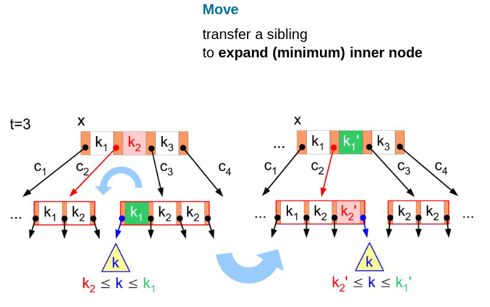

---

tldraw-file: true
tags: [tldraw]

---

^769c6e73-33c6-41f0-a48a-63fdb0a2491b


^338e94da-dec0-41a2-bf91-7b686facb916


```json !!!_START_OF_TLDRAW_DATA__DO_NOT_CHANGE_THIS_PHRASE_!!!
{
	"meta": {
		"uuid": "eb9f6821-e96f-4a59-8266-920ee83625ea",
		"plugin-version": "1.15.0",
		"tldraw-version": "3.4.1"
	},
	"raw": {
		"tldrawFileFormatVersion": 1,
		"schema": {
			"schemaVersion": 2,
			"sequences": {
				"com.tldraw.store": 4,
				"com.tldraw.asset": 1,
				"com.tldraw.camera": 1,
				"com.tldraw.document": 2,
				"com.tldraw.instance": 25,
				"com.tldraw.instance_page_state": 5,
				"com.tldraw.page": 1,
				"com.tldraw.instance_presence": 5,
				"com.tldraw.pointer": 1,
				"com.tldraw.shape": 4,
				"com.tldraw.asset.bookmark": 2,
				"com.tldraw.asset.image": 5,
				"com.tldraw.asset.video": 5,
				"com.tldraw.shape.arrow": 5,
				"com.tldraw.shape.bookmark": 2,
				"com.tldraw.shape.draw": 2,
				"com.tldraw.shape.embed": 4,
				"com.tldraw.shape.frame": 0,
				"com.tldraw.shape.geo": 9,
				"com.tldraw.shape.group": 0,
				"com.tldraw.shape.highlight": 1,
				"com.tldraw.shape.image": 4,
				"com.tldraw.shape.line": 5,
				"com.tldraw.shape.note": 8,
				"com.tldraw.shape.text": 2,
				"com.tldraw.shape.video": 2,
				"com.tldraw.binding.arrow": 0
			}
		},
		"records": [
			{
				"gridSize": 10,
				"name": "",
				"meta": {},
				"id": "document:document",
				"typeName": "document"
			},
			{
				"meta": {},
				"id": "page:page",
				"name": "Page 1",
				"index": "a1",
				"typeName": "page"
			},
			{
				"id": "asset:522506483",
				"type": "image",
				"typeName": "asset",
				"props": {
					"name": "tldrawFile",
					"src": "asset:obsidian.blockref.769c6e73-33c6-41f0-a48a-63fdb0a2491b",
					"w": 827,
					"h": 519,
					"fileSize": 177341,
					"mimeType": "image/png",
					"isAnimated": false
				},
				"meta": {}
			},
			{
				"x": 31.3621826171875,
				"y": 157.58981323242188,
				"rotation": 0,
				"isLocked": false,
				"opacity": 1,
				"meta": {},
				"id": "shape:1_LK97gTWuIGQb1chTNQz",
				"type": "image",
				"props": {
					"w": 827,
					"h": 519,
					"assetId": "asset:522506483",
					"playing": true,
					"url": "",
					"crop": null,
					"flipX": false,
					"flipY": false
				},
				"parentId": "page:page",
				"index": "a1",
				"typeName": "shape"
			},
			{
				"x": 0,
				"y": 0,
				"lastActivityTimestamp": 0,
				"meta": {},
				"id": "pointer:pointer",
				"typeName": "pointer"
			},
			{
				"followingUserId": null,
				"opacityForNextShape": 1,
				"stylesForNextShape": {},
				"brush": null,
				"scribbles": [],
				"cursor": {
					"type": "default",
					"rotation": 0
				},
				"isFocusMode": false,
				"exportBackground": true,
				"isDebugMode": false,
				"isToolLocked": false,
				"screenBounds": {
					"x": 0,
					"y": 0,
					"w": 1080,
					"h": 720
				},
				"insets": [
					false,
					false,
					false,
					false
				],
				"zoomBrush": null,
				"isGridMode": false,
				"isPenMode": false,
				"chatMessage": "",
				"isChatting": false,
				"highlightedUserIds": [],
				"isFocused": false,
				"devicePixelRatio": 2.190890312194824,
				"isCoarsePointer": false,
				"isHoveringCanvas": null,
				"openMenus": [],
				"isChangingStyle": false,
				"isReadonly": false,
				"meta": {},
				"duplicateProps": null,
				"id": "instance:instance",
				"currentPageId": "page:page",
				"typeName": "instance"
			},
			{
				"editingShapeId": null,
				"croppingShapeId": null,
				"selectedShapeIds": [],
				"hoveredShapeId": null,
				"erasingShapeIds": [],
				"hintingShapeIds": [],
				"focusedGroupId": null,
				"meta": {},
				"id": "instance_page_state:page:page",
				"pageId": "page:page",
				"typeName": "instance_page_state"
			},
			{
				"x": 0,
				"y": 0,
				"z": 1,
				"meta": {},
				"id": "camera:page:page",
				"typeName": "camera"
			}
		]
	}
}
!!!_END_OF_TLDRAW_DATA__DO_NOT_CHANGE_THIS_PHRASE_!!!
```