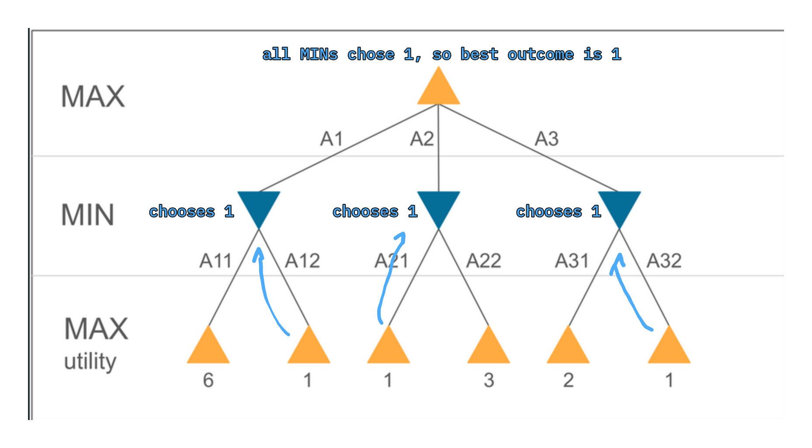

TODO: Add quiz content
```table-of-contents
title: ## Table of Contents
maxLevel: 3
```
## Uninformed Search Algorithms

### Supporting Details and Definitions
---
#### Search problem:
A search problem consists of the following:
- The complete set $S$ of possible **world states**
- A **Successor function** $Succ(s)$ that gives, for every state $s \in S$, all possible actions that can be taken in $s$, and their effects (the resulting world state). We need to know the consequences of each action.
- **Initial state**
- A **Goal Test** that defines what woul be a solution. Can be explicit (the exact state we want) or implicit (computed on $s$ e.g. a checkmate in chess)
- **Action Costs** are non negative values assigned to actions which get summed up(some actions may e.g. take more energy), so we usually want to find the cheapest/most efficient solution
#### State Space
The set of all possible states that can be reached form the initial state. This is defined by the initial state and successor function.

A **graph** is formed from the state space.
A **path** in the state space is a sequence of states connected by actions.
#### Solution
A solution to a problem is a path from the initial state to the goal state.
#### Cost
The cost of a solution is the sum of action costs along the solution path (these are usually cumulative in graphs!).
#### Optimal solution
Solution with the lowest cost
#### Completeness 
An algorithm is complete if it is guaranteed to find a solution, given that a solution exists.
#### Optimality 
An algorithm is optimal if it is guaranteed to find the [optimal solution](#Optimal%20solution).
#### Time Complexity  
The time it takes to find a solution (how well it scales)
#### Space Complexity
The amount of memory that is needed to perform a search.
#### Uninformed / Blind Search
Search strategy has no undeerstanding of the meaning of states.
#### Heuristic / Informed Search
Can look at the states and make an estimate on which states are more promising than others.
### Asymptotic Complexity Analysis
---
#ai-todo if deemed relevant 
### Breadth-First Search (BFS)
---
Use a a queue (FIFO) as a fringe.
#### Identification
Path will go through all nodes on the same level before looking at their children.
#### Quick application
Always visit all nodes on the same level from left to right, then continue to the next depth until the goal node is found.
#### Properties
- BFS is complete, all nodes will be expanded eventually
- BFS is only optimal if the cost is constant (the same for all actions)
- Has a time (and space) complexity of $O(b^{d+1})$ where $b$ is the max. num of successors and $d$ is the depth of the shallowest goal
### Uniform Cost Search (UCS)
---
BFS but sort the queue by lowest cost first (Priority queue). **If all costs are equal, it is equivalent to BFS.**
#### Identification
Path will go to a lower depth or a sibling based on which has the lowest cost.
#### Quick application
Look at all reachable children from the first child. Mark it as visited. Choose the lowest cost child and mark it as visited. Look at all reachable children again...
#### Properties
- Complete if all actions have a cost > 0
- UCS is optimal
### Depth-First Search (DFS)
---
Generic search algorithm like BFS, but with a stack (LIFO) instead of a queue. 
#### Identification
Path will always go down to full depth before other branches are explored.
#### Properties
- Not complete - can follow infinite paths and therefore get stuck on an infinite branch that doesn't contain a goal node
- Not optimal, will only find "left-most" solution
### Depth-Limited Depth-First Search (DLS)
---
- Fixes DFS' incompleteness problem by eliminating infinite paths. 
- Only searches up to a fixed/predefined depth limit. 
- Otherwise same as DFS.
- Nodes at the max depth $l$ are simply treated as if they have no successors
#### Properties
- Complete
- Not optimal
### Iterative Deepening Depth-First Search (IDS)
---
- DLS but increments the max depth by 1 each time it doesn't find the goal
- Start at 1, if DLS doesn't find the goal increase by 1 etc...
- Similar process to DFS
- BUT, it finds the shallowest solution, not the left-most like regular DFS
#### Identification
- For a question that gives you the order of expanded nodes (such as A-B-C-D), keep in mind that previous iterations still need to be in this list of expansions. (e.g. A-A-B-C-D)
#### Properties
- Complete
- Only optimal if costs are uniform. Otherwise will find the shallowest solution
## Heuristic Search

### Supporting Details and Definitions
---
#### Heuristic function 
A function $h(n)$ that guesses how close a node $n$ is to a goal -> whether it should be expanded next.
#### Short-sightedness
Only relying on local information / guesses.
#### Greedy algorithm
Always selects next node to continue that seems to be closest to goal.
#### Admissible
A heuristic function $h(n)$ is admissible, if for $\forall n: h(n) \le h^*(n)$, where $h^*(n)$ is the true cost of the optimal path from $n$ to a goal.
In other words, **the true cost always has to be bigger than the calculated heuristic.**
#### Domination
A heuristic $h_2$ dominates a heuristic $h_1$ if $\forall n: h_2(n) \ge h_1(n)$
### Greedy Best-First Search
---
- Relies directly on the heuristic function
- Expands whatever node appears closest to a goal
- Evaluation function $f(n) = h(n)$
- Evaluation function can be something like the straight line distance
#### Properties
- Complete in finite spaces with repeated state-checking. Can get stuck in loops otherwise
- Not optimal (heuristic may not be correct)
- Greedy
- Short-sighted
### A* Search
---
Tries to minimise the total estimated solution cost by finding the estimated cost of the cheapest solution from a certain path onwards.
- Avoids expanding paths that are already expensive
- Use a more complex evaluation function $f(n) = g(n) + h(n)$
	- $g(n)$ is the cost of the current path so far
	- $h(n)$ regular heuristic function
- If $h(n)$ is admissible, it is complete and optimal

The outcome is like a combination of UCS and Greedy Search. 
## Adversarial Search (Playing against opponents)
### Supporting Details and Definitions
---
#### Successor Function
Returns a list of `[ move, newstate ]` pairs for a given state $s$. `move` is a possible legal/next move and `newstate` the resulting state of doing the move.
#### Terminal (Goal) Test
Determines if the game is over. States where the game is over are called terminal states.
#### Utility Function
Gives a numerical value to each terminal state (e.g. +1 for a win, -1 for a loss, 0 for a draw)
#### Minimax Value
The utility (for MAX) of a node $n$ assuming that both players play optimally for the rest of the game.
$$MINIMAX\_VAL(n) = 
\begin{cases} 
& UTILITY(n) & \text{if } n  \text{ is a terminal node} \\
& min_{s \in Succs(n)}MINIMAX\_VAL(s) & \text{if } n  \text{ is a MIN node} \\
& max_{s \in Succs(n)}MINIMAX\_VAL(s) & \text{if } n  \text{ is a MAX node}
\end{cases}$$
Higher values are better for MAX, so MAX will prefer to move to a state with the a maximum value, min will prefer to move to a state with the minimum value.
#### Optimal Strategy / Minimax Decision
The optimal strategy **for MAX** is to always select the action that leads to the state with the highest Minimax value at the next lower level. This is called the **Minimax Decision**.
#### Feature-based Evaluation Functions
In order to guess what move would give us the best outcome for MAX, we can use features in the current state, such as the number of pawns a player has, king safety etc.
### Minimax
---
Finds the node with the best outcome for MAX based on the assumption that MIN will play perfectly too (choose the best outcome for itself).

ts-ish code
```ts
// gets the next action that should be taken
function minimax(n: Node) : [outcome: number, node: Node] {
	if (n.isTerminal()) {
		switch(n.winner) {
			case "maxPlayer": return [1, n]
			case "minPlayer": return [-1, n]
			default: return [0, n]
		}
	}

	if (n.player === "maxPlayer") {
		// Worst outcome is -1 so we can use that instead of -Inf
		let [bestVal, bestNode]: [number, Node | undefined ] = [-1, undefined]
		for (let succ of n.successors()) {
			let [val, node] = minimax(succ) // min will choose lowest outcome next
            if (val > best_value) {
                best_value = val
                best_node = node
            }
		}
		return [bestVal, bestNode]
	} else {
		// Worst outcome for min is 1 so we use that instead of Inf
		let [bestVal, bestNode]: [number, Node | undefined ] = [1, undefined]
		for (let succ of n.successors()) {
			let [val, node] = minimax(succ) // max will choose highest outcome next
            if (val < best_value) {
                best_value = val
                best_node = node
            }
		}
		return [bestVal, bestNode]
	}
}
```
#### Quick application
- Work from the bottom up
- See what node the bottom-most MIN or MAX would choose. This is the value at this node now. 
- Then, given those choices, see which one of these the MIN or MAX above it would choose.

**Example: Finding the Minimax-value for the root node**

#### Properties
- Complete if the tree is finite
- Optimal if the opponent also plays optimally
### Alpha-Beta Pruning
---
Idea: optimal play without having to explore every path. We ignore subtrees that have no way of influencing the final decision.
- Have to compute the first subtree to full depth
- If the first or $n$th MIN decision of the next subtree is lower than the outcome of the first tree, we can ignore it, because MIN will won't choose anything higher, and we've basically already lost on that branch.
- Alpha is the "best value for MAX so far" (assuming that MAX started)
- Beta is the "best value for MIN so far"
- Therefore **Alpha starts at -inf** and gets revealed at the first branch is explored

**Example: how many/what branches can we skip by using Alpha-Beta Pruning instead of Minimnax?**

Skipped branch is marked  in red.
#### Properties
- Optimal
- Effectiveness depends on how successors are ordered. If they are always ordered from best to worst (for MAX), then we'll have to keep checking.
### Alpha-Beta with Depth Limit and Heuristic Evaluation
---
- Same as Alpha-Beta, but we have a maximum search depth that we stop at.
- Heuristic function $\text{EVAL}(s)$ should return an estimate of the expected utility for MAX. 
- Could add Endgame databases like in chess.
### Monte Carlo Tree Search
---
- Build the tree gradually as we decide on the next action
- In eaech iteration, expand one selected leaf (fringe node)
- Evaluate nodes by playing random games as simulations from there.
- Store the statistics (number/types of outcomes) of all the expanded nodes (backpropogate through the tree up to the root node)
- Use these statistics to make decisions -> select the node with the best stats
## Reinforcement / Q Learning
### Supporting Details and Definitions
---
#### Reinforcement learning
- Learning by acting in the world and gradually collecting information about the value of actions or states.
- Need to act first, then observe effects
#### Policy / Strategy
$\pi: S \mapsto A$ returns the action that should be taken next, based on the current observed state $s_t$
-> $\pi(s_t)=a_t$
#### State Transition Function
$\delta: S \times A \mapsto S$ returns the state $s'$ we're in after applying an action $a$ to our current state $s$.
-> $\delta(s,a)=s'$
#### Reward Function
$R: S \times A \mapsto \mathbb{R}$ returns the immediate reward $r$ of applying an action $a$ in a state $s$.
-> $R(s,a) = r$
#### Discounted Cumulative Reward
$V_\pi(s_t)$  returns the value of our current observed state $s_t$ under the policy $\pi$.
$$V_\pi(S_t)=r_t+\gamma \cdot r_{t+1} + \gamma^2 \cdot r_{t+2} = \sum_{i=0} \gamma^i\cdot r_{t+i}$$
- $r$ is the immediate reward of the action
- Actions are chosen according to $\pi$
- The Discount factor $\gamma \le 1$ weighs the importance of short-term reward.

With each next (or previous) action, the rewards gets discounted more and more as $\gamma$ gets smaller. Therefore short term rewards are worth more.
#### Optimal Policy
$\pi^*: S \mapsto A$ is a policy that gives the maximum discounted cumulative reward ($V_\pi(s)$) for all possible starting states $s$.
#### True Value
$V^*$ is the maximum reward that is possible when starting from state $s$. Or in other words, the discounted cumulative reward that would result from following the optimal strategy $\pi*$ when starting from state $s$.
-> $V^*(s)=V_{\pi^*}(s)$

Here, the squares right next to the goal haev a True Value of 100, since there is no square inbetween that will cause a discount on the reward. The square labeled 81 requires at least 3 steps to the goal, so gamma will be applied to the reward twice.
#### Agent Worlds

The agent doesn't know the rewards or the state transition function, just the set of possible actions and its current state.

#### Evaluation function
$Q: S \times A \mapsto \mathbb{R}$ is a function that, for any $(state, action)$ pair, predicts the expected cumulative rewards $v$ that can be gained from state $s$ onwards if the first action we take from $s$ is $a$. 

In other words, it predicts the best reward we can get from $s$ given that the next action we take is $a$.
-> $Q(s,a)=v$
#### Optimal  Evaluation Function
The optimal [evaluation function](#Evaluation%20function) $Q^*$:
$$Q^*(s,a)=R(s,a)+\gamma\cdot V^*(\delta(s,a)) = v$$
- $s$ is the current state
- $a$ is the next action
- $R(s,a)$ is the [Reward Function](#Reward%20Function)
- $\gamma$ is the [discount factor](#Discounted%20Cumulative%20Reward)
- $V^*$ is the [true value](#True%20Value)
- $\delta$ is the [State Transition Function](#State%20Transition%20Function)
- $Q^*$ returns the expected cumulative reward $v$

This function predicts the **true cumulative reward** that can be gained if we:
- take action $a$ in our current state $s$
- behave optimally after this first action (= from the next state $s'=\delta(s,a)$ onwards)

We calculate $Q^*$ for each possible action. Our [Optimal Policy](#Optimal%20Policy) then becomes the maximum of all the $Q^*$ values:
$$\pi^*(s)=\text{arg max} ~ Q^*(s,a)$$
-> returns the action with the highest cumulative reward given by $Q^*$


Here we can see that, for example, if we go from d to a, we'll require 3 steps to c, so gamma is applied 3 times -> discounted cumulative reward = 81. If we start by going from a to d, we'll need a total of 4 steps -> 73.
### Q Learning
---
Q learning tries to learn/approximate the [Optimal  Evaluation Function](#Optimal%20Evaluation%20Function) $Q^*$, as we would need training examples and true cumulative rewards otherwise. But the only information we want to use is the sequence of immediate rewards.

Through **iterative approximation** we can backpropogate our approximation for Q, by which it gets better and better.

The easiest way to do this is through a table `Q[s,a]` :

- Create table Q[s,a] for all state action pairs. 
- Initialize all table entries to 0 (rewards are 0)
- `let currState = s`
- `while (true)`
	- select an action `a` that can be taken from `s` and execute it
	- calculate the immediate reward $R(s,a) = r$
	- calculate the new state $\delta(s,a)=s'$
	- update the table entry for the action we just took: $Q[s,a] \leftarrow r + \gamma \cdot maxQ[s',a']$
	- update `currState = s'`

Essentially, we start out with the full reward for a step + zero, since we have no other entries...
#### Quick application

Assuming we've already let it run for a bit and some entries have already been made (left)... And we want to go right from R:
- Get the immediate reward $r$ (is zero because the only reward we know from the beginning is the one going into the goal)
- Look at what Q rewards already exist in this next state and pick the largest one
- Add the discount and store it in the table for our current state.
#### Properties
- If we run this for an infinite amount of time, the entries should converge to the results gained by $Q^*$.
## Propositional Logic
### Definitions
---
#### Model
An assignment of specific truth values (true or false) to eevery proposition symbol in a logical sentence.
#### Entailment ($\models$)
$a \models b$ means "$b$ follows logically from $a$".
-> In all models where $a$ is true, $b$ must be true too.
#### Logical Inference ($\vdash$)
$a \vdash_A b$ means "$b$ follows from $a$ by inference algorithm $A$"
#### Soundness
An inference algorithm $A$ is sound/correct if $(a\vdash_Ab)\implies(a \models b)$
#### Completeness
An inference algorithm is complete if it can derive all sentences that follow from $a$.
-> $(a\models b) \implies (a \vdash_A b)$
#### Inference Algorithm
Is a general pattern of direct entailment (a logical transformation step) that always produces a true new sentence if the original sentence is true.
e.g. modus ponens, modus tollens.
- They are [sound](#Soundness) if all individual inference rules are sound
- They are [complete](#Completeness) if we use a complete search algorithm and the set of available inference rules is logically complete
### Conversion to CNF
---
- Convert implications and equivalences
- Move all negations inwards
- Apply associativity and distributivity
### Resolution
---
A single inference rule that, when coupled with any complete search algorithm, gives a sound and complete inference algorithm for propositional logic.

- Split our knowledge base $KB$ into CNF/clauses and also add what the negation of what we want to prove
- Find clauses where exactly one literal is contradictory
- "merge" the clauses, contradicting literals become an empty clause
- repeat with this new clause in our KB
- When we reach the empty clause, we have a contradiction. If we don't end up with the empty clause, we have proven the original statement


For example, here we might have proven $d$ by disproving $\neg d$.
## Concept Learning
### Definitions
---
#### Inductive Generalisation
- Infers general rules/laws from a finite set of specific observations
- Is not logically justified unless we've seen all possible situations, but we're always working with a sample set
#### Concept learning
We are given
- A set $D$ of training samples $\{(x_i, y_i)\}$
- $x_i$ is a fixed list of properties in the example (features) ("circumstances" I guess?)
- $y_i$ is the name of the class or category the example belongs to ("outcome" I guess?) = label

We want to learn
- A classifier -> general description of the underlying concepts
- Can predict the correct class for each training example in $D$
#### Decision Trees
A set of logical rules/implications where a conjunction of conditions implies a class.

#### Entropy of an Empirical Class Distribution
Is a measure of how equally the classes are distributed in $D$. Is 0.0 when only examples of one class are present, at most 1.0 when all classes are equally frequent.

For $k$ classes $\Omega = \{ \omega_1, ..., \omega_k\}$, where $N(\omega_i)$ is the number of examples of class $\omega_i$ in $D$:
$$E(D)=-\sum^k_{i=1}\frac{N(\omega_i)}{|D|} \cdot log_2\left (\frac{N(\omega_i)}{|D|}\right)$$
For example, if there is only one example (e.g. if there was only 1 Play and 0 don't), then k = 1, then, since there's only 1 example of outcome/class $w_1$ and 1 example in total, we end up with $\frac{1}{1}$. Since $log_2(1)=0$, $E(D_i) = -0$.  
#### Information Gain
The information gain of a feature $A$ on a dataset $D$ is the expected reduction of entropy/uncertainty about the class labels if we split $D$ according to $A$:
$$IG_D(A)=E(D)-\sum_{v_i\in A}\frac{|D_i|}{|D|}E(D_i)$$
Where $D_i$ is the subset of all examples in $D$ that have the value $v_i$ for feature A. (e.g. $D_1 = \text{sunny}$)

Generally, if we can distinctly tell based on the the value for a feature what the outcome/class will be, then the information gain must be 1.
### ID3 Algorithm for Learning Decision Trees
---
- Recursive algorithm where we generate the decision tree step by step
- Heuristic algorithm
- Greedy algorithm, as we always select the feature that maximises the heuristic
- Not optimal, can't guarantee finding the simplest possible tree
- Short-sighted
- Efficient
#### Algorithm
- If all examples  in the current node  belong to the same class  (have the same "outcome"), make the current node a leaf, label it as being class , and return.
- If no more features are available for splitting in the current node $N^a$, make the current node a leaf, label it as being the majority class in $N$, and exit.
- Select the best feature $A_N$ to split instance set $D_N$:
	- Calculate $IG_{D_N}(A_i)$ for all features $A_i$ on current local examples $D_N$ (i.e. try out all features for splitting)
	- Select the feature $A$ with the maximum information gain
- Create a branch and successor node $N_i$ for each possible value $v_i \in Val(A_n)$
- Split training examples $D_N$ into subsets according to their value for feature $A_N$. Assign each subset to its respective branch/subnode.
- For each subnode, recursively call ID3
#### Numeric features and split points
For numeric features, use split points. If we are below the split point, go left, otherwise, go right.
#### Example 1
Assuming our algorithm can choose beetween 4 possible split points: $\{(X1: -2), (X0: -3), (X1: 0), (X0: 0) \}$, which one would it choose?

It would choose $X0: -3$ since it provides the highest information gain. If we split here (vertically), then there are only dots of the same color on one side, which none of the others do -> highest information gain. The dot colors represent class labels presumably.
#### Example 2
We are given split points in each node of the tree. Class labels are included too. We are given samples in the form $X=(X0, X1, X2, X3, X4).$

For the following sample, predict its class label using the tree:
$X=(4.0,3.1,3.5,2.5,9.4)$ will give us label=3. We start with feature X2, which has the value 3.5. Since this is bigger than the split point, we move right. Continue until we reach the label=3.
#### Example 3
We are given a list of features, their values, and the corresponding labels:

To find possible split points for a feature and a label, look at the feature values **from smallest to largest** and see if the value of the label changes in each step. If it does change, the mean of the two feature values can be used as a split point.

For example, for X0 and y:
- Between 3 and 11.5, y does not change
- Between 17 and 19, y changes from 0 to 1, therefore 18 is a possible splitpoint.
- Between 42 and 64, y changes from 1 to 0, therefore 53 is a possible splitpoint
## Probability
### Definitions
---
#### Atomic Sentence
No conjunction etc. For example: cavity = true
#### Complex sentence
Conjunction and whatnot, e.g. cavity AND Toothache = false
#### Atomic Event
And assignment of specific values to **all** variables that make up the description of the agent's world. If we only have three variables, e.g. $cavity$, $old$ and $toothache$, then $(cavity \land \neg old \land toothache)$ is an atomic event. However, $(\neg old \land cavity)$ is not. That's just an event.

If all $k$ events are boolean, then there are $2^k$ atomic events.
#### Probability Distribution
The probability distribution over a random variable $X=\{x_1,...,x_k\}$ is the set of probabilities $P(X)=\{P(x_1),...,P(x_k)\}$ that the distribution P assigns to the possible values of X. 

Probability dist. will be writting with a **bold P**.
#### Joint Distributions
The joint distribution $P(X_1,X_2,..,X_k)$ over a set of of random variables assigns a probability to each combimation of these k variables. The numbers (all numbers in the table together!) must sum up to 1.


For boolean variables, we need $2^k-1$ entries to be able to get all probabilities out of it. 
## Bayesian Networks
### Definitions
---
#### Conditional Probability Distribution
Set of probabilities based on the parent node's value.
#### Conditional Independence
If the values of the parents are known/given, then a variable $X$ is conditionally independent of the nodes that aren't it's children/descendants. More formally, what must hold:

For example, the 3rd option should actually hold here too, since the parents of WO are given, which means that it's not dependent on SP (a descendant). Therefore it doesn't matter whether or not SP is given.

### Probabilistic Inference in Bayesian Neworks
---
Calculating atomic events is easy. If the probabilities of all nodes/variables are given, just calculate their product. If we have a conditional probability though:

Say we want to calculate $P(b|j,m)$ for the network above.
1. Calculate $t = P(b|j,m)$ by taking the sum of all the possible probabilities (possibilities we have with the missing variables, but b is true in all of them!)
2. Calculate $f = P(\neg b|j,m)$ by taking the sum of all the possible probabilities (but b is false in all of them!)
3. Calculate $\alpha = 1 /(t+f)$
4. $P(b|j,m)=\alpha*t$. Additionally, we can calculate $P(\neg b| j, m) = \alpha * f$.


### Checking for conditional indepence of a specific node
How do we know that nodes **X** are conditionally independent of **Y** given **Z**?
1. Draw the ancestral subgraph. Remove everything but X,Y,Z and their ancestors (not descendants!!)
2. Add links between unlinked nodes that share a common child.
3. Delete Z and its edges
4. If deleting Z leaves no links between X and Y, they are independent!
Example:

Is Rain conditionally independent of WetGrass, if we know the value of Cloudy?
1. Ancestral subgraph:
```plantuml-svg
digraph G {
dpi=60
	rankdir="TB"
    bgcolor=transparent
	node [margin=0 width=0.5 color="#666666" penwidth=1.5 fontcolor="#eeeeee" fontsize=15 style=filled fillcolor="#333333"]
	edge [color="#666666"]
	
	cloudy -> sprinkler
	cloudy -> rain
	rain -> wetGrass
	sprinkler -> wetGrass
}
```
2. add links between nodes that share a child
```plantuml-svg
digraph G {
dpi=60
	rankdir="TB"
    bgcolor=transparent
	node [margin=0 width=0.5 color="#666666" penwidth=1.5 fontcolor="#eeeeee" fontsize=15 style=filled fillcolor="#333333"]
	edge [color="#666666"]
	
	cloudy -> sprinkler
	cloudy -> rain
	sprinkler -> rain
	rain -> wetGrass
	sprinkler -> wetGrass
}
```
3. delete Z (cloudy, the given)
```plantuml-svg
digraph G {
dpi=60
	rankdir="TB"
    bgcolor=transparent
	node [margin=0 width=0.5 color="#666666" penwidth=1.5 fontcolor="#eeeeee" fontsize=15 style=filled fillcolor="#333333"]
	edge [color="#666666"]
	
	sprinkler -> rain
	rain -> wetGrass
	sprinkler -> wetGrass
}
```
4. rain and wet grass are still connected by an arrow. Therefore it is **not** conditionally independent.
## Learning Proabilisic Classifiers
### Definitions
---
#### Likelihood
The likelihood $L(\theta:D)$ of a model (set of parameters) $\theta$ is the probability that we would observe exactly the dataset (set of examples) $D$. The likelihood is 1 if our parameters $\theta$ are modeled directly off this dataset. We want to maximise this agreement.
#### Maximum Likelihood Estimate
$\hat\theta_{ML} =  \underset{\theta}{\text{arg max}} ~ P(D | \theta) =  \underset{\theta}{\text{arg max}} ~ L(\theta : D)$ is the set of parameters that provides the highest likelihood.
#### Binary Cross-Entropy

Also called the error of a logistic model We want to minimise this in a Logistic Regression to ensure the maximum likelihood. The output of this function can never reach zero when used on training data.

### Logistic Regression
---
Solves the problems of linear regression by passing the output of a linear function $f_c$ through a non-linear function.
The logistic function is also called a sigmoid: 

The output will always we squashed into a \[0,1] interval.
#### The Logistic Regression Problem
- We are given a training set $D=\{(x_i, y_i)\}$. It consists of feature vectors (observations) $x_i$ and class labels $y_i \in \{0,1\}$.
- We want to find parameters $\theta = (w_1,...,w_n;b)$ for a model of the form  where $b$ stands for the bias in neural networks...
- This resulting model should have the highest possible [likelihood](#Maximum%20Likelihood%20Estimate) on the training data.
#### Solving the Logistic Regression Task
Maximising the likelihood is equivalent to minimising the Binary Cross-Entropy. We do this through iterative optimisation, the most common method being Grardient Descent:
- Start with random parameter values $\theta^{(0)}$ and start iterating
- With each iteration, pass the parameter values $\theta^{(i)}$ and training data $D$ through the function $f_c(x;\theta^{(i)})$ and observe the error $E(\theta^{(i)};D)$
- Tweak the parameters slightly in such a way that the error decreases
- Terminate when there is no more improvement
#### Turning the regression model into a classifier

## Old Exam + Explanations
