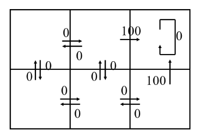

---

tldraw-file: true
tags: [tldraw]

---

^f55cebc1-d58a-413a-8856-dfe4b34082a4


```json !!!_START_OF_TLDRAW_DATA__DO_NOT_CHANGE_THIS_PHRASE_!!!
{
	"meta": {
		"uuid": "9b8578ec-eea4-40bb-8148-74341259a83e",
		"plugin-version": "1.15.0",
		"tldraw-version": "3.4.1"
	},
	"raw": {
		"tldrawFileFormatVersion": 1,
		"schema": {
			"schemaVersion": 2,
			"sequences": {
				"com.tldraw.store": 4,
				"com.tldraw.asset": 1,
				"com.tldraw.camera": 1,
				"com.tldraw.document": 2,
				"com.tldraw.instance": 25,
				"com.tldraw.instance_page_state": 5,
				"com.tldraw.page": 1,
				"com.tldraw.instance_presence": 5,
				"com.tldraw.pointer": 1,
				"com.tldraw.shape": 4,
				"com.tldraw.asset.bookmark": 2,
				"com.tldraw.asset.image": 5,
				"com.tldraw.asset.video": 5,
				"com.tldraw.shape.arrow": 5,
				"com.tldraw.shape.bookmark": 2,
				"com.tldraw.shape.draw": 2,
				"com.tldraw.shape.embed": 4,
				"com.tldraw.shape.frame": 0,
				"com.tldraw.shape.geo": 9,
				"com.tldraw.shape.group": 0,
				"com.tldraw.shape.highlight": 1,
				"com.tldraw.shape.image": 4,
				"com.tldraw.shape.line": 5,
				"com.tldraw.shape.note": 8,
				"com.tldraw.shape.text": 2,
				"com.tldraw.shape.video": 2,
				"com.tldraw.binding.arrow": 0
			}
		},
		"records": [
			{
				"gridSize": 10,
				"name": "",
				"meta": {},
				"id": "document:document",
				"typeName": "document"
			},
			{
				"x": 0,
				"y": 0,
				"lastActivityTimestamp": 0,
				"meta": {},
				"id": "pointer:pointer",
				"typeName": "pointer"
			},
			{
				"meta": {},
				"id": "page:page",
				"name": "Page 1",
				"index": "a1",
				"typeName": "page"
			},
			{
				"followingUserId": null,
				"opacityForNextShape": 1,
				"stylesForNextShape": {},
				"brush": null,
				"scribbles": [],
				"cursor": {
					"type": "default",
					"rotation": 0
				},
				"isFocusMode": false,
				"exportBackground": true,
				"isDebugMode": false,
				"isToolLocked": false,
				"screenBounds": {
					"x": 0,
					"y": 0,
					"w": 1080,
					"h": 720
				},
				"insets": [
					false,
					false,
					false,
					false
				],
				"zoomBrush": null,
				"isGridMode": false,
				"isPenMode": false,
				"chatMessage": "",
				"isChatting": false,
				"highlightedUserIds": [],
				"isFocused": false,
				"devicePixelRatio": 1.440000057220459,
				"isCoarsePointer": false,
				"isHoveringCanvas": null,
				"openMenus": [],
				"isChangingStyle": false,
				"isReadonly": false,
				"meta": {},
				"duplicateProps": null,
				"id": "instance:instance",
				"currentPageId": "page:page",
				"typeName": "instance"
			},
			{
				"editingShapeId": null,
				"croppingShapeId": null,
				"selectedShapeIds": [],
				"hoveredShapeId": null,
				"erasingShapeIds": [],
				"hintingShapeIds": [],
				"focusedGroupId": null,
				"meta": {},
				"id": "instance_page_state:page:page",
				"pageId": "page:page",
				"typeName": "instance_page_state"
			},
			{
				"x": 0,
				"y": 0,
				"z": 1,
				"meta": {},
				"id": "camera:page:page",
				"typeName": "camera"
			},
			{
				"id": "asset:595908743",
				"type": "image",
				"typeName": "asset",
				"props": {
					"name": "tldrawFile",
					"src": "asset:obsidian.blockref.f55cebc1-d58a-413a-8856-dfe4b34082a4",
					"w": 390,
					"h": 269,
					"fileSize": 12885,
					"mimeType": "image/png",
					"isAnimated": false
				},
				"meta": {}
			},
			{
				"x": 369.111328125,
				"y": 282.5898132324219,
				"rotation": 0,
				"isLocked": false,
				"opacity": 1,
				"meta": {},
				"id": "shape:Dj5YvHXRVJC6dVsjNbq_T",
				"type": "image",
				"props": {
					"w": 390,
					"h": 269,
					"assetId": "asset:595908743",
					"playing": true,
					"url": "",
					"crop": null,
					"flipX": false,
					"flipY": false
				},
				"parentId": "page:page",
				"index": "a1",
				"typeName": "shape"
			},
			{
				"x": 340,
				"y": 200,
				"rotation": 0,
				"isLocked": false,
				"opacity": 1,
				"meta": {},
				"id": "shape:Twi-G5zkpp3Ag5s360R-7",
				"type": "text",
				"props": {
					"color": "blue",
					"size": "m",
					"w": 66.92881774902344,
					"text": "state",
					"font": "draw",
					"textAlign": "start",
					"autoSize": true,
					"scale": 1
				},
				"parentId": "page:page",
				"index": "a25CK",
				"typeName": "shape"
			},
			{
				"x": 377.7782003229315,
				"y": 237.40059592507103,
				"rotation": 0,
				"isLocked": false,
				"opacity": 1,
				"meta": {},
				"id": "shape:Z56AQbV-N7GHmeCIJAqJA",
				"type": "draw",
				"props": {
					"segments": [
						{
							"type": "free",
							"points": [
								{
									"x": 0,
									"y": 0,
									"z": 0.5
								},
								{
									"x": 0,
									"y": 0.63,
									"z": 0.5
								},
								{
									"x": 0,
									"y": 1.89,
									"z": 0.5
								},
								{
									"x": 0.63,
									"y": 3.79,
									"z": 0.5
								},
								{
									"x": 1.89,
									"y": 6.31,
									"z": 0.5
								},
								{
									"x": 3.79,
									"y": 10.1,
									"z": 0.5
								},
								{
									"x": 5.68,
									"y": 15.15,
									"z": 0.5
								},
								{
									"x": 8.84,
									"y": 22.73,
									"z": 0.5
								},
								{
									"x": 11.99,
									"y": 29.67,
									"z": 0.5
								},
								{
									"x": 17.05,
									"y": 39.14,
									"z": 0.5
								},
								{
									"x": 20.2,
									"y": 45.45,
									"z": 0.5
								},
								{
									"x": 22.73,
									"y": 52.4,
									"z": 0.5
								},
								{
									"x": 26.52,
									"y": 61.87,
									"z": 0.5
								},
								{
									"x": 28.41,
									"y": 65.03,
									"z": 0.5
								},
								{
									"x": 31.57,
									"y": 70.08,
									"z": 0.5
								},
								{
									"x": 33.46,
									"y": 73.23,
									"z": 0.5
								},
								{
									"x": 34.72,
									"y": 76.39,
									"z": 0.5
								},
								{
									"x": 37.25,
									"y": 78.91,
									"z": 0.5
								},
								{
									"x": 37.88,
									"y": 80.81,
									"z": 0.5
								},
								{
									"x": 38.51,
									"y": 82.07,
									"z": 0.5
								},
								{
									"x": 39.14,
									"y": 83.33,
									"z": 0.5
								},
								{
									"x": 39.77,
									"y": 83.96,
									"z": 0.5
								},
								{
									"x": 39.77,
									"y": 84.6,
									"z": 0.5
								},
								{
									"x": 40.4,
									"y": 85.23,
									"z": 0.5
								},
								{
									"x": 40.4,
									"y": 85.86,
									"z": 0.5
								},
								{
									"x": 41.04,
									"y": 85.86,
									"z": 0.5
								}
							]
						}
					],
					"color": "blue",
					"fill": "none",
					"dash": "draw",
					"size": "m",
					"isComplete": true,
					"isClosed": false,
					"isPen": false,
					"scale": 1
				},
				"parentId": "page:page",
				"index": "a3Bby",
				"typeName": "shape"
			},
			{
				"x": 479.4196021340111,
				"y": 482.35010320490056,
				"rotation": 0,
				"isLocked": false,
				"opacity": 1,
				"meta": {},
				"id": "shape:sG6mP6owpv-_91YR7WVaT",
				"type": "draw",
				"props": {
					"segments": [
						{
							"type": "free",
							"points": [
								{
									"x": 0,
									"y": 0,
									"z": 0.5
								},
								{
									"x": 0,
									"y": 0.63,
									"z": 0.5
								},
								{
									"x": -0.63,
									"y": 1.26,
									"z": 0.5
								},
								{
									"x": -1.26,
									"y": 2.53,
									"z": 0.5
								},
								{
									"x": -1.89,
									"y": 3.79,
									"z": 0.5
								},
								{
									"x": -2.53,
									"y": 4.42,
									"z": 0.5
								},
								{
									"x": -3.79,
									"y": 6.31,
									"z": 0.5
								},
								{
									"x": -4.42,
									"y": 7.58,
									"z": 0.5
								},
								{
									"x": -5.05,
									"y": 9.47,
									"z": 0.5
								},
								{
									"x": -6.94,
									"y": 11.99,
									"z": 0.5
								},
								{
									"x": -7.58,
									"y": 13.89,
									"z": 0.5
								},
								{
									"x": -8.21,
									"y": 16.41,
									"z": 0.5
								},
								{
									"x": -9.47,
									"y": 19.57,
									"z": 0.5
								},
								{
									"x": -10.73,
									"y": 21.46,
									"z": 0.5
								},
								{
									"x": -11.36,
									"y": 24.62,
									"z": 0.5
								},
								{
									"x": -11.99,
									"y": 27.15,
									"z": 0.5
								},
								{
									"x": -12.63,
									"y": 29.67,
									"z": 0.5
								},
								{
									"x": -12.63,
									"y": 32.2,
									"z": 0.5
								},
								{
									"x": -13.89,
									"y": 35.35,
									"z": 0.5
								},
								{
									"x": -13.89,
									"y": 38.51,
									"z": 0.5
								},
								{
									"x": -14.52,
									"y": 40.4,
									"z": 0.5
								},
								{
									"x": -14.52,
									"y": 45.45,
									"z": 0.5
								},
								{
									"x": -14.52,
									"y": 49.24,
									"z": 0.5
								},
								{
									"x": -14.52,
									"y": 54.29,
									"z": 0.5
								},
								{
									"x": -14.52,
									"y": 58.71,
									"z": 0.5
								},
								{
									"x": -14.52,
									"y": 63.76,
									"z": 0.5
								},
								{
									"x": -14.52,
									"y": 67.55,
									"z": 0.5
								},
								{
									"x": -15.15,
									"y": 70.08,
									"z": 0.5
								},
								{
									"x": -15.15,
									"y": 73.86,
									"z": 0.5
								},
								{
									"x": -15.15,
									"y": 77.65,
									"z": 0.5
								},
								{
									"x": -15.15,
									"y": 80.18,
									"z": 0.5
								},
								{
									"x": -15.15,
									"y": 83.96,
									"z": 0.5
								},
								{
									"x": -15.15,
									"y": 85.86,
									"z": 0.5
								},
								{
									"x": -14.52,
									"y": 89.02,
									"z": 0.5
								},
								{
									"x": -13.89,
									"y": 90.28,
									"z": 0.5
								},
								{
									"x": -13.89,
									"y": 92.17,
									"z": 0.5
								},
								{
									"x": -13.26,
									"y": 94.07,
									"z": 0.5
								},
								{
									"x": -13.26,
									"y": 94.7,
									"z": 0.5
								},
								{
									"x": -13.26,
									"y": 95.33,
									"z": 0.5
								},
								{
									"x": -13.26,
									"y": 95.96,
									"z": 0.5
								},
								{
									"x": -12.63,
									"y": 95.96,
									"z": 0.5
								}
							]
						}
					],
					"color": "light-green",
					"fill": "none",
					"dash": "draw",
					"size": "m",
					"isComplete": true,
					"isClosed": false,
					"isPen": false,
					"scale": 1
				},
				"parentId": "page:page",
				"index": "a42fI",
				"typeName": "shape"
			},
			{
				"x": 492.6771871393378,
				"y": 497.50158136541194,
				"rotation": 0,
				"isLocked": false,
				"opacity": 1,
				"meta": {},
				"id": "shape:6gSZeTCrDRD271DV3ZMpA",
				"type": "draw",
				"props": {
					"segments": [
						{
							"type": "free",
							"points": [
								{
									"x": 0,
									"y": 0,
									"z": 0.5
								},
								{
									"x": -0.63,
									"y": 0,
									"z": 0.5
								},
								{
									"x": -1.26,
									"y": 0.63,
									"z": 0.5
								},
								{
									"x": -1.89,
									"y": 1.26,
									"z": 0.5
								},
								{
									"x": -2.53,
									"y": 1.26,
									"z": 0.5
								},
								{
									"x": -3.16,
									"y": 1.89,
									"z": 0.5
								},
								{
									"x": -3.79,
									"y": 1.89,
									"z": 0.5
								},
								{
									"x": -4.42,
									"y": 1.89,
									"z": 0.5
								},
								{
									"x": -4.42,
									"y": 2.53,
									"z": 0.5
								},
								{
									"x": -5.05,
									"y": 3.16,
									"z": 0.5
								},
								{
									"x": -5.68,
									"y": 3.16,
									"z": 0.5
								},
								{
									"x": -6.31,
									"y": 3.79,
									"z": 0.5
								},
								{
									"x": -6.31,
									"y": 4.42,
									"z": 0.5
								},
								{
									"x": -6.94,
									"y": 4.42,
									"z": 0.5
								},
								{
									"x": -6.94,
									"y": 5.05,
									"z": 0.5
								},
								{
									"x": -7.58,
									"y": 6.31,
									"z": 0.5
								},
								{
									"x": -8.21,
									"y": 6.31,
									"z": 0.5
								},
								{
									"x": -8.21,
									"y": 6.94,
									"z": 0.5
								},
								{
									"x": -8.21,
									"y": 7.58,
									"z": 0.5
								},
								{
									"x": -8.84,
									"y": 7.58,
									"z": 0.5
								},
								{
									"x": -8.84,
									"y": 8.21,
									"z": 0.5
								},
								{
									"x": -9.47,
									"y": 8.21,
									"z": 0.5
								},
								{
									"x": -9.47,
									"y": 8.84,
									"z": 0.5
								},
								{
									"x": -10.1,
									"y": 9.47,
									"z": 0.5
								},
								{
									"x": -10.73,
									"y": 10.1,
									"z": 0.5
								},
								{
									"x": -10.73,
									"y": 10.73,
									"z": 0.5
								},
								{
									"x": -11.36,
									"y": 11.36,
									"z": 0.5
								},
								{
									"x": -11.36,
									"y": 11.99,
									"z": 0.5
								},
								{
									"x": -11.99,
									"y": 11.99,
									"z": 0.5
								},
								{
									"x": -11.99,
									"y": 12.63,
									"z": 0.5
								},
								{
									"x": -12.63,
									"y": 13.89,
									"z": 0.5
								},
								{
									"x": -13.26,
									"y": 14.52,
									"z": 0.5
								},
								{
									"x": -13.26,
									"y": 15.15,
									"z": 0.5
								},
								{
									"x": -14.52,
									"y": 15.78,
									"z": 0.5
								},
								{
									"x": -14.52,
									"y": 16.41,
									"z": 0.5
								},
								{
									"x": -14.52,
									"y": 17.05,
									"z": 0.5
								},
								{
									"x": -15.15,
									"y": 17.05,
									"z": 0.5
								},
								{
									"x": -15.15,
									"y": 17.68,
									"z": 0.5
								},
								{
									"x": -15.78,
									"y": 17.68,
									"z": 0.5
								},
								{
									"x": -15.78,
									"y": 18.31,
									"z": 0.5
								},
								{
									"x": -16.41,
									"y": 18.94,
									"z": 0.5
								},
								{
									"x": -16.41,
									"y": 19.57,
									"z": 0.5
								},
								{
									"x": -17.05,
									"y": 20.2,
									"z": 0.5
								},
								{
									"x": -17.68,
									"y": 20.83,
									"z": 0.5
								},
								{
									"x": -17.68,
									"y": 21.46,
									"z": 0.5
								},
								{
									"x": -18.31,
									"y": 22.1,
									"z": 0.5
								},
								{
									"x": -18.31,
									"y": 22.73,
									"z": 0.5
								},
								{
									"x": -19.57,
									"y": 23.99,
									"z": 0.5
								},
								{
									"x": -19.57,
									"y": 24.62,
									"z": 0.5
								},
								{
									"x": -20.2,
									"y": 25.25,
									"z": 0.5
								},
								{
									"x": -20.2,
									"y": 25.88,
									"z": 0.5
								},
								{
									"x": -20.83,
									"y": 26.52,
									"z": 0.5
								},
								{
									"x": -20.83,
									"y": 27.15,
									"z": 0.5
								},
								{
									"x": -20.83,
									"y": 27.78,
									"z": 0.5
								},
								{
									"x": -21.46,
									"y": 27.78,
									"z": 0.5
								},
								{
									"x": -21.46,
									"y": 28.41,
									"z": 0.5
								},
								{
									"x": -22.1,
									"y": 28.41,
									"z": 0.5
								},
								{
									"x": -22.1,
									"y": 29.04,
									"z": 0.5
								},
								{
									"x": -22.1,
									"y": 29.67,
									"z": 0.5
								},
								{
									"x": -22.73,
									"y": 30.3,
									"z": 0.5
								},
								{
									"x": -22.73,
									"y": 30.93,
									"z": 0.5
								},
								{
									"x": -22.73,
									"y": 31.57,
									"z": 0.5
								},
								{
									"x": -22.73,
									"y": 32.2,
									"z": 0.5
								},
								{
									"x": -22.73,
									"y": 32.83,
									"z": 0.5
								},
								{
									"x": -22.73,
									"y": 33.46,
									"z": 0.5
								},
								{
									"x": -22.73,
									"y": 34.09,
									"z": 0.5
								},
								{
									"x": -23.36,
									"y": 34.09,
									"z": 0.5
								},
								{
									"x": -23.36,
									"y": 34.72,
									"z": 0.5
								},
								{
									"x": -23.36,
									"y": 35.35,
									"z": 0.5
								},
								{
									"x": -23.36,
									"y": 35.98,
									"z": 0.5
								},
								{
									"x": -23.99,
									"y": 36.62,
									"z": 0.5
								},
								{
									"x": -23.99,
									"y": 37.25,
									"z": 0.5
								},
								{
									"x": -23.99,
									"y": 37.88,
									"z": 0.5
								},
								{
									"x": -23.99,
									"y": 38.51,
									"z": 0.5
								},
								{
									"x": -24.62,
									"y": 39.14,
									"z": 0.5
								},
								{
									"x": -24.62,
									"y": 39.77,
									"z": 0.5
								},
								{
									"x": -24.62,
									"y": 40.4,
									"z": 0.5
								},
								{
									"x": -24.62,
									"y": 41.04,
									"z": 0.5
								},
								{
									"x": -25.25,
									"y": 41.04,
									"z": 0.5
								},
								{
									"x": -25.25,
									"y": 41.67,
									"z": 0.5
								},
								{
									"x": -25.25,
									"y": 42.3,
									"z": 0.5
								},
								{
									"x": -25.88,
									"y": 42.93,
									"z": 0.5
								},
								{
									"x": -25.88,
									"y": 43.56,
									"z": 0.5
								},
								{
									"x": -25.88,
									"y": 44.19,
									"z": 0.5
								},
								{
									"x": -25.88,
									"y": 44.82,
									"z": 0.5
								},
								{
									"x": -25.88,
									"y": 45.45,
									"z": 0.5
								},
								{
									"x": -25.88,
									"y": 46.09,
									"z": 0.5
								},
								{
									"x": -25.88,
									"y": 46.72,
									"z": 0.5
								},
								{
									"x": -25.88,
									"y": 47.35,
									"z": 0.5
								},
								{
									"x": -26.52,
									"y": 47.35,
									"z": 0.5
								},
								{
									"x": -26.52,
									"y": 47.98,
									"z": 0.5
								},
								{
									"x": -26.52,
									"y": 48.61,
									"z": 0.5
								},
								{
									"x": -26.52,
									"y": 49.24,
									"z": 0.5
								},
								{
									"x": -26.52,
									"y": 49.87,
									"z": 0.5
								},
								{
									"x": -26.52,
									"y": 50.51,
									"z": 0.5
								},
								{
									"x": -26.52,
									"y": 51.14,
									"z": 0.5
								},
								{
									"x": -26.52,
									"y": 51.77,
									"z": 0.5
								},
								{
									"x": -26.52,
									"y": 52.4,
									"z": 0.5
								},
								{
									"x": -26.52,
									"y": 53.03,
									"z": 0.5
								},
								{
									"x": -26.52,
									"y": 53.66,
									"z": 0.5
								},
								{
									"x": -26.52,
									"y": 54.29,
									"z": 0.5
								},
								{
									"x": -26.52,
									"y": 54.92,
									"z": 0.5
								},
								{
									"x": -26.52,
									"y": 55.56,
									"z": 0.5
								},
								{
									"x": -26.52,
									"y": 56.19,
									"z": 0.5
								},
								{
									"x": -26.52,
									"y": 56.82,
									"z": 0.5
								},
								{
									"x": -26.52,
									"y": 57.45,
									"z": 0.5
								},
								{
									"x": -26.52,
									"y": 58.08,
									"z": 0.5
								},
								{
									"x": -26.52,
									"y": 58.71,
									"z": 0.5
								},
								{
									"x": -26.52,
									"y": 59.34,
									"z": 0.5
								},
								{
									"x": -26.52,
									"y": 59.97,
									"z": 0.5
								},
								{
									"x": -26.52,
									"y": 61.24,
									"z": 0.5
								},
								{
									"x": -26.52,
									"y": 61.87,
									"z": 0.5
								},
								{
									"x": -26.52,
									"y": 62.5,
									"z": 0.5
								},
								{
									"x": -26.52,
									"y": 63.76,
									"z": 0.5
								},
								{
									"x": -25.88,
									"y": 64.39,
									"z": 0.5
								},
								{
									"x": -25.88,
									"y": 66.29,
									"z": 0.5
								},
								{
									"x": -25.88,
									"y": 66.92,
									"z": 0.5
								},
								{
									"x": -25.88,
									"y": 68.18,
									"z": 0.5
								},
								{
									"x": -25.88,
									"y": 69.44,
									"z": 0.5
								},
								{
									"x": -25.88,
									"y": 70.71,
									"z": 0.5
								},
								{
									"x": -25.88,
									"y": 71.34,
									"z": 0.5
								},
								{
									"x": -25.88,
									"y": 71.97,
									"z": 0.5
								},
								{
									"x": -25.88,
									"y": 72.6,
									"z": 0.5
								},
								{
									"x": -25.88,
									"y": 73.23,
									"z": 0.5
								},
								{
									"x": -25.88,
									"y": 73.86,
									"z": 0.5
								},
								{
									"x": -25.25,
									"y": 74.49,
									"z": 0.5
								},
								{
									"x": -25.25,
									"y": 75.13,
									"z": 0.5
								},
								{
									"x": -25.25,
									"y": 75.76,
									"z": 0.5
								},
								{
									"x": -25.25,
									"y": 76.39,
									"z": 0.5
								},
								{
									"x": -25.25,
									"y": 77.02,
									"z": 0.5
								},
								{
									"x": -25.25,
									"y": 77.65,
									"z": 0.5
								},
								{
									"x": -25.25,
									"y": 78.28,
									"z": 0.5
								},
								{
									"x": -25.25,
									"y": 78.91,
									"z": 0.5
								},
								{
									"x": -24.62,
									"y": 79.55,
									"z": 0.5
								},
								{
									"x": -24.62,
									"y": 80.18,
									"z": 0.5
								},
								{
									"x": -24.62,
									"y": 80.81,
									"z": 0.5
								},
								{
									"x": -23.99,
									"y": 81.44,
									"z": 0.5
								},
								{
									"x": -23.99,
									"y": 82.07,
									"z": 0.5
								},
								{
									"x": -23.99,
									"y": 82.7,
									"z": 0.5
								},
								{
									"x": -23.36,
									"y": 83.96,
									"z": 0.5
								},
								{
									"x": -22.73,
									"y": 84.6,
									"z": 0.5
								},
								{
									"x": -22.73,
									"y": 85.86,
									"z": 0.5
								},
								{
									"x": -22.1,
									"y": 87.12,
									"z": 0.5
								},
								{
									"x": -22.1,
									"y": 87.75,
									"z": 0.5
								},
								{
									"x": -21.46,
									"y": 87.75,
									"z": 0.5
								},
								{
									"x": -21.46,
									"y": 88.38,
									"z": 0.5
								},
								{
									"x": -21.46,
									"y": 89.02,
									"z": 0.5
								},
								{
									"x": -21.46,
									"y": 89.65,
									"z": 0.5
								},
								{
									"x": -20.83,
									"y": 89.65,
									"z": 0.5
								},
								{
									"x": -20.83,
									"y": 90.28,
									"z": 0.5
								}
							]
						}
					],
					"color": "light-green",
					"fill": "none",
					"dash": "draw",
					"size": "m",
					"isComplete": true,
					"isClosed": false,
					"isPen": false,
					"scale": 1
				},
				"parentId": "page:page",
				"index": "a526z",
				"typeName": "shape"
			},
			{
				"x": 370,
				"y": 590,
				"rotation": 0,
				"isLocked": false,
				"opacity": 1,
				"meta": {},
				"id": "shape:DSQaacaCeXJ5RZjj27fDL",
				"type": "text",
				"props": {
					"color": "light-green",
					"size": "m",
					"w": 329.111328125,
					"text": "actions (state transition function δ(s, a))",
					"font": "draw",
					"textAlign": "start",
					"autoSize": false,
					"scale": 1
				},
				"parentId": "page:page",
				"index": "a65dH",
				"typeName": "shape"
			},
			{
				"x": 495.202433499423,
				"y": 325.153115012429,
				"rotation": 0,
				"isLocked": false,
				"opacity": 1,
				"meta": {},
				"id": "shape:NN-hXgLQlyFxRPN7D2m45",
				"type": "draw",
				"props": {
					"segments": [
						{
							"type": "free",
							"points": [
								{
									"x": 0,
									"y": 0,
									"z": 0.5
								},
								{
									"x": 0,
									"y": -0.63,
									"z": 0.5
								},
								{
									"x": 0,
									"y": -1.26,
									"z": 0.5
								},
								{
									"x": 0,
									"y": -2.53,
									"z": 0.5
								},
								{
									"x": 0,
									"y": -3.16,
									"z": 0.5
								},
								{
									"x": 0,
									"y": -5.05,
									"z": 0.5
								},
								{
									"x": 0,
									"y": -6.31,
									"z": 0.5
								},
								{
									"x": 0.63,
									"y": -9.47,
									"z": 0.5
								},
								{
									"x": 0.63,
									"y": -12.63,
									"z": 0.5
								},
								{
									"x": 1.26,
									"y": -15.78,
									"z": 0.5
								},
								{
									"x": 1.26,
									"y": -20.2,
									"z": 0.5
								},
								{
									"x": 2.53,
									"y": -25.25,
									"z": 0.5
								},
								{
									"x": 2.53,
									"y": -29.04,
									"z": 0.5
								},
								{
									"x": 2.53,
									"y": -34.09,
									"z": 0.5
								},
								{
									"x": 3.16,
									"y": -37.88,
									"z": 0.5
								},
								{
									"x": 3.16,
									"y": -42.93,
									"z": 0.5
								},
								{
									"x": 3.16,
									"y": -44.82,
									"z": 0.5
								},
								{
									"x": 3.16,
									"y": -47.35,
									"z": 0.5
								},
								{
									"x": 3.16,
									"y": -49.87,
									"z": 0.5
								},
								{
									"x": 3.16,
									"y": -51.77,
									"z": 0.5
								},
								{
									"x": 3.16,
									"y": -53.03,
									"z": 0.5
								},
								{
									"x": 3.16,
									"y": -54.29,
									"z": 0.5
								},
								{
									"x": 3.16,
									"y": -56.19,
									"z": 0.5
								},
								{
									"x": 3.16,
									"y": -56.82,
									"z": 0.5
								},
								{
									"x": 3.16,
									"y": -57.45,
									"z": 0.5
								},
								{
									"x": 3.16,
									"y": -58.08,
									"z": 0.5
								},
								{
									"x": 3.16,
									"y": -58.71,
									"z": 0.5
								}
							]
						}
					],
					"color": "orange",
					"fill": "none",
					"dash": "draw",
					"size": "m",
					"isComplete": true,
					"isClosed": false,
					"isPen": false,
					"scale": 1
				},
				"parentId": "page:page",
				"index": "a7BIn",
				"typeName": "shape"
			},
			{
				"x": 460,
				"y": 200,
				"rotation": 0,
				"isLocked": false,
				"opacity": 1,
				"meta": {},
				"id": "shape:_pKzaLmLJ3QaARgTQ-gED",
				"type": "text",
				"props": {
					"color": "orange",
					"size": "m",
					"w": 400,
					"text": "immediate reward for action (reward function R(s,a)",
					"font": "draw",
					"textAlign": "start",
					"autoSize": false,
					"scale": 1
				},
				"parentId": "page:page",
				"index": "a87k8",
				"typeName": "shape"
			}
		]
	}
}
!!!_END_OF_TLDRAW_DATA__DO_NOT_CHANGE_THIS_PHRASE_!!!
```