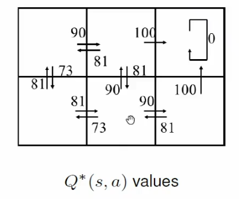
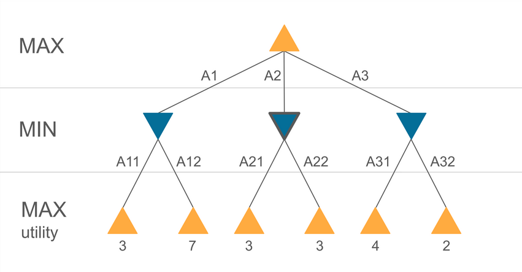
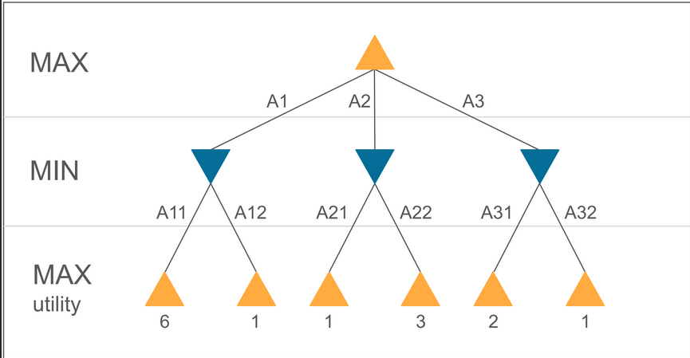

---

tldraw-file: true
tags: [tldraw]

---

^4bc52412-dfb0-46a1-addb-1af9e773b763


^51d86013-236c-480d-8ef8-2b82a6c8afe9


^6535af2c-8ef3-4d31-bdab-3c968ccdaaf2


^0faa559a-e7d1-4f4b-af31-fd2a824aafe1


```json !!!_START_OF_TLDRAW_DATA__DO_NOT_CHANGE_THIS_PHRASE_!!!
{
	"meta": {
		"uuid": "dd58342c-7da1-4618-9389-ab5afbe1b81d",
		"plugin-version": "1.15.0",
		"tldraw-version": "3.4.1"
	},
	"raw": {
		"tldrawFileFormatVersion": 1,
		"schema": {
			"schemaVersion": 2,
			"sequences": {
				"com.tldraw.store": 4,
				"com.tldraw.asset": 1,
				"com.tldraw.camera": 1,
				"com.tldraw.document": 2,
				"com.tldraw.instance": 25,
				"com.tldraw.instance_page_state": 5,
				"com.tldraw.page": 1,
				"com.tldraw.instance_presence": 5,
				"com.tldraw.pointer": 1,
				"com.tldraw.shape": 4,
				"com.tldraw.asset.bookmark": 2,
				"com.tldraw.asset.image": 5,
				"com.tldraw.asset.video": 5,
				"com.tldraw.shape.arrow": 5,
				"com.tldraw.shape.bookmark": 2,
				"com.tldraw.shape.draw": 2,
				"com.tldraw.shape.embed": 4,
				"com.tldraw.shape.frame": 0,
				"com.tldraw.shape.geo": 9,
				"com.tldraw.shape.group": 0,
				"com.tldraw.shape.highlight": 1,
				"com.tldraw.shape.image": 4,
				"com.tldraw.shape.line": 5,
				"com.tldraw.shape.note": 8,
				"com.tldraw.shape.text": 2,
				"com.tldraw.shape.video": 2,
				"com.tldraw.binding.arrow": 0
			}
		},
		"records": [
			{
				"gridSize": 10,
				"name": "",
				"meta": {},
				"id": "document:document",
				"typeName": "document"
			},
			{
				"meta": {},
				"id": "page:page",
				"name": "Page 1",
				"index": "a1",
				"typeName": "page"
			},
			{
				"id": "asset:758237470",
				"type": "image",
				"typeName": "asset",
				"props": {
					"name": "tldrawFile",
					"src": "asset:obsidian.blockref.6535af2c-8ef3-4d31-bdab-3c968ccdaaf2",
					"w": 851,
					"h": 443,
					"fileSize": 67017,
					"mimeType": "image/png",
					"isAnimated": false
				},
				"meta": {}
			},
			{
				"x": 190,
				"y": 870,
				"rotation": 0,
				"isLocked": false,
				"opacity": 1,
				"meta": {},
				"id": "shape:9y7jgq0sFR3Pfs7NtrQk_",
				"type": "text",
				"props": {
					"color": "blue",
					"size": "s",
					"w": 227.68185424804688,
					"text": "this branch returns 3",
					"font": "mono",
					"textAlign": "start",
					"autoSize": true,
					"scale": 1
				},
				"parentId": "page:page",
				"index": "aD9pV",
				"typeName": "shape"
			},
			{
				"x": 296.8457661297192,
				"y": 1070.4864570702166,
				"rotation": 0,
				"isLocked": false,
				"opacity": 1,
				"meta": {},
				"id": "shape:4CCFhmCUYiCP3qQLPzA-P",
				"type": "draw",
				"props": {
					"segments": [
						{
							"type": "free",
							"points": [
								{
									"x": 0,
									"y": 0,
									"z": 0.5
								},
								{
									"x": 0,
									"y": -1.58,
									"z": 0.5
								},
								{
									"x": 0,
									"y": -3.15,
									"z": 0.5
								},
								{
									"x": 0,
									"y": -9.46,
									"z": 0.5
								},
								{
									"x": 0,
									"y": -13.41,
									"z": 0.5
								},
								{
									"x": 0,
									"y": -19.71,
									"z": 0.5
								},
								{
									"x": 0,
									"y": -24.45,
									"z": 0.5
								},
								{
									"x": 0,
									"y": -32.33,
									"z": 0.5
								},
								{
									"x": 1.58,
									"y": -38.64,
									"z": 0.5
								},
								{
									"x": 2.37,
									"y": -43.37,
									"z": 0.5
								},
								{
									"x": 4.73,
									"y": -49.68,
									"z": 0.5
								},
								{
									"x": 5.52,
									"y": -55.99,
									"z": 0.5
								},
								{
									"x": 7.89,
									"y": -61.51,
									"z": 0.5
								},
								{
									"x": 10.25,
									"y": -67.03,
									"z": 0.5
								},
								{
									"x": 13.41,
									"y": -70.19,
									"z": 0.5
								},
								{
									"x": 15.77,
									"y": -74.92,
									"z": 0.5
								},
								{
									"x": 19.71,
									"y": -78.86,
									"z": 0.5
								},
								{
									"x": 22.87,
									"y": -83.59,
									"z": 0.5
								},
								{
									"x": 27.6,
									"y": -88.32,
									"z": 0.5
								},
								{
									"x": 29.97,
									"y": -94.63,
									"z": 0.5
								},
								{
									"x": 34.7,
									"y": -100.94,
									"z": 0.5
								},
								{
									"x": 37.06,
									"y": -104.09,
									"z": 0.5
								},
								{
									"x": 40.22,
									"y": -107.25,
									"z": 0.5
								},
								{
									"x": 41.8,
									"y": -109.62,
									"z": 0.5
								},
								{
									"x": 43.37,
									"y": -111.98,
									"z": 0.5
								},
								{
									"x": 44.95,
									"y": -112.77,
									"z": 0.5
								},
								{
									"x": 44.95,
									"y": -113.56,
									"z": 0.5
								},
								{
									"x": 45.74,
									"y": -114.35,
									"z": 0.5
								},
								{
									"x": 46.53,
									"y": -114.35,
									"z": 0.5
								},
								{
									"x": 46.53,
									"y": -115.14,
									"z": 0.5
								},
								{
									"x": 47.32,
									"y": -115.14,
									"z": 0.5
								}
							]
						}
					],
					"color": "blue",
					"fill": "none",
					"dash": "draw",
					"size": "s",
					"isComplete": true,
					"isClosed": false,
					"isPen": false,
					"scale": 1
				},
				"parentId": "page:page",
				"index": "aE5sh",
				"typeName": "shape"
			},
			{
				"x": 337.0642615142084,
				"y": 952.1967769941402,
				"rotation": 0,
				"isLocked": false,
				"opacity": 1,
				"meta": {},
				"id": "shape:IHgKlw8cKzE-_c4GR0z1u",
				"type": "draw",
				"props": {
					"segments": [
						{
							"type": "free",
							"points": [
								{
									"x": 0,
									"y": 0,
									"z": 0.5
								},
								{
									"x": 0,
									"y": -0.79,
									"z": 0.5
								},
								{
									"x": 0.79,
									"y": -2.37,
									"z": 0.5
								},
								{
									"x": 2.37,
									"y": -3.15,
									"z": 0.5
								},
								{
									"x": 3.15,
									"y": -3.94,
									"z": 0.5
								},
								{
									"x": 4.73,
									"y": -5.52,
									"z": 0.5
								},
								{
									"x": 5.52,
									"y": -7.1,
									"z": 0.5
								},
								{
									"x": 6.31,
									"y": -7.1,
									"z": 0.5
								},
								{
									"x": 7.1,
									"y": -8.67,
									"z": 0.5
								},
								{
									"x": 7.89,
									"y": -9.46,
									"z": 0.5
								},
								{
									"x": 7.89,
									"y": -10.25,
									"z": 0.5
								},
								{
									"x": 8.67,
									"y": -10.25,
									"z": 0.5
								},
								{
									"x": 8.67,
									"y": -11.04,
									"z": 0.5
								},
								{
									"x": 9.46,
									"y": -11.83,
									"z": 0.5
								},
								{
									"x": 10.25,
									"y": -11.83,
									"z": 0.5
								},
								{
									"x": 11.04,
									"y": -12.62,
									"z": 0.5
								},
								{
									"x": 11.83,
									"y": -12.62,
									"z": 0.5
								},
								{
									"x": 11.83,
									"y": -13.41,
									"z": 0.5
								},
								{
									"x": 12.62,
									"y": -13.41,
									"z": 0.5
								},
								{
									"x": 12.62,
									"y": -12.62,
									"z": 0.5
								},
								{
									"x": 12.62,
									"y": -11.83,
									"z": 0.5
								},
								{
									"x": 12.62,
									"y": -11.04,
									"z": 0.5
								},
								{
									"x": 12.62,
									"y": -9.46,
									"z": 0.5
								},
								{
									"x": 12.62,
									"y": -7.89,
									"z": 0.5
								},
								{
									"x": 12.62,
									"y": -7.1,
									"z": 0.5
								},
								{
									"x": 12.62,
									"y": -5.52,
									"z": 0.5
								},
								{
									"x": 13.41,
									"y": -3.94,
									"z": 0.5
								},
								{
									"x": 13.41,
									"y": -3.15,
									"z": 0.5
								},
								{
									"x": 14.19,
									"y": -2.37,
									"z": 0.5
								},
								{
									"x": 14.19,
									"y": -1.58,
									"z": 0.5
								},
								{
									"x": 14.19,
									"y": -0.79,
									"z": 0.5
								}
							]
						}
					],
					"color": "blue",
					"fill": "none",
					"dash": "draw",
					"size": "s",
					"isComplete": true,
					"isClosed": false,
					"isPen": false,
					"scale": 1
				},
				"parentId": "page:page",
				"index": "aF8G6",
				"typeName": "shape"
			},
			{
				"x": 420,
				"y": 1190,
				"rotation": 0,
				"isLocked": false,
				"opacity": 1,
				"meta": {},
				"id": "shape:km0JvMdwa9tO_LzmfFaA6",
				"type": "text",
				"props": {
					"color": "blue",
					"size": "s",
					"w": 290,
					"text": "3 (beta) is already <= the value for alpha. MIN won't choose sth bigger than that. don't bother checking the other branch(es)",
					"font": "mono",
					"textAlign": "start",
					"autoSize": false,
					"scale": 1
				},
				"parentId": "page:page",
				"index": "ap9Hv",
				"typeName": "shape"
			},
			{
				"x": 140,
				"y": 720,
				"rotation": 0,
				"isLocked": true,
				"opacity": 1,
				"meta": {},
				"id": "shape:Ih64BBPN08-5meYWPnY1L",
				"type": "image",
				"props": {
					"w": 851,
					"h": 443,
					"assetId": "asset:758237470",
					"playing": true,
					"url": "",
					"crop": null,
					"flipX": false,
					"flipY": false
				},
				"parentId": "page:page",
				"index": "aC6Ah",
				"typeName": "shape"
			},
			{
				"x": 523.2180294479671,
				"y": 1049.1943409944702,
				"rotation": 0,
				"isLocked": false,
				"opacity": 1,
				"meta": {},
				"id": "shape:0a6E_hIhvcH0RCnFnnvMd",
				"type": "draw",
				"props": {
					"segments": [
						{
							"type": "free",
							"points": [
								{
									"x": 0,
									"y": 0,
									"z": 0.5
								},
								{
									"x": 0,
									"y": -0.79,
									"z": 0.5
								},
								{
									"x": 0,
									"y": -3.15,
									"z": 0.5
								},
								{
									"x": 0.79,
									"y": -4.73,
									"z": 0.5
								},
								{
									"x": 1.58,
									"y": -8.67,
									"z": 0.5
								},
								{
									"x": 3.94,
									"y": -11.04,
									"z": 0.5
								},
								{
									"x": 5.52,
									"y": -16.56,
									"z": 0.5
								},
								{
									"x": 7.89,
									"y": -21.29,
									"z": 0.5
								},
								{
									"x": 9.46,
									"y": -26.02,
									"z": 0.5
								},
								{
									"x": 12.62,
									"y": -32.33,
									"z": 0.5
								},
								{
									"x": 15.77,
									"y": -37.06,
									"z": 0.5
								},
								{
									"x": 18.93,
									"y": -44.95,
									"z": 0.5
								},
								{
									"x": 22.08,
									"y": -49.68,
									"z": 0.5
								},
								{
									"x": 24.45,
									"y": -54.41,
									"z": 0.5
								},
								{
									"x": 27.6,
									"y": -59.93,
									"z": 0.5
								},
								{
									"x": 28.39,
									"y": -63.09,
									"z": 0.5
								},
								{
									"x": 30.76,
									"y": -67.03,
									"z": 0.5
								},
								{
									"x": 32.33,
									"y": -68.61,
									"z": 0.5
								},
								{
									"x": 33.91,
									"y": -72.55,
									"z": 0.5
								},
								{
									"x": 36.28,
									"y": -74.92,
									"z": 0.5
								},
								{
									"x": 37.06,
									"y": -76.49,
									"z": 0.5
								},
								{
									"x": 37.85,
									"y": -78.86,
									"z": 0.5
								},
								{
									"x": 38.64,
									"y": -80.44,
									"z": 0.5
								},
								{
									"x": 40.22,
									"y": -81.23,
									"z": 0.5
								},
								{
									"x": 41.01,
									"y": -82.01,
									"z": 0.5
								},
								{
									"x": 41.8,
									"y": -83.59,
									"z": 0.5
								},
								{
									"x": 42.58,
									"y": -83.59,
									"z": 0.5
								},
								{
									"x": 43.37,
									"y": -84.38,
									"z": 0.5
								},
								{
									"x": 44.95,
									"y": -85.17,
									"z": 0.5
								},
								{
									"x": 44.95,
									"y": -85.96,
									"z": 0.5
								},
								{
									"x": 45.74,
									"y": -85.96,
									"z": 0.5
								},
								{
									"x": 46.53,
									"y": -85.96,
									"z": 0.5
								},
								{
									"x": 46.53,
									"y": -86.75,
									"z": 0.5
								}
							]
						}
					],
					"color": "blue",
					"fill": "none",
					"dash": "draw",
					"size": "s",
					"isComplete": true,
					"isClosed": false,
					"isPen": false,
					"scale": 1
				},
				"parentId": "page:page",
				"index": "asAr2",
				"typeName": "shape"
			},
			{
				"x": 554.7619487556132,
				"y": 961.6599319933185,
				"rotation": 0,
				"isLocked": false,
				"opacity": 1,
				"meta": {},
				"id": "shape:9QQwFEfysPSXTocL0xcv8",
				"type": "draw",
				"props": {
					"segments": [
						{
							"type": "free",
							"points": [
								{
									"x": 0,
									"y": 0,
									"z": 0.5
								},
								{
									"x": 0,
									"y": -0.79,
									"z": 0.5
								},
								{
									"x": 1.58,
									"y": -0.79,
									"z": 0.5
								},
								{
									"x": 2.37,
									"y": -1.58,
									"z": 0.5
								},
								{
									"x": 3.94,
									"y": -2.37,
									"z": 0.5
								},
								{
									"x": 4.73,
									"y": -3.15,
									"z": 0.5
								},
								{
									"x": 7.1,
									"y": -3.94,
									"z": 0.5
								},
								{
									"x": 8.67,
									"y": -4.73,
									"z": 0.5
								},
								{
									"x": 11.83,
									"y": -5.52,
									"z": 0.5
								},
								{
									"x": 13.41,
									"y": -6.31,
									"z": 0.5
								},
								{
									"x": 14.98,
									"y": -7.1,
									"z": 0.5
								},
								{
									"x": 16.56,
									"y": -7.89,
									"z": 0.5
								},
								{
									"x": 17.35,
									"y": -8.67,
									"z": 0.5
								},
								{
									"x": 18.93,
									"y": -9.46,
									"z": 0.5
								},
								{
									"x": 19.71,
									"y": -9.46,
									"z": 0.5
								},
								{
									"x": 20.5,
									"y": -10.25,
									"z": 0.5
								},
								{
									"x": 21.29,
									"y": -10.25,
									"z": 0.5
								},
								{
									"x": 21.29,
									"y": -11.04,
									"z": 0.5
								},
								{
									"x": 21.29,
									"y": -10.25,
									"z": 0.5
								},
								{
									"x": 21.29,
									"y": -9.46,
									"z": 0.5
								},
								{
									"x": 20.5,
									"y": -7.89,
									"z": 0.5
								},
								{
									"x": 20.5,
									"y": -7.1,
									"z": 0.5
								},
								{
									"x": 19.71,
									"y": -5.52,
									"z": 0.5
								},
								{
									"x": 18.93,
									"y": -3.94,
									"z": 0.5
								},
								{
									"x": 18.14,
									"y": -1.58,
									"z": 0.5
								},
								{
									"x": 17.35,
									"y": 0,
									"z": 0.5
								},
								{
									"x": 15.77,
									"y": 8.67,
									"z": 0.5
								},
								{
									"x": 15.77,
									"y": 10.25,
									"z": 0.5
								},
								{
									"x": 15.77,
									"y": 11.83,
									"z": 0.5
								}
							]
						}
					],
					"color": "blue",
					"fill": "none",
					"dash": "draw",
					"size": "s",
					"isComplete": true,
					"isClosed": false,
					"isPen": false,
					"scale": 1
				},
				"parentId": "page:page",
				"index": "at19m",
				"typeName": "shape"
			},
			{
				"x": 550,
				"y": 870,
				"rotation": 0,
				"isLocked": false,
				"opacity": 1,
				"meta": {},
				"id": "shape:yfbK-g7d7_LRmNELMEJ1k",
				"type": "text",
				"props": {
					"color": "blue",
					"size": "s",
					"w": 16,
					"text": "3",
					"font": "mono",
					"textAlign": "start",
					"autoSize": true,
					"scale": 1
				},
				"parentId": "page:page",
				"index": "aw1qQ",
				"typeName": "shape"
			},
			{
				"x": 415.1801179485968,
				"y": 1186.4104003792888,
				"rotation": 0,
				"isLocked": false,
				"opacity": 1,
				"meta": {},
				"id": "shape:e76h7tbQfZYckkfvIQB8q",
				"type": "draw",
				"props": {
					"segments": [
						{
							"type": "free",
							"points": [
								{
									"x": 0,
									"y": 0,
									"z": 0.5
								},
								{
									"x": -0.79,
									"y": 0,
									"z": 0.5
								},
								{
									"x": -1.58,
									"y": -0.79,
									"z": 0.5
								},
								{
									"x": -1.58,
									"y": -1.58,
									"z": 0.5
								},
								{
									"x": -1.58,
									"y": -2.37,
									"z": 0.5
								},
								{
									"x": -1.58,
									"y": -3.15,
									"z": 0.5
								},
								{
									"x": -0.79,
									"y": -3.94,
									"z": 0.5
								},
								{
									"x": 0.79,
									"y": -4.73,
									"z": 0.5
								},
								{
									"x": 1.58,
									"y": -6.31,
									"z": 0.5
								},
								{
									"x": 2.37,
									"y": -7.1,
									"z": 0.5
								},
								{
									"x": 4.73,
									"y": -8.67,
									"z": 0.5
								},
								{
									"x": 6.31,
									"y": -9.46,
									"z": 0.5
								},
								{
									"x": 7.89,
									"y": -11.04,
									"z": 0.5
								},
								{
									"x": 8.67,
									"y": -11.83,
									"z": 0.5
								},
								{
									"x": 10.25,
									"y": -12.62,
									"z": 0.5
								},
								{
									"x": 11.83,
									"y": -13.41,
									"z": 0.5
								},
								{
									"x": 13.41,
									"y": -14.19,
									"z": 0.5
								},
								{
									"x": 14.98,
									"y": -14.98,
									"z": 0.5
								},
								{
									"x": 15.77,
									"y": -14.98,
									"z": 0.5
								},
								{
									"x": 17.35,
									"y": -15.77,
									"z": 0.5
								},
								{
									"x": 18.14,
									"y": -16.56,
									"z": 0.5
								},
								{
									"x": 19.71,
									"y": -16.56,
									"z": 0.5
								},
								{
									"x": 20.5,
									"y": -17.35,
									"z": 0.5
								},
								{
									"x": 21.29,
									"y": -18.14,
									"z": 0.5
								},
								{
									"x": 22.87,
									"y": -18.14,
									"z": 0.5
								},
								{
									"x": 23.66,
									"y": -18.14,
									"z": 0.5
								},
								{
									"x": 25.24,
									"y": -18.93,
									"z": 0.5
								},
								{
									"x": 26.02,
									"y": -18.93,
									"z": 0.5
								},
								{
									"x": 27.6,
									"y": -18.93,
									"z": 0.5
								},
								{
									"x": 28.39,
									"y": -18.93,
									"z": 0.5
								},
								{
									"x": 30.76,
									"y": -19.71,
									"z": 0.5
								},
								{
									"x": 33.12,
									"y": -19.71,
									"z": 0.5
								},
								{
									"x": 34.7,
									"y": -19.71,
									"z": 0.5
								},
								{
									"x": 36.28,
									"y": -19.71,
									"z": 0.5
								},
								{
									"x": 39.43,
									"y": -19.71,
									"z": 0.5
								},
								{
									"x": 40.22,
									"y": -19.71,
									"z": 0.5
								},
								{
									"x": 43.37,
									"y": -19.71,
									"z": 0.5
								},
								{
									"x": 44.95,
									"y": -19.71,
									"z": 0.5
								},
								{
									"x": 48.89,
									"y": -18.93,
									"z": 0.5
								},
								{
									"x": 50.47,
									"y": -18.93,
									"z": 0.5
								},
								{
									"x": 53.62,
									"y": -18.14,
									"z": 0.5
								},
								{
									"x": 55.2,
									"y": -18.14,
									"z": 0.5
								},
								{
									"x": 58.36,
									"y": -17.35,
									"z": 0.5
								},
								{
									"x": 60.72,
									"y": -16.56,
									"z": 0.5
								},
								{
									"x": 63.09,
									"y": -15.77,
									"z": 0.5
								},
								{
									"x": 65.45,
									"y": -15.77,
									"z": 0.5
								},
								{
									"x": 68.61,
									"y": -14.98,
									"z": 0.5
								},
								{
									"x": 70.19,
									"y": -14.98,
									"z": 0.5
								},
								{
									"x": 71.76,
									"y": -14.19,
									"z": 0.5
								},
								{
									"x": 72.55,
									"y": -14.19,
									"z": 0.5
								},
								{
									"x": 74.92,
									"y": -14.19,
									"z": 0.5
								},
								{
									"x": 75.71,
									"y": -14.19,
									"z": 0.5
								},
								{
									"x": 77.28,
									"y": -13.41,
									"z": 0.5
								},
								{
									"x": 78.07,
									"y": -13.41,
									"z": 0.5
								},
								{
									"x": 78.86,
									"y": -13.41,
									"z": 0.5
								},
								{
									"x": 81.23,
									"y": -13.41,
									"z": 0.5
								},
								{
									"x": 82.8,
									"y": -11.83,
									"z": 0.5
								},
								{
									"x": 85.17,
									"y": -11.83,
									"z": 0.5
								},
								{
									"x": 86.75,
									"y": -11.04,
									"z": 0.5
								},
								{
									"x": 89.11,
									"y": -11.04,
									"z": 0.5
								},
								{
									"x": 90.69,
									"y": -11.04,
									"z": 0.5
								},
								{
									"x": 93.05,
									"y": -11.04,
									"z": 0.5
								},
								{
									"x": 93.84,
									"y": -11.04,
									"z": 0.5
								},
								{
									"x": 94.63,
									"y": -11.04,
									"z": 0.5
								},
								{
									"x": 96.21,
									"y": -11.83,
									"z": 0.5
								},
								{
									"x": 97,
									"y": -12.62,
									"z": 0.5
								},
								{
									"x": 97.79,
									"y": -12.62,
									"z": 0.5
								},
								{
									"x": 98.57,
									"y": -13.41,
									"z": 0.5
								},
								{
									"x": 99.36,
									"y": -14.19,
									"z": 0.5
								},
								{
									"x": 100.15,
									"y": -14.98,
									"z": 0.5
								},
								{
									"x": 100.94,
									"y": -15.77,
									"z": 0.5
								},
								{
									"x": 102.52,
									"y": -16.56,
									"z": 0.5
								},
								{
									"x": 104.09,
									"y": -17.35,
									"z": 0.5
								},
								{
									"x": 106.46,
									"y": -19.71,
									"z": 0.5
								},
								{
									"x": 108.04,
									"y": -21.29,
									"z": 0.5
								},
								{
									"x": 109.62,
									"y": -22.87,
									"z": 0.5
								},
								{
									"x": 111.19,
									"y": -26.02,
									"z": 0.5
								},
								{
									"x": 113.56,
									"y": -27.6,
									"z": 0.5
								},
								{
									"x": 114.35,
									"y": -29.18,
									"z": 0.5
								},
								{
									"x": 115.14,
									"y": -30.76,
									"z": 0.5
								},
								{
									"x": 118.29,
									"y": -33.12,
									"z": 0.5
								},
								{
									"x": 119.08,
									"y": -34.7,
									"z": 0.5
								},
								{
									"x": 119.87,
									"y": -35.49,
									"z": 0.5
								},
								{
									"x": 120.66,
									"y": -37.06,
									"z": 0.5
								},
								{
									"x": 120.66,
									"y": -38.64,
									"z": 0.5
								},
								{
									"x": 121.44,
									"y": -40.22,
									"z": 0.5
								},
								{
									"x": 122.23,
									"y": -41.01,
									"z": 0.5
								},
								{
									"x": 122.23,
									"y": -41.8,
									"z": 0.5
								},
								{
									"x": 123.02,
									"y": -42.58,
									"z": 0.5
								},
								{
									"x": 123.02,
									"y": -43.37,
									"z": 0.5
								},
								{
									"x": 123.81,
									"y": -44.16,
									"z": 0.5
								},
								{
									"x": 123.81,
									"y": -44.95,
									"z": 0.5
								},
								{
									"x": 123.81,
									"y": -45.74,
									"z": 0.5
								},
								{
									"x": 123.81,
									"y": -44.95,
									"z": 0.5
								},
								{
									"x": 124.6,
									"y": -44.95,
									"z": 0.5
								},
								{
									"x": 124.6,
									"y": -43.37,
									"z": 0.5
								},
								{
									"x": 124.6,
									"y": -42.58,
									"z": 0.5
								},
								{
									"x": 125.39,
									"y": -41.8,
									"z": 0.5
								},
								{
									"x": 125.39,
									"y": -40.22,
									"z": 0.5
								},
								{
									"x": 126.18,
									"y": -37.85,
									"z": 0.5
								},
								{
									"x": 126.18,
									"y": -37.06,
									"z": 0.5
								},
								{
									"x": 126.18,
									"y": -36.28,
									"z": 0.5
								},
								{
									"x": 126.96,
									"y": -34.7,
									"z": 0.5
								},
								{
									"x": 126.96,
									"y": -33.91,
									"z": 0.5
								},
								{
									"x": 127.75,
									"y": -33.12,
									"z": 0.5
								},
								{
									"x": 127.75,
									"y": -32.33,
									"z": 0.5
								},
								{
									"x": 128.54,
									"y": -31.54,
									"z": 0.5
								},
								{
									"x": 128.54,
									"y": -30.76,
									"z": 0.5
								},
								{
									"x": 129.33,
									"y": -29.97,
									"z": 0.5
								},
								{
									"x": 129.33,
									"y": -29.18,
									"z": 0.5
								},
								{
									"x": 129.33,
									"y": -28.39,
									"z": 0.5
								},
								{
									"x": 130.12,
									"y": -28.39,
									"z": 0.5
								},
								{
									"x": 130.91,
									"y": -27.6,
									"z": 0.5
								},
								{
									"x": 131.7,
									"y": -26.81,
									"z": 0.5
								},
								{
									"x": 132.48,
									"y": -26.81,
									"z": 0.5
								},
								{
									"x": 133.27,
									"y": -26.02,
									"z": 0.5
								},
								{
									"x": 134.06,
									"y": -25.24,
									"z": 0.5
								},
								{
									"x": 134.85,
									"y": -25.24,
									"z": 0.5
								},
								{
									"x": 135.64,
									"y": -24.45,
									"z": 0.5
								},
								{
									"x": 136.43,
									"y": -24.45,
									"z": 0.5
								},
								{
									"x": 137.22,
									"y": -23.66,
									"z": 0.5
								},
								{
									"x": 138,
									"y": -23.66,
									"z": 0.5
								},
								{
									"x": 139.58,
									"y": -23.66,
									"z": 0.5
								},
								{
									"x": 140.37,
									"y": -22.87,
									"z": 0.5
								},
								{
									"x": 141.16,
									"y": -22.87,
									"z": 0.5
								},
								{
									"x": 141.95,
									"y": -22.08,
									"z": 0.5
								},
								{
									"x": 143.52,
									"y": -22.08,
									"z": 0.5
								},
								{
									"x": 144.31,
									"y": -22.08,
									"z": 0.5
								},
								{
									"x": 145.89,
									"y": -21.29,
									"z": 0.5
								},
								{
									"x": 146.68,
									"y": -21.29,
									"z": 0.5
								},
								{
									"x": 148.26,
									"y": -21.29,
									"z": 0.5
								},
								{
									"x": 149.83,
									"y": -20.5,
									"z": 0.5
								},
								{
									"x": 152.2,
									"y": -20.5,
									"z": 0.5
								},
								{
									"x": 153.78,
									"y": -20.5,
									"z": 0.5
								},
								{
									"x": 157.72,
									"y": -19.71,
									"z": 0.5
								},
								{
									"x": 159.3,
									"y": -19.71,
									"z": 0.5
								},
								{
									"x": 162.45,
									"y": -19.71,
									"z": 0.5
								},
								{
									"x": 164.82,
									"y": -18.93,
									"z": 0.5
								},
								{
									"x": 167.97,
									"y": -18.93,
									"z": 0.5
								},
								{
									"x": 169.55,
									"y": -18.93,
									"z": 0.5
								},
								{
									"x": 171.91,
									"y": -18.93,
									"z": 0.5
								},
								{
									"x": 174.28,
									"y": -18.93,
									"z": 0.5
								},
								{
									"x": 175.86,
									"y": -18.93,
									"z": 0.5
								},
								{
									"x": 177.43,
									"y": -18.93,
									"z": 0.5
								},
								{
									"x": 179.01,
									"y": -18.93,
									"z": 0.5
								},
								{
									"x": 180.59,
									"y": -18.14,
									"z": 0.5
								},
								{
									"x": 181.38,
									"y": -18.14,
									"z": 0.5
								},
								{
									"x": 182.17,
									"y": -18.14,
									"z": 0.5
								},
								{
									"x": 182.95,
									"y": -18.14,
									"z": 0.5
								},
								{
									"x": 184.53,
									"y": -18.14,
									"z": 0.5
								},
								{
									"x": 186.11,
									"y": -18.14,
									"z": 0.5
								},
								{
									"x": 186.9,
									"y": -18.14,
									"z": 0.5
								},
								{
									"x": 188.47,
									"y": -18.14,
									"z": 0.5
								},
								{
									"x": 189.26,
									"y": -18.14,
									"z": 0.5
								},
								{
									"x": 190.84,
									"y": -18.93,
									"z": 0.5
								},
								{
									"x": 192.42,
									"y": -18.93,
									"z": 0.5
								},
								{
									"x": 194,
									"y": -18.93,
									"z": 0.5
								},
								{
									"x": 195.57,
									"y": -18.93,
									"z": 0.5
								},
								{
									"x": 196.36,
									"y": -18.93,
									"z": 0.5
								},
								{
									"x": 197.94,
									"y": -18.93,
									"z": 0.5
								},
								{
									"x": 199.52,
									"y": -18.93,
									"z": 0.5
								},
								{
									"x": 201.09,
									"y": -18.93,
									"z": 0.5
								},
								{
									"x": 201.88,
									"y": -18.93,
									"z": 0.5
								},
								{
									"x": 204.25,
									"y": -18.93,
									"z": 0.5
								},
								{
									"x": 205.82,
									"y": -18.93,
									"z": 0.5
								},
								{
									"x": 207.4,
									"y": -18.93,
									"z": 0.5
								},
								{
									"x": 209.77,
									"y": -18.93,
									"z": 0.5
								},
								{
									"x": 212.13,
									"y": -18.93,
									"z": 0.5
								},
								{
									"x": 213.71,
									"y": -18.93,
									"z": 0.5
								},
								{
									"x": 216.08,
									"y": -18.93,
									"z": 0.5
								},
								{
									"x": 218.44,
									"y": -18.93,
									"z": 0.5
								},
								{
									"x": 220.81,
									"y": -18.93,
									"z": 0.5
								},
								{
									"x": 223.17,
									"y": -18.93,
									"z": 0.5
								},
								{
									"x": 224.75,
									"y": -18.93,
									"z": 0.5
								},
								{
									"x": 228.69,
									"y": -18.14,
									"z": 0.5
								},
								{
									"x": 231.06,
									"y": -18.14,
									"z": 0.5
								},
								{
									"x": 233.43,
									"y": -18.14,
									"z": 0.5
								},
								{
									"x": 235,
									"y": -18.14,
									"z": 0.5
								},
								{
									"x": 237.37,
									"y": -18.14,
									"z": 0.5
								},
								{
									"x": 240.52,
									"y": -17.35,
									"z": 0.5
								},
								{
									"x": 242.1,
									"y": -17.35,
									"z": 0.5
								},
								{
									"x": 244.47,
									"y": -17.35,
									"z": 0.5
								},
								{
									"x": 246.04,
									"y": -17.35,
									"z": 0.5
								},
								{
									"x": 246.83,
									"y": -17.35,
									"z": 0.5
								},
								{
									"x": 248.41,
									"y": -17.35,
									"z": 0.5
								},
								{
									"x": 249.2,
									"y": -17.35,
									"z": 0.5
								},
								{
									"x": 250.77,
									"y": -16.56,
									"z": 0.5
								},
								{
									"x": 251.56,
									"y": -16.56,
									"z": 0.5
								},
								{
									"x": 253.14,
									"y": -16.56,
									"z": 0.5
								},
								{
									"x": 253.93,
									"y": -16.56,
									"z": 0.5
								},
								{
									"x": 255.51,
									"y": -16.56,
									"z": 0.5
								},
								{
									"x": 256.29,
									"y": -16.56,
									"z": 0.5
								},
								{
									"x": 257.87,
									"y": -16.56,
									"z": 0.5
								},
								{
									"x": 259.45,
									"y": -15.77,
									"z": 0.5
								},
								{
									"x": 260.24,
									"y": -15.77,
									"z": 0.5
								},
								{
									"x": 261.81,
									"y": -15.77,
									"z": 0.5
								},
								{
									"x": 262.6,
									"y": -15.77,
									"z": 0.5
								},
								{
									"x": 263.39,
									"y": -15.77,
									"z": 0.5
								},
								{
									"x": 264.18,
									"y": -15.77,
									"z": 0.5
								},
								{
									"x": 264.97,
									"y": -15.77,
									"z": 0.5
								},
								{
									"x": 265.76,
									"y": -15.77,
									"z": 0.5
								},
								{
									"x": 266.55,
									"y": -15.77,
									"z": 0.5
								},
								{
									"x": 267.33,
									"y": -15.77,
									"z": 0.5
								},
								{
									"x": 268.12,
									"y": -14.98,
									"z": 0.5
								},
								{
									"x": 268.91,
									"y": -14.98,
									"z": 0.5
								},
								{
									"x": 269.7,
									"y": -14.98,
									"z": 0.5
								},
								{
									"x": 271.28,
									"y": -14.98,
									"z": 0.5
								},
								{
									"x": 272.07,
									"y": -14.98,
									"z": 0.5
								},
								{
									"x": 273.64,
									"y": -14.19,
									"z": 0.5
								},
								{
									"x": 275.22,
									"y": -14.19,
									"z": 0.5
								},
								{
									"x": 276.8,
									"y": -14.19,
									"z": 0.5
								},
								{
									"x": 277.59,
									"y": -13.41,
									"z": 0.5
								},
								{
									"x": 279.16,
									"y": -13.41,
									"z": 0.5
								},
								{
									"x": 280.74,
									"y": -13.41,
									"z": 0.5
								},
								{
									"x": 282.32,
									"y": -13.41,
									"z": 0.5
								},
								{
									"x": 283.11,
									"y": -12.62,
									"z": 0.5
								},
								{
									"x": 283.9,
									"y": -12.62,
									"z": 0.5
								},
								{
									"x": 284.68,
									"y": -12.62,
									"z": 0.5
								},
								{
									"x": 285.47,
									"y": -12.62,
									"z": 0.5
								},
								{
									"x": 285.47,
									"y": -11.83,
									"z": 0.5
								},
								{
									"x": 286.26,
									"y": -11.83,
									"z": 0.5
								},
								{
									"x": 287.05,
									"y": -11.04,
									"z": 0.5
								},
								{
									"x": 287.84,
									"y": -10.25,
									"z": 0.5
								},
								{
									"x": 288.63,
									"y": -9.46,
									"z": 0.5
								},
								{
									"x": 289.42,
									"y": -9.46,
									"z": 0.5
								},
								{
									"x": 290.2,
									"y": -8.67,
									"z": 0.5
								},
								{
									"x": 290.2,
									"y": -7.89,
									"z": 0.5
								},
								{
									"x": 290.99,
									"y": -7.1,
									"z": 0.5
								},
								{
									"x": 291.78,
									"y": -5.52,
									"z": 0.5
								},
								{
									"x": 292.57,
									"y": -4.73,
									"z": 0.5
								},
								{
									"x": 293.36,
									"y": -3.94,
									"z": 0.5
								},
								{
									"x": 294.15,
									"y": -3.15,
									"z": 0.5
								},
								{
									"x": 294.15,
									"y": -2.37,
									"z": 0.5
								},
								{
									"x": 294.94,
									"y": -1.58,
									"z": 0.5
								},
								{
									"x": 294.94,
									"y": -0.79,
									"z": 0.5
								},
								{
									"x": 295.72,
									"y": -0.79,
									"z": 0.5
								},
								{
									"x": 295.72,
									"y": 0,
									"z": 0.5
								},
								{
									"x": 295.72,
									"y": 0.79,
									"z": 0.5
								},
								{
									"x": 295.72,
									"y": 1.58,
									"z": 0.5
								},
								{
									"x": 295.72,
									"y": 2.37,
									"z": 0.5
								},
								{
									"x": 295.72,
									"y": 3.15,
									"z": 0.5
								},
								{
									"x": 295.72,
									"y": 3.94,
									"z": 0.5
								},
								{
									"x": 295.72,
									"y": 4.73,
									"z": 0.5
								}
							]
						}
					],
					"color": "blue",
					"fill": "none",
					"dash": "draw",
					"size": "s",
					"isComplete": true,
					"isClosed": false,
					"isPen": false,
					"scale": 1
				},
				"parentId": "page:page",
				"index": "axBSS",
				"typeName": "shape"
			},
			{
				"x": 618.6384009484335,
				"y": 959.2941259159275,
				"rotation": 0,
				"isLocked": false,
				"opacity": 1,
				"meta": {},
				"id": "shape:BfZMOYD_1W9-kaDTO0z1O",
				"type": "draw",
				"props": {
					"segments": [
						{
							"type": "free",
							"points": [
								{
									"x": 0,
									"y": 0,
									"z": 0.5
								},
								{
									"x": 0,
									"y": 0.79,
									"z": 0.5
								},
								{
									"x": -0.79,
									"y": 1.58,
									"z": 0.5
								},
								{
									"x": -1.58,
									"y": 3.15,
									"z": 0.5
								},
								{
									"x": -2.37,
									"y": 3.94,
									"z": 0.5
								},
								{
									"x": -3.15,
									"y": 4.73,
									"z": 0.5
								},
								{
									"x": -3.15,
									"y": 5.52,
									"z": 0.5
								},
								{
									"x": -3.15,
									"y": 7.1,
									"z": 0.5
								},
								{
									"x": -3.94,
									"y": 7.89,
									"z": 0.5
								},
								{
									"x": -3.94,
									"y": 8.67,
									"z": 0.5
								},
								{
									"x": -3.94,
									"y": 9.46,
									"z": 0.5
								},
								{
									"x": -4.73,
									"y": 10.25,
									"z": 0.5
								},
								{
									"x": -5.52,
									"y": 11.04,
									"z": 0.5
								},
								{
									"x": -5.52,
									"y": 11.83,
									"z": 0.5
								},
								{
									"x": -5.52,
									"y": 12.62,
									"z": 0.5
								},
								{
									"x": -6.31,
									"y": 13.41,
									"z": 0.5
								},
								{
									"x": -6.31,
									"y": 14.19,
									"z": 0.5
								}
							]
						}
					],
					"color": "red",
					"fill": "none",
					"dash": "draw",
					"size": "s",
					"isComplete": true,
					"isClosed": false,
					"isPen": false,
					"scale": 1
				},
				"parentId": "page:page",
				"index": "ay0u9",
				"typeName": "shape"
			},
			{
				"x": 624.9471709478855,
				"y": 971.1230869924964,
				"rotation": 0,
				"isLocked": false,
				"opacity": 1,
				"meta": {},
				"id": "shape:ZADCBbLjPFsmrtmvu5vwT",
				"type": "draw",
				"props": {
					"segments": [
						{
							"type": "free",
							"points": [
								{
									"x": 0,
									"y": 0,
									"z": 0.5
								},
								{
									"x": 0,
									"y": 0.79,
									"z": 0.5
								},
								{
									"x": 0,
									"y": 1.58,
									"z": 0.5
								},
								{
									"x": 0,
									"y": 2.37,
									"z": 0.5
								},
								{
									"x": -0.79,
									"y": 3.15,
									"z": 0.5
								},
								{
									"x": -0.79,
									"y": 3.94,
									"z": 0.5
								},
								{
									"x": -0.79,
									"y": 4.73,
									"z": 0.5
								},
								{
									"x": -0.79,
									"y": 5.52,
									"z": 0.5
								},
								{
									"x": -1.58,
									"y": 7.1,
									"z": 0.5
								},
								{
									"x": -1.58,
									"y": 8.67,
									"z": 0.5
								},
								{
									"x": -2.37,
									"y": 9.46,
									"z": 0.5
								},
								{
									"x": -2.37,
									"y": 11.83,
									"z": 0.5
								},
								{
									"x": -2.37,
									"y": 13.41,
									"z": 0.5
								},
								{
									"x": -2.37,
									"y": 14.19,
									"z": 0.5
								},
								{
									"x": -3.15,
									"y": 15.77,
									"z": 0.5
								},
								{
									"x": -3.15,
									"y": 16.56,
									"z": 0.5
								},
								{
									"x": -3.15,
									"y": 17.35,
									"z": 0.5
								},
								{
									"x": -3.15,
									"y": 18.93,
									"z": 0.5
								},
								{
									"x": -3.94,
									"y": 19.71,
									"z": 0.5
								},
								{
									"x": -3.94,
									"y": 20.5,
									"z": 0.5
								},
								{
									"x": -3.94,
									"y": 22.08,
									"z": 0.5
								},
								{
									"x": -3.94,
									"y": 22.87,
									"z": 0.5
								},
								{
									"x": -3.94,
									"y": 23.66,
									"z": 0.5
								}
							]
						}
					],
					"color": "red",
					"fill": "none",
					"dash": "draw",
					"size": "s",
					"isComplete": true,
					"isClosed": false,
					"isPen": false,
					"scale": 1
				},
				"parentId": "page:page",
				"index": "az8yF",
				"typeName": "shape"
			},
			{
				"x": 645.4507774116839,
				"y": 1004.2442334551988,
				"rotation": 0,
				"isLocked": false,
				"opacity": 1,
				"meta": {},
				"id": "shape:vFVxMgkkKdUkd5L_t6e1Y",
				"type": "draw",
				"props": {
					"segments": [
						{
							"type": "free",
							"points": [
								{
									"x": 0,
									"y": 0,
									"z": 0.5
								},
								{
									"x": 0,
									"y": 0.79,
									"z": 0.5
								},
								{
									"x": -0.79,
									"y": 0.79,
									"z": 0.5
								},
								{
									"x": -1.58,
									"y": 1.58,
									"z": 0.5
								},
								{
									"x": -1.58,
									"y": 2.37,
									"z": 0.5
								},
								{
									"x": -2.37,
									"y": 3.94,
									"z": 0.5
								},
								{
									"x": -2.37,
									"y": 4.73,
									"z": 0.5
								},
								{
									"x": -3.15,
									"y": 5.52,
									"z": 0.5
								},
								{
									"x": -3.94,
									"y": 7.89,
									"z": 0.5
								},
								{
									"x": -3.94,
									"y": 8.67,
									"z": 0.5
								},
								{
									"x": -5.52,
									"y": 10.25,
									"z": 0.5
								},
								{
									"x": -6.31,
									"y": 11.04,
									"z": 0.5
								},
								{
									"x": -6.31,
									"y": 12.62,
									"z": 0.5
								},
								{
									"x": -6.31,
									"y": 13.41,
									"z": 0.5
								}
							]
						}
					],
					"color": "red",
					"fill": "none",
					"dash": "draw",
					"size": "s",
					"isComplete": true,
					"isClosed": false,
					"isPen": false,
					"scale": 1
				},
				"parentId": "page:page",
				"index": "b006Hj",
				"typeName": "shape"
			},
			{
				"x": 651.7595474111359,
				"y": 1028.6907691858648,
				"rotation": 0,
				"isLocked": false,
				"opacity": 1,
				"meta": {},
				"id": "shape:d-0YaeRvF1YyjY4vuf1cg",
				"type": "draw",
				"props": {
					"segments": [
						{
							"type": "free",
							"points": [
								{
									"x": 0,
									"y": 0,
									"z": 0.5
								},
								{
									"x": 0,
									"y": 0.79,
									"z": 0.5
								},
								{
									"x": -0.79,
									"y": 0.79,
									"z": 0.5
								},
								{
									"x": -1.58,
									"y": 1.58,
									"z": 0.5
								},
								{
									"x": -1.58,
									"y": 2.37,
									"z": 0.5
								},
								{
									"x": -2.37,
									"y": 3.15,
									"z": 0.5
								},
								{
									"x": -2.37,
									"y": 3.94,
									"z": 0.5
								},
								{
									"x": -3.15,
									"y": 4.73,
									"z": 0.5
								},
								{
									"x": -3.15,
									"y": 5.52,
									"z": 0.5
								},
								{
									"x": -3.94,
									"y": 5.52,
									"z": 0.5
								},
								{
									"x": -3.94,
									"y": 6.31,
									"z": 0.5
								},
								{
									"x": -3.94,
									"y": 7.1,
									"z": 0.5
								},
								{
									"x": -3.94,
									"y": 7.89,
									"z": 0.5
								},
								{
									"x": -4.73,
									"y": 7.89,
									"z": 0.5
								},
								{
									"x": -4.73,
									"y": 8.67,
									"z": 0.5
								},
								{
									"x": -4.73,
									"y": 9.46,
									"z": 0.5
								}
							]
						}
					],
					"color": "red",
					"fill": "none",
					"dash": "draw",
					"size": "s",
					"isComplete": true,
					"isClosed": false,
					"isPen": false,
					"scale": 1
				},
				"parentId": "page:page",
				"index": "b016lW",
				"typeName": "shape"
			},
			{
				"x": 754.2773024885824,
				"y": 1149.3462553393324,
				"rotation": 0,
				"isLocked": false,
				"opacity": 1,
				"meta": {},
				"id": "shape:OUG98k_2ATucGwdCVi5B_",
				"type": "draw",
				"props": {
					"segments": [
						{
							"type": "free",
							"points": [
								{
									"x": 0,
									"y": 0,
									"z": 0.5
								},
								{
									"x": 0,
									"y": 0.79,
									"z": 0.5
								},
								{
									"x": 0,
									"y": 1.58,
									"z": 0.5
								},
								{
									"x": 0,
									"y": 3.15,
									"z": 0.5
								},
								{
									"x": 0.79,
									"y": 3.94,
									"z": 0.5
								},
								{
									"x": 0.79,
									"y": 5.52,
									"z": 0.5
								},
								{
									"x": 1.58,
									"y": 7.1,
									"z": 0.5
								},
								{
									"x": 2.37,
									"y": 10.25,
									"z": 0.5
								},
								{
									"x": 3.94,
									"y": 12.62,
									"z": 0.5
								},
								{
									"x": 6.31,
									"y": 15.77,
									"z": 0.5
								},
								{
									"x": 7.89,
									"y": 18.14,
									"z": 0.5
								},
								{
									"x": 8.67,
									"y": 21.29,
									"z": 0.5
								},
								{
									"x": 10.25,
									"y": 22.87,
									"z": 0.5
								},
								{
									"x": 12.62,
									"y": 26.02,
									"z": 0.5
								},
								{
									"x": 14.19,
									"y": 27.6,
									"z": 0.5
								},
								{
									"x": 15.77,
									"y": 29.97,
									"z": 0.5
								},
								{
									"x": 17.35,
									"y": 31.54,
									"z": 0.5
								},
								{
									"x": 18.93,
									"y": 33.91,
									"z": 0.5
								},
								{
									"x": 19.71,
									"y": 34.7,
									"z": 0.5
								},
								{
									"x": 20.5,
									"y": 36.28,
									"z": 0.5
								},
								{
									"x": 21.29,
									"y": 37.06,
									"z": 0.5
								},
								{
									"x": 21.29,
									"y": 37.85,
									"z": 0.5
								},
								{
									"x": 22.08,
									"y": 37.85,
									"z": 0.5
								}
							]
						}
					],
					"color": "light-blue",
					"fill": "none",
					"dash": "draw",
					"size": "s",
					"isComplete": true,
					"isClosed": false,
					"isPen": false,
					"scale": 1
				},
				"parentId": "page:page",
				"index": "b02CHo",
				"typeName": "shape"
			},
			{
				"x": 790,
				"y": 1150,
				"rotation": 0,
				"isLocked": false,
				"opacity": 1,
				"meta": {},
				"id": "shape:hsd85uIN7SQvSmsTy8VAB",
				"type": "text",
				"props": {
					"color": "light-blue",
					"size": "s",
					"w": 270,
					"text": "4 is greater than the alpha. Need to check if there are other branches that give MIN a better outcome.",
					"font": "mono",
					"textAlign": "start",
					"autoSize": false,
					"scale": 1
				},
				"parentId": "page:page",
				"index": "b037bk",
				"typeName": "shape"
			},
			{
				"x": 849.9999999999999,
				"y": 878.9999951681823,
				"rotation": 0,
				"isLocked": false,
				"opacity": 1,
				"meta": {},
				"id": "shape:P61Qum5iR9aTe4ncLfIrD",
				"type": "text",
				"props": {
					"color": "light-blue",
					"size": "s",
					"w": 175.1437834822459,
					"text": "yep. best outcome for MAX is 2 here.",
					"font": "mono",
					"textAlign": "start",
					"autoSize": false,
					"scale": 1.1990148655278274
				},
				"parentId": "page:page",
				"index": "b0421S",
				"typeName": "shape"
			},
			{
				"x": 150,
				"y": 730,
				"rotation": 0,
				"isLocked": false,
				"opacity": 1,
				"meta": {},
				"id": "shape:sfovc4Ff3nXG8-71NRbyH",
				"type": "text",
				"props": {
					"color": "black",
					"size": "m",
					"w": 1005.1340942382812,
					"text": "I'm so sorry if the way I'm describing it is awfully confusing, it just heelps me :,)",
					"font": "draw",
					"textAlign": "start",
					"autoSize": true,
					"scale": 0.3811054287966154
				},
				"parentId": "page:page",
				"index": "b054AM",
				"typeName": "shape"
			},
			{
				"id": "asset:-1811811905",
				"type": "image",
				"typeName": "asset",
				"props": {
					"name": "tldrawFile",
					"src": "asset:obsidian.blockref.51d86013-236c-480d-8ef8-2b82a6c8afe9",
					"w": 108,
					"h": 93,
					"fileSize": 297,
					"mimeType": "image/png",
					"isAnimated": false
				},
				"meta": {}
			},
			{
				"x": 138.9275690077543,
				"y": 695.1743605710025,
				"rotation": 0,
				"isLocked": false,
				"opacity": 1,
				"meta": {},
				"id": "shape:kvcOU929eFuYapbP2RBkJ",
				"type": "image",
				"props": {
					"w": 923.5936014643983,
					"h": 795.3167123721207,
					"assetId": "asset:-1811811905",
					"playing": true,
					"url": "",
					"crop": null,
					"flipX": false,
					"flipY": false
				},
				"parentId": "page:page",
				"index": "aB5t1",
				"typeName": "shape"
			},
			{
				"x": 0,
				"y": 0,
				"lastActivityTimestamp": 0,
				"meta": {},
				"id": "pointer:pointer",
				"typeName": "pointer"
			},
			{
				"followingUserId": null,
				"opacityForNextShape": 1,
				"stylesForNextShape": {},
				"brush": null,
				"scribbles": [],
				"cursor": {
					"type": "default",
					"rotation": 0
				},
				"isFocusMode": false,
				"exportBackground": true,
				"isDebugMode": false,
				"isToolLocked": false,
				"screenBounds": {
					"x": 0,
					"y": 0,
					"w": 1080,
					"h": 720
				},
				"insets": [
					false,
					false,
					false,
					false
				],
				"zoomBrush": null,
				"isGridMode": false,
				"isPenMode": false,
				"chatMessage": "",
				"isChatting": false,
				"highlightedUserIds": [],
				"isFocused": false,
				"devicePixelRatio": 1.440000057220459,
				"isCoarsePointer": false,
				"isHoveringCanvas": null,
				"openMenus": [],
				"isChangingStyle": false,
				"isReadonly": false,
				"meta": {},
				"duplicateProps": null,
				"id": "instance:instance",
				"currentPageId": "page:page",
				"typeName": "instance"
			},
			{
				"editingShapeId": null,
				"croppingShapeId": null,
				"selectedShapeIds": [],
				"hoveredShapeId": null,
				"erasingShapeIds": [],
				"hintingShapeIds": [],
				"focusedGroupId": null,
				"meta": {},
				"id": "instance_page_state:page:page",
				"pageId": "page:page",
				"typeName": "instance_page_state"
			},
			{
				"x": 0,
				"y": 0,
				"z": 1,
				"meta": {},
				"id": "camera:page:page",
				"typeName": "camera"
			},
			{
				"id": "asset:-1751360931",
				"type": "image",
				"typeName": "asset",
				"props": {
					"name": "tldrawFile",
					"src": "asset:obsidian.blockref.4bc52412-dfb0-46a1-addb-1af9e773b763",
					"w": 396,
					"h": 330,
					"fileSize": 36599,
					"mimeType": "image/png",
					"isAnimated": false
				},
				"meta": {}
			},
			{
				"x": 402.72436973995343,
				"y": 1397.0928566726757,
				"rotation": 0,
				"isLocked": true,
				"opacity": 1,
				"meta": {},
				"id": "shape:lyeNPn-QIl3dhVpejFPpQ",
				"type": "image",
				"props": {
					"w": 396,
					"h": 330,
					"assetId": "asset:-1751360931",
					"playing": true,
					"url": "",
					"crop": null,
					"flipX": false,
					"flipY": false
				},
				"parentId": "page:page",
				"index": "b069JQ",
				"typeName": "shape"
			},
			{
				"x": 470,
				"y": 1440,
				"rotation": 0,
				"isLocked": false,
				"opacity": 1,
				"meta": {},
				"id": "shape:LxUGcdwR0opL6y5nEdLUR",
				"type": "text",
				"props": {
					"color": "blue",
					"size": "xl",
					"w": 30.35112762451172,
					"text": "a",
					"font": "draw",
					"textAlign": "middle",
					"autoSize": true,
					"scale": 1
				},
				"parentId": "page:page",
				"index": "b086eb",
				"typeName": "shape"
			},
			{
				"x": 590,
				"y": 1440,
				"rotation": 0,
				"isLocked": false,
				"opacity": 1,
				"meta": {},
				"id": "shape:N_YCxFmHVXRZvyfr_yfQY",
				"type": "text",
				"props": {
					"color": "blue",
					"size": "xl",
					"w": 27.31293296813965,
					"text": "b",
					"font": "draw",
					"textAlign": "middle",
					"autoSize": true,
					"scale": 1
				},
				"parentId": "page:page",
				"index": "b094gk",
				"typeName": "shape"
			},
			{
				"x": 710,
				"y": 1440,
				"rotation": 0,
				"isLocked": false,
				"opacity": 1,
				"meta": {},
				"id": "shape:Sg_mt7ZgJ8Szdbk-AjtKa",
				"type": "text",
				"props": {
					"color": "blue",
					"size": "xl",
					"w": 23.092012405395508,
					"text": "c",
					"font": "draw",
					"textAlign": "middle",
					"autoSize": true,
					"scale": 1
				},
				"parentId": "page:page",
				"index": "b0ABuS",
				"typeName": "shape"
			},
			{
				"x": 470,
				"y": 1560,
				"rotation": 0,
				"isLocked": false,
				"opacity": 1,
				"meta": {},
				"id": "shape:bcPnAoZyNSUZY7VL5xIK8",
				"type": "text",
				"props": {
					"color": "blue",
					"size": "xl",
					"w": 30.75260353088379,
					"text": "d",
					"font": "draw",
					"textAlign": "middle",
					"autoSize": true,
					"scale": 1
				},
				"parentId": "page:page",
				"index": "b0B6v7",
				"typeName": "shape"
			},
			{
				"x": 590,
				"y": 1560,
				"rotation": 0,
				"isLocked": false,
				"opacity": 1,
				"meta": {},
				"id": "shape:gcRTSYOXkbY9h65hv9PEr",
				"type": "text",
				"props": {
					"color": "blue",
					"size": "xl",
					"w": 27.71440887451172,
					"text": "e",
					"font": "draw",
					"textAlign": "middle",
					"autoSize": true,
					"scale": 1
				},
				"parentId": "page:page",
				"index": "b0C40c",
				"typeName": "shape"
			},
			{
				"x": 710,
				"y": 1560,
				"rotation": 0,
				"isLocked": false,
				"opacity": 1,
				"meta": {},
				"id": "shape:lo7LF9K0wE8d6maZKHsOk",
				"type": "text",
				"props": {
					"color": "blue",
					"size": "xl",
					"w": 20.542098999023438,
					"text": "f",
					"font": "draw",
					"textAlign": "middle",
					"autoSize": true,
					"scale": 1
				},
				"parentId": "page:page",
				"index": "b0D3hi",
				"typeName": "shape"
			}
		]
	}
}
!!!_END_OF_TLDRAW_DATA__DO_NOT_CHANGE_THIS_PHRASE_!!!
```