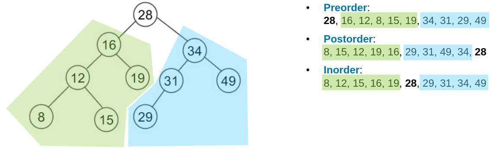

## Lecture material
Contains highlighted sections

## 1. Trees (Height Balanced)
### Determining a Tree's Characteristics
#### Ordered
A tree is ordered if all of its successors are ordered, e.g. the left child is always smaller than the parent, the right child always bigger.
#### Order
The maximum number of successors a node has in the tree.
#### Height (of the tree)
Maximum distance from a leaf to the root.
#### Depth (of a node)
The number of edges from the node to the root.
#### Complete
A tree of order $n$ is called complete if all leaves have the same depth, and each node has the maximum number or children.
### Binary Tree
No node has more than 2 children and it is acyclical. (and something else I forgor but it doesn't matter).
From this we can derive:
- The number of external nodes: min: $height + 1$, max: $2^{height}$
- ..n not sure this is relevant anyhow
#### Binary Traversal

I'm just going to assume that there will be little to no questions about this bc wtf
### B-Trees

### AVL Trees (!)
### Multipath Search
### (2,4) Trees
### Red-Black Trees
### Splay Trees
## 2. Trees (Weight Balanced)
### Treaps
### Randomized Treaps
## 3. Hashing
### Universal Hashing
### Overflow Handling
#### Overflow Chaining
#### Open Hashing
## 4. Double Hashing
### Open Hashing: Double Hashing
### Brent's Algorithm
### Binary Tree Probing
### Ordered Double Hashing
## 5. Monte Carlo Tree Search
### Minimax Algorithm
### Alpha-Beta Pruning
### Monte Carlo Tree Search
## 6. Graphs (Structure)
### DFS
### BFS
### Floyd-Warshall Algorithm
### Dijkstra's Algorithm (!)
### Minimum Spanning Tree (MST) (!)
### Kruskal's Algorithm
### Distance and Centrality
### Short Distance Graphs
## 7. Graphs (Flows)
### Characteristics
#### Maximum Flow
#### Cuts
#### Augmenting Path
### Ford-Fulkerson Algorithm
## 8. Social Graphs
???
## 9. Community Analysis
### Characteristics
#### Centrality (!)
#### Distance (!)
#### Importance (Closeness)
#### Ties and Influence
### Influence Modeling
### Clustering
## 10. PRAM Algorithms
### PRAM Models
### Parallel Reduction
### List Ranking (Suffix Sums)
### Preorder Tree Traversal
### Parallel Merge Sort
### Graph Coloring
### Brent's Theorem
#### Cost Optimality
### Cost Optimal Algorithm for Prefix Sums
### Speedup Factor
#### Speedup Performance Laws
#### Fixed Load Speedup Factor (Amdahl)
#### Fixed Time Speedup (Gustafson)
#### Fixed Memory Speedup 